# Final Project Submission

Please fill out:
* Student name: James M. Irving, Ph.D.
* Student pace: Full Time
* Scheduled project review date/time: 
* Instructor name: Brandon Lewis, Jeff Herman
* Blog post URL: https://jirvingphd.github.io/building_artifical_neural_networks


<h1>Table of Contents<span class="tocSkip"></span></h1>
<div class="toc"><ul class="toc-item"><li><span><a href="#Final-Project-Submission" data-toc-modified-id="Final-Project-Submission-1">Final Project Submission</a></span></li><li><span><a href="#Goal:" data-toc-modified-id="Goal:-2">Goal:</a></span><ul class="toc-item"><li><span><a href="#Methods-Overview:" data-toc-modified-id="Methods-Overview:-2.1">Methods Overview:</a></span></li><li><span><a href="#Original-Troll-Dataset-Features-&amp;-Observations" data-toc-modified-id="Original-Troll-Dataset-Features-&amp;-Observations-2.2">Original Troll Dataset Features &amp; Observations</a></span></li></ul></li><li><span><a href="#OBTAIN:" data-toc-modified-id="OBTAIN:-3">OBTAIN:</a></span><ul class="toc-item"><li><span><a href="#Control-Tweet-Extract-with-TwitterAPI" data-toc-modified-id="Control-Tweet-Extract-with-TwitterAPI-3.1">Control Tweet Extract with TwitterAPI</a></span></li><li><span><a href="#Combining-&amp;-Sampling-Original-Troll-Tweets-and-with-Newly-Harvested-Control-Tweets" data-toc-modified-id="Combining-&amp;-Sampling-Original-Troll-Tweets-and-with-Newly-Harvested-Control-Tweets-3.2">Combining &amp; Sampling Original Troll Tweets and with Newly-Harvested Control Tweets</a></span></li><li><span><a href="#Investigating-and-Preprocessing-the-New-Full-Dataset" data-toc-modified-id="Investigating-and-Preprocessing-the-New-Full-Dataset-3.3">Investigating and Preprocessing the New Full Dataset</a></span></li></ul></li><li><span><a href="#SCRUB:" data-toc-modified-id="SCRUB:-4">SCRUB:</a></span><ul class="toc-item"><li><span><a href="#Text-Processing:-tokenizing,-removing-stopwords,-urls,-hashtags" data-toc-modified-id="Text-Processing:-tokenizing,-removing-stopwords,-urls,-hashtags-4.1">Text Processing: tokenizing, removing stopwords, urls, hashtags</a></span></li><li><span><a href="#Using-RegularExpressions-to-extract-and-replace-Urls,-Hashtags,-and-Mentions" data-toc-modified-id="Using-RegularExpressions-to-extract-and-replace-Urls,-Hashtags,-and-Mentions-4.2">Using RegularExpressions to extract and replace Urls, Hashtags, and Mentions</a></span></li><li><span><a href="#Saving/Loading-the-Full-Dataset-for-Resuming-Analysis" data-toc-modified-id="Saving/Loading-the-Full-Dataset-for-Resuming-Analysis-4.3">Saving/Loading the Full Dataset for Resuming Analysis</a></span></li><li><span><a href="#Resampling-Troll-Tweets-to-Match-Number-of-Control-Tweets" data-toc-modified-id="Resampling-Troll-Tweets-to-Match-Number-of-Control-Tweets-4.4">Resampling Troll Tweets to Match Number of Control Tweets</a></span></li><li><span><a href="#Saving/Loading-the-resampled-data" data-toc-modified-id="Saving/Loading-the-resampled-data-4.5">Saving/Loading the resampled data</a></span></li></ul></li><li><span><a href="#EXPLORE" data-toc-modified-id="EXPLORE-5">EXPLORE</a></span><ul class="toc-item"><li><span><a href="#Generating-Frequency-Distribtuions" data-toc-modified-id="Generating-Frequency-Distribtuions-5.1">Generating Frequency Distribtuions</a></span></li><li><span><a href="#Creating-Bigrams-and-PMI-scores" data-toc-modified-id="Creating-Bigrams-and-PMI-scores-5.2">Creating Bigrams and PMI scores</a></span></li><li><span><a href="#Sentiment-Analysis-with-VADER" data-toc-modified-id="Sentiment-Analysis-with-VADER-5.3">Sentiment Analysis with VADER</a></span></li></ul></li><li><span><a href="#MODEL" data-toc-modified-id="MODEL-6">MODEL</a></span><ul class="toc-item"><li><span><a href="#BUILDING-THE-INITIAL-MODELS" data-toc-modified-id="BUILDING-THE-INITIAL-MODELS-6.1">BUILDING THE INITIAL MODELS</a></span></li><li><span><a href="#Logistic-Regression" data-toc-modified-id="Logistic-Regression-6.2">Logistic Regression</a></span></li><li><span><a href="#DecisionTreeClassifier" data-toc-modified-id="DecisionTreeClassifier-6.3">DecisionTreeClassifier</a></span></li><li><span><a href="#Random-Forests-Classifier" data-toc-modified-id="Random-Forests-Classifier-6.4">Random Forests Classifier</a></span></li><li><span><a href="#Keras-Model-1:-creating-a-Text-Classification-Neural-Network-in-Keras" data-toc-modified-id="Keras-Model-1:-creating-a-Text-Classification-Neural-Network-in-Keras-6.5">Keras Model 1: creating a Text Classification Neural Network in Keras</a></span></li><li><span><a href="#Keras-Model-2-Adding-pretrained-Word2Vec-embeddings" data-toc-modified-id="Keras-Model-2-Adding-pretrained-Word2Vec-embeddings-6.6">Keras Model 2 Adding pretrained Word2Vec embeddings</a></span></li><li><span><a href="#Keras-model-3--using-keras'-tokenizer-to-fit_on_texts+one_hot" data-toc-modified-id="Keras-model-3--using-keras'-tokenizer-to-fit_on_texts+one_hot-6.7">Keras model 3 -using keras' tokenizer to fit_on_texts+one_hot</a></span></li></ul></li><li><span><a href="#INTERPRET" data-toc-modified-id="INTERPRET-7">INTERPRET</a></span></li><li><span><a href="#FUTURE-DIRECTIONS" data-toc-modified-id="FUTURE-DIRECTIONS-8">FUTURE DIRECTIONS</a></span></li></ul></div>

# Goal:
> **To create a deep-learning Natural Language Processing neural network that can analyze the language content of a Tweet to determine if the tweet was written by an authentic user or a Russian Troll.**

## Dataset Download:
- The entire dataset is available to download from a Google Drive folder located [here](https://drive.google.com/drive/folders/1-9xFWyaZkkUxp8A1-Q4ePo7kHepyb2Hz?usp=sharing)


## Methods Overview:


### Analysis Framework

- **We will be using the OSEMN framework (outlined in brief below)**
    - [X] Obtain
        - Extract new Twitter control tweets.
        - Merge with Kaggle/FiveThirtyEight dataset
    - [X] Scrub
        - Remove hashtags, mentions, misleading common terms (discovered by feature importance in Decision Tree Classifier. 
    - [X] Explore
        - WordClouds for tokenized, stop-word removed text.
            - Also for hashtags, mentions
            - Bigrams & Pointwise Mutual Information Score
            - Sentiment Analysis
    - [x] Model 
        - Logistic Regression
        - Decision Tree Classifier
        - Random Forests Classifier
        - Artificial Neural Networks (3 vers)
    - [x] Interpret
        - Summary 
        - Future Directions
___

### Data Sources
#### Russian Troll Tweets
>We started with a dataset of **3 Million Tweets sent from 2,752 Twitter accounts connected to the "Internet Research Agency," a Russian-Troll farm** that was part of The Mueller Investigation's February 2018 indictments. The tweets cover a range from February 2012 to May 2018, with the majority published from 2015-2017.
    >    - The tweets [published on Kaggle by FiveThirtyEight](https://www.kaggle.com/fivethirtyeight/russian-troll-tweets) and were originally **collected by Clemson University researchers, Dr. Darren Linvill and Dr. Patrick Warren**, using custom searches using Social-Studio software licensed by Clemson University.<br><br>
    >    - Their analysis on the various tactics used and the various social groups that were targeted by the trolls is detailed in their manuscript ["Troll Factories: The Internet Research Agency and State-Sponsored Agenda Building"](http://pwarren.people.clemson.edu/Linvill_Warren_TrollFactory.pdf) published in July of 2018.


#### Appropriate Control Tweets
> ***However, since the goal is to produce a machine learning model that can accurately classify if a tweet came from an authentic user or a Russian troll, we needed to acquire a set of control tweets from non-trolls.*** 
> - **We used Tweepy to to extract a set of control tweets from the twitter api.**
     - Our goal was to extract tweets from the same time period as the troll tweet dataset, matching the top 20 hashtags(#) and mentions(@).<br><br>
    - However, **due to limitations of the Twitter API** *(including the inability to search for specific date ranges)* we **extracted present-day tweets directed at the top 40 most-frequent mentions (@s) from the troll Tweets.**<br>
        - (The top 20 hashtags contained many generic topics (#news, #sports) that would not be proper controls for the language content of the troll tweets.)<br><br>
        
- ***Our newly extracted control dataset is comprised of:***
    > - **39,086 tweets ranging from 05/24/19 to 06/03/19.**<br><br>
> - We **do not have equal number of troll tweets and new tweets**
> - We **will resample from the troll tweets** to meet the # of new controls.
___


## Original Troll Dataset Features & Observations
**For our analyses, we will be focusing strictly on the language of the tweets, and none of the other characteristics int he dataset.** 
> - **Variables:**
    - ~~`external_author_id` | An author account ID from Twitter~~
    - `author` | The handle sending the tweet
    - `content` | The text of the tweet
    - ~~`region` | A region classification, as [determined by Social Studio](https://help.salesforce.com/articleView?   id=000199367&type=1)~~
    - `language` | The language of the tweet
    - `publish_date` | The date and time the tweet was sent
    - ~~`harvested_date` | The date and time the tweet was collected by Social Studio~~
    - ~~`following` | The number of accounts the handle was following at the time of the tweet~~
    - ~~`followers` | The number of followers the handle had at the time of the tweet~~
    - ~~`updates` | The number of “update actions” on the account that authored the tweet, including tweets, retweets and likes~~
    - ~~`post_type` | Indicates if the tweet was a retweet or a quote-tweet *[Whats a quote-tweet?]*~~
    - ~~`account_type` | Specific account theme, as coded by Linvill and Warren~~
    - `retweet` | A binary indicator of whether or not the tweet is a retweet
    - ~~`account_category` | General account theme, as coded by Linvill and Warren~~
    - ~~`new_june_2018` | A binary indicator of whether the handle was newly listed in June 2018~~
    
    
#### Observations on the Troll Tweet Dataset
> - **Dataset is comprised of 2,973,371 tweets.**
    - Target Tweet Text to Analyze is in `Content`   
- **Thoughts on specific features:**
    - `language`
        - There are 56 unique languages. 
        - 2.1 million are English (71.6%), 670 K are in Russian, etc.
        - [x] Drop all non-English tweets. 
    - `retweet`
        - 1.3 million entries are retweets (44.1 % )
        - Since this analysis will use language content to predict author, retweets are not helpful.
        - Retweets were not written by the account's author and should be not considered.
        - [x] Drop all retweets
- **Final Troll Tweet Summary:**
    - After dropping non-English tweets and retweets, there are **1,272,848 Russian-Troll tweets.**

# OBTAIN: 

## Control Tweet Extract with TwitterAPI
- See Notebook "student_JMI_twitter_extraction.ipynb" for the extraction of control tweets to match the Troll tweets.

## Combining & Sampling Original Troll Tweets and with Newly-Harvested Control Tweets


```python
# Custom functions written for this project are located in mod4functions_JMI.py in the main folder of this repo.
# from mod4functions_JMI import *
import mod4functions_JMI as jmi

import bs_ds as bs

import warnings
warnings.filterwarnings('ignore')
from bs_ds.imports import *
```

    bs_ds  v0.9.10 loaded.  Read the docs: https://bs-ds.readthedocs.io/en/latest/index.html
    For convenient loading of standard modules use: from bs_ds.imports import *
    
    


<style  type="text/css" >
</style><table id="T_689aa228_d4ac_11e9_86fd_f48e38b6371f" ><caption>Loaded Packages and Handles</caption><thead>    <tr>        <th class="col_heading level0 col0" >Package</th>        <th class="col_heading level0 col1" >Handle</th>        <th class="col_heading level0 col2" >Description</th>    </tr></thead><tbody>
                <tr>
                                <td id="T_689aa228_d4ac_11e9_86fd_f48e38b6371frow0_col0" class="data row0 col0" >bs_ds</td>
                        <td id="T_689aa228_d4ac_11e9_86fd_f48e38b6371frow0_col1" class="data row0 col1" >bs</td>
                        <td id="T_689aa228_d4ac_11e9_86fd_f48e38b6371frow0_col2" class="data row0 col2" >Custom data science bootcamp student package</td>
            </tr>
            <tr>
                                <td id="T_689aa228_d4ac_11e9_86fd_f48e38b6371frow1_col0" class="data row1 col0" >matplotlib</td>
                        <td id="T_689aa228_d4ac_11e9_86fd_f48e38b6371frow1_col1" class="data row1 col1" >mpl</td>
                        <td id="T_689aa228_d4ac_11e9_86fd_f48e38b6371frow1_col2" class="data row1 col2" >Matplotlib's base OOP module with formatting artists</td>
            </tr>
            <tr>
                                <td id="T_689aa228_d4ac_11e9_86fd_f48e38b6371frow2_col0" class="data row2 col0" >matplotlib.pyplot</td>
                        <td id="T_689aa228_d4ac_11e9_86fd_f48e38b6371frow2_col1" class="data row2 col1" >plt</td>
                        <td id="T_689aa228_d4ac_11e9_86fd_f48e38b6371frow2_col2" class="data row2 col2" >Matplotlib's matlab-like plotting module</td>
            </tr>
            <tr>
                                <td id="T_689aa228_d4ac_11e9_86fd_f48e38b6371frow3_col0" class="data row3 col0" >numpy</td>
                        <td id="T_689aa228_d4ac_11e9_86fd_f48e38b6371frow3_col1" class="data row3 col1" >np</td>
                        <td id="T_689aa228_d4ac_11e9_86fd_f48e38b6371frow3_col2" class="data row3 col2" >scientific computing with Python</td>
            </tr>
            <tr>
                                <td id="T_689aa228_d4ac_11e9_86fd_f48e38b6371frow4_col0" class="data row4 col0" >pandas</td>
                        <td id="T_689aa228_d4ac_11e9_86fd_f48e38b6371frow4_col1" class="data row4 col1" >pd</td>
                        <td id="T_689aa228_d4ac_11e9_86fd_f48e38b6371frow4_col2" class="data row4 col2" >High performance data structures and tools</td>
            </tr>
            <tr>
                                <td id="T_689aa228_d4ac_11e9_86fd_f48e38b6371frow5_col0" class="data row5 col0" >seaborn</td>
                        <td id="T_689aa228_d4ac_11e9_86fd_f48e38b6371frow5_col1" class="data row5 col1" >sns</td>
                        <td id="T_689aa228_d4ac_11e9_86fd_f48e38b6371frow5_col2" class="data row5 col2" >High-level data visualization library based on matplotlib</td>
            </tr>
    </tbody></table>


```python
# Load in a  partially-processed version of the Troll Tweets (have already dropped non-English tweets and retweets.)
df = pd.read_csv('final_dataset/russian_troll_tweets_eng_only_date_pub_index.csv', encoding='utf-8', index_col=0)

# Add label column troll_tweet, set =1 for original troll tweets
df['troll_tweet'] = 1

# Recast date_published as datetime and make index
df['date_published'] = pd.to_datetime(df['publish_date'])
df.set_index('date_published', inplace=True)

# Drop any tweets missing the actual Tweet content
df.dropna(subset=['content'],inplace=True) # Dropping the 1 null value 

df.head(3)
```


<div>
<style scoped>
    .dataframe tbody tr th:only-of-type {
        vertical-align: middle;
    }

    .dataframe tbody tr th {
        vertical-align: top;
    }

    .dataframe thead th {
        text-align: right;
    }
</style>
<table border="1" class="dataframe">
  <thead>
    <tr style="text-align: right;">
      <th></th>
      <th>external_author_id</th>
      <th>author</th>
      <th>content</th>
      <th>region</th>
      <th>language</th>
      <th>publish_date</th>
      <th>following</th>
      <th>followers</th>
      <th>updates</th>
      <th>post_type</th>
      <th>account_type</th>
      <th>retweet</th>
      <th>account_category</th>
      <th>troll_tweet</th>
    </tr>
    <tr>
      <th>date_published</th>
      <th></th>
      <th></th>
      <th></th>
      <th></th>
      <th></th>
      <th></th>
      <th></th>
      <th></th>
      <th></th>
      <th></th>
      <th></th>
      <th></th>
      <th></th>
      <th></th>
    </tr>
  </thead>
  <tbody>
    <tr>
      <th>2017-10-01 19:58:00</th>
      <td>9.060000e+17</td>
      <td>10_GOP</td>
      <td>"We have a sitting Democrat US Senator on tria...</td>
      <td>Unknown</td>
      <td>English</td>
      <td>10/1/2017 19:58</td>
      <td>1052</td>
      <td>9636</td>
      <td>253</td>
      <td>NaN</td>
      <td>Right</td>
      <td>0</td>
      <td>RightTroll</td>
      <td>1</td>
    </tr>
    <tr>
      <th>2017-10-01 22:43:00</th>
      <td>9.060000e+17</td>
      <td>10_GOP</td>
      <td>Marshawn Lynch arrives to game in anti-Trump s...</td>
      <td>Unknown</td>
      <td>English</td>
      <td>10/1/2017 22:43</td>
      <td>1054</td>
      <td>9637</td>
      <td>254</td>
      <td>NaN</td>
      <td>Right</td>
      <td>0</td>
      <td>RightTroll</td>
      <td>1</td>
    </tr>
    <tr>
      <th>2017-10-01 23:52:00</th>
      <td>9.060000e+17</td>
      <td>10_GOP</td>
      <td>JUST IN: President Trump dedicates Presidents ...</td>
      <td>Unknown</td>
      <td>English</td>
      <td>10/1/2017 23:52</td>
      <td>1062</td>
      <td>9642</td>
      <td>256</td>
      <td>NaN</td>
      <td>Right</td>
      <td>0</td>
      <td>RightTroll</td>
      <td>1</td>
    </tr>
  </tbody>
</table>
</div>


### Retreiving Only Tweets with the Top 40 @'s


```python
# Get all tweet tags and @'s from text_to_search_list
from mod4functions_JMI import get_tags_ats

# Need to get a list of hash tags.
full_text_to_search = df['content']

tweet_tags, tweet_ats = get_tags_ats(full_text_to_search, show_counts=False)
print(f"There were {len(tweet_tags)} unique hashtags and {len(tweet_ats)} unique @'s\n")

# Create a dataframe with top_tags
df_top_tags = pd.DataFrame(tweet_tags.value_counts()[:40])#,'\n')
df_top_tags['% Total'] = (df_top_tags['tags']/len(tweet_tags)*100)

# Create a dataframe with top_ats
df_top_ats = pd.DataFrame(tweet_ats.value_counts()[:40])
df_top_ats['% Total'] = (df_top_ats['ats']/len(tweet_ats)*100)

display(df_top_tags[:10]),display(df_top_ats[:10])
```

    There were 832208 unique hashtags and 673442 unique @'s
    
    


<div>
<style scoped>
    .dataframe tbody tr th:only-of-type {
        vertical-align: middle;
    }

    .dataframe tbody tr th {
        vertical-align: top;
    }

    .dataframe thead th {
        text-align: right;
    }
</style>
<table border="1" class="dataframe">
  <thead>
    <tr style="text-align: right;">
      <th></th>
      <th>tags</th>
      <th>% Total</th>
    </tr>
  </thead>
  <tbody>
    <tr>
      <th>#news</th>
      <td>118624</td>
      <td>14.254129</td>
    </tr>
    <tr>
      <th>#sports</th>
      <td>45544</td>
      <td>5.472670</td>
    </tr>
    <tr>
      <th>#politics</th>
      <td>37452</td>
      <td>4.500317</td>
    </tr>
    <tr>
      <th>#world</th>
      <td>27077</td>
      <td>3.253634</td>
    </tr>
    <tr>
      <th>#local</th>
      <td>23130</td>
      <td>2.779353</td>
    </tr>
    <tr>
      <th>#TopNews</th>
      <td>14621</td>
      <td>1.756893</td>
    </tr>
    <tr>
      <th>#health</th>
      <td>10328</td>
      <td>1.241036</td>
    </tr>
    <tr>
      <th>#business</th>
      <td>9558</td>
      <td>1.148511</td>
    </tr>
    <tr>
      <th>#BlackLivesMatter</th>
      <td>8252</td>
      <td>0.991579</td>
    </tr>
    <tr>
      <th>#tech</th>
      <td>7836</td>
      <td>0.941592</td>
    </tr>
  </tbody>
</table>
</div>


<div>
<style scoped>
    .dataframe tbody tr th:only-of-type {
        vertical-align: middle;
    }

    .dataframe tbody tr th {
        vertical-align: top;
    }

    .dataframe thead th {
        text-align: right;
    }
</style>
<table border="1" class="dataframe">
  <thead>
    <tr style="text-align: right;">
      <th></th>
      <th>ats</th>
      <th>% Total</th>
    </tr>
  </thead>
  <tbody>
    <tr>
      <th>@midnight</th>
      <td>6691</td>
      <td>0.993553</td>
    </tr>
    <tr>
      <th>@realDonaldTrump</th>
      <td>3532</td>
      <td>0.524470</td>
    </tr>
    <tr>
      <th>@WarfareWW</th>
      <td>1529</td>
      <td>0.227043</td>
    </tr>
    <tr>
      <th>@CNN</th>
      <td>1471</td>
      <td>0.218430</td>
    </tr>
    <tr>
      <th>@HillaryClinton</th>
      <td>1424</td>
      <td>0.211451</td>
    </tr>
    <tr>
      <th>@POTUS</th>
      <td>1035</td>
      <td>0.153688</td>
    </tr>
    <tr>
      <th>@CNNPolitics</th>
      <td>948</td>
      <td>0.140769</td>
    </tr>
    <tr>
      <th>@FoxNews</th>
      <td>930</td>
      <td>0.138097</td>
    </tr>
    <tr>
      <th>@mashable</th>
      <td>740</td>
      <td>0.109883</td>
    </tr>
    <tr>
      <th>@YouTube</th>
      <td>680</td>
      <td>0.100974</td>
    </tr>
  </tbody>
</table>
</div>


    (None, None)


### Loading in the new control tweets


```python
# Load in harvest tweets
df_new = pd.read_csv('final_dataset/newly_extracted_control_tweets.csv', encoding='utf-8', index_col=0)

# Recast date_published as datetime and make index
df_new['date_published'] = pd.to_datetime(df_new['publish_date'])
df_new.set_index('date_published', inplace=True)

# Label the control tweets as troll_tweet=0
df_new['troll_tweet'] = 0

# Keep only non-retweeted tweets
df_new = df_new.loc[df_new['retweet']==0]

# Keep only english tweets
df_new = df_new.loc[df_new['language']=='en']

# Drop problematic nan in 'content'
df_new.dropna(subset=['content'],inplace=True)

df_new.head()
```


<div>
<style scoped>
    .dataframe tbody tr th:only-of-type {
        vertical-align: middle;
    }

    .dataframe tbody tr th {
        vertical-align: top;
    }

    .dataframe thead th {
        text-align: right;
    }
</style>
<table border="1" class="dataframe">
  <thead>
    <tr style="text-align: right;">
      <th></th>
      <th>external_author_id</th>
      <th>author</th>
      <th>content</th>
      <th>region</th>
      <th>following</th>
      <th>followers</th>
      <th>updates</th>
      <th>post_type</th>
      <th>account_type</th>
      <th>retweet</th>
      <th>account_category</th>
      <th>publish_date</th>
      <th>language</th>
      <th>troll_tweet</th>
    </tr>
    <tr>
      <th>date_published</th>
      <th></th>
      <th></th>
      <th></th>
      <th></th>
      <th></th>
      <th></th>
      <th></th>
      <th></th>
      <th></th>
      <th></th>
      <th></th>
      <th></th>
      <th></th>
      <th></th>
    </tr>
  </thead>
  <tbody>
    <tr>
      <th>2019-06-02 18:34:59</th>
      <td>1.114658e+18</td>
      <td>Draftdodgingdon</td>
      <td>@realDonaldTrump it’s perfectly reasonable tha...</td>
      <td>NaN</td>
      <td>NaN</td>
      <td>0.0</td>
      <td>NaN</td>
      <td>control</td>
      <td>control</td>
      <td>False</td>
      <td>control</td>
      <td>2019-06-02 18:34:59</td>
      <td>en</td>
      <td>0</td>
    </tr>
    <tr>
      <th>2019-06-02 18:34:59</th>
      <td>1.038424e+18</td>
      <td>beapartofthemo1</td>
      <td>RT @BelkissObadia: BREAKING NEWS: \n\n@realDon...</td>
      <td>Bradenton, FL</td>
      <td>NaN</td>
      <td>1198.0</td>
      <td>NaN</td>
      <td>control</td>
      <td>control</td>
      <td>False</td>
      <td>control</td>
      <td>2019-06-02 18:34:59</td>
      <td>en</td>
      <td>0</td>
    </tr>
    <tr>
      <th>2019-06-02 18:34:59</th>
      <td>8.798349e+17</td>
      <td>BarbHuber9</td>
      <td>@realDonaldTrump I thought you were supposed t...</td>
      <td>NaN</td>
      <td>NaN</td>
      <td>1099.0</td>
      <td>NaN</td>
      <td>control</td>
      <td>control</td>
      <td>False</td>
      <td>control</td>
      <td>2019-06-02 18:34:59</td>
      <td>en</td>
      <td>0</td>
    </tr>
    <tr>
      <th>2019-06-02 18:34:59</th>
      <td>4.765020e+09</td>
      <td>nonamehombre</td>
      <td>RT @realDonaldTrump: Mexico is sending a big d...</td>
      <td>NaN</td>
      <td>NaN</td>
      <td>69.0</td>
      <td>NaN</td>
      <td>control</td>
      <td>control</td>
      <td>False</td>
      <td>control</td>
      <td>2019-06-02 18:34:59</td>
      <td>en</td>
      <td>0</td>
    </tr>
    <tr>
      <th>2019-06-02 18:34:59</th>
      <td>8.244085e+17</td>
      <td>letbuildthewall</td>
      <td>RT @realDonaldTrump: Mexico is sending a big d...</td>
      <td>NaN</td>
      <td>NaN</td>
      <td>18.0</td>
      <td>NaN</td>
      <td>control</td>
      <td>control</td>
      <td>False</td>
      <td>control</td>
      <td>2019-06-02 18:34:59</td>
      <td>en</td>
      <td>0</td>
    </tr>
  </tbody>
</table>
</div>


```python
df_new.index.min(), df_new.index.max()
```


    (Timestamp('2019-05-24 03:23:03'), Timestamp('2019-06-03 02:09:16'))


```python
df_new.info()
```

    <class 'pandas.core.frame.DataFrame'>
    DatetimeIndex: 39086 entries, 2019-06-02 18:34:59 to 2019-06-03 00:09:23
    Data columns (total 14 columns):
    external_author_id    39086 non-null float64
    author                39086 non-null object
    content               39086 non-null object
    region                24921 non-null object
    following             0 non-null float64
    followers             39086 non-null float64
    updates               0 non-null float64
    post_type             39086 non-null object
    account_type          39086 non-null object
    retweet               39086 non-null bool
    account_category      39086 non-null object
    publish_date          39086 non-null object
    language              39086 non-null object
    troll_tweet           39086 non-null int64
    dtypes: bool(1), float64(4), int64(1), object(8)
    memory usage: 4.2+ MB
    

#### Concatenating Troll Tweets and New Tweets


```python
# Confirming the columns of the old and new data match before concatenating
if set(df.columns) == set(df_new.columns):
    # Concatenate the dataframes then get a ProfileReport
    df_full = pd.concat([df,df_new],axis=0)
```

## Investigating and Preprocessing the New Full Dataset


```python
bs.html_on('')
# from pandas_profiling import ProfileReport
# ProfileReport(df_full)
```


<style></style>


# SCRUB: 
## Text Processing: tokenizing, removing stopwords, urls, hashtags

## Using RegularExpressions to extract and replace Urls, Hashtags, and Mentions

- [x] URLs, hasthtags, mentions were already removed.
    - hashtags and mentions are in `content_hashtags`,`content_mentions`
- **Cleaned data columns are:**
    - `content_min_clean`: only RT headers and urls have been removed.
    - `content`: RT headers, urls, hashtags, mentions were all removed. 

#### ADDRESSING THE "RT" ISSUE
- **Summary: many messages in both the troll tweets and new control tweets are prepended with "RT".**
    - Some are `RT @handle:` others are just `RT handle:`, but SOME are using `RT` internally as an abbreviation for the idea of a retweet, not as an indicator that the _current message_ is a retweet. 

___
- [Reference Article from 2014 re: the usage of RT and more modern methods of reatweeting.](https://socialnetworking.lovetoknow.com/What_Does_RT_on_Twitter_Mean)
- According to this article, using "RT @Username:" in an anachronism that has been replaced by an automated retweet function, but that many die-hard old school twitter users still prefer to do it the manual way. 
- Therefore, by filtering out tweets marked as officially retweeted by the Twitter API, but keeping tweets thats were manually retweeted using "RT @handle:", can produce a sort of sampling error.
    - That being said, if someone is taking the effort to manually type the origin and quote, that level of effort, in my opinion, still is a reasonable metric to use to separate out these tweets from the auto-retweeted tweets.
    
- **HOWEVER: there is still the issue of what effect this has on the dataset.**
- **My proposed solution:**
    1. [x] take current df['content'] column and change it to df['content_raw'] (so that it is no longer used by the following code)
    2. [x] **create a new df['content_min_clean'] column that uses  regexp to remove all `RT @handle:` and `RT handle:` from the `df['raw']` column and all URL links, but keeps mentions and hashtags**
        - Use for some vectorized analyses
    3. [x] Create a new `hashtags` and `mentions` columns that will find and save any handles and hashtags from anywhere in the NEW `RT @mention:`-removed content.
        - This means that any hashtags that represent the original source and are pre-pended to the message will NOT be included, but any other mentions WILL be included.
        


```python
# create 'content_raw' column from 'content'
df_full['content_raw'] = df_full['content'].copy()
```


```python
# Generate Stopwords List
from nltk import regexp_tokenize
pattern = "([a-zA-Z]+(?:'[a-z]+)?)"

from nltk.corpus import stopwords
import string

stopwords_list = stopwords.words('english')
stopwords_list += list(string.punctuation)
stopwords_list += ['http','https','...','…','``','co','“','’','‘','”',"n't","''",'u','s',"'s",'|','\\|','amp',"i'm"]
stopwords_list += [0,1,2,3,4,5,6,7,8,9]

## Adding in stopword removal to the actual dataframe
def apply_stopwords(stopwords_list,  text, tokenize=True):

    if tokenize==True:
        from nltk import regexp_tokenize
        pattern = "([a-zA-Z]+(?:'[a-z]+)?)"
        
        text = regexp_tokenize(text,pattern)
        
    stopped = [x.lower() for x in text if x.lower() not in stopwords_list]
    return ' '.join(stopped)
```


```python
# Save 'hashtags' column containing all hastags
import re

# Add has_RT and starts_RT columns
# Creating columns for tweets that `has_RT` or `starts_RT`
df_full['has_RT']=df_full['content_raw'].str.contains('RT')
df_full['starts_RT']=df_full['content_raw'].str.contains('^RT')

## FIRST REMOVE THE RT HEADERS

# Remove `RT @Mentions` FIRST:
re_RT = re.compile('RT [@]?\w*:')

raw_col =  'content_raw'
check_content_col =raw_col
fill_content_col = 'content'

df_full['content_starts_RT'] = df_full[check_content_col].apply(lambda x: re_RT.findall(x))
df_full[fill_content_col] =  df_full[check_content_col].apply(lambda x: re_RT.sub(' ',x))


## SECOND REMOVE URLS
# Remove urls with regex
urls = re.compile(r"(http[s]?://\w*\.\w*/+\w+)")

check_content_col = 'content'
fill_content_col = 'content'

# df_full['content_urls'] = df_full[check_content_col].apply(lambda x: urls.findall(x))
df_full[fill_content_col] =  df_full[check_content_col].apply(lambda x: urls.sub(' ',x))

## SAVE THIS MINIMALLY CLEANED CONTENT AS 'content_min_clean'
df_full['content_min_clean'] =  df_full[fill_content_col]


## REMOVE AND SAVE HASHTAGS, MENTIONS
# Remove and save Hashtags
hashtags = re.compile(r'\#\w*')

check_content_col = 'content'
fill_content_col = 'content'

df_full['content_hashtags'] =  df_full[check_content_col].apply(lambda x: hashtags.findall(x))
df_full[fill_content_col] =  df_full[check_content_col].apply(lambda x: hashtags.sub(' ',x))


# Remove and save mentions (@)'s
mentions = re.compile(r'\@\w*')

check_content_col = 'content'
fill_content_col = 'content'

df_full['content_mentions'] =  df_full[check_content_col].apply(lambda x: mentions.findall(x))
df_full[fill_content_col] =  df_full[check_content_col].apply(lambda x: mentions.sub(' ',x))


# Creating content_stopped columns and then tokens_stopped column
df_full['content_stopped'] = df_full['content'].apply(lambda x: apply_stopwords(stopwords_list,x))
df_full['tokens_stopped'] = df_full['content_stopped'].apply(lambda x: regexp_tokenize(x,pattern))
```


```python
df_full.head()
```


<div>
<style scoped>
    .dataframe tbody tr th:only-of-type {
        vertical-align: middle;
    }

    .dataframe tbody tr th {
        vertical-align: top;
    }

    .dataframe thead th {
        text-align: right;
    }
</style>
<table border="1" class="dataframe">
  <thead>
    <tr style="text-align: right;">
      <th></th>
      <th>account_category</th>
      <th>account_type</th>
      <th>author</th>
      <th>content</th>
      <th>external_author_id</th>
      <th>followers</th>
      <th>following</th>
      <th>language</th>
      <th>post_type</th>
      <th>publish_date</th>
      <th>...</th>
      <th>updates</th>
      <th>content_raw</th>
      <th>has_RT</th>
      <th>starts_RT</th>
      <th>content_starts_RT</th>
      <th>content_min_clean</th>
      <th>content_hashtags</th>
      <th>content_mentions</th>
      <th>content_stopped</th>
      <th>tokens_stopped</th>
    </tr>
    <tr>
      <th>date_published</th>
      <th></th>
      <th></th>
      <th></th>
      <th></th>
      <th></th>
      <th></th>
      <th></th>
      <th></th>
      <th></th>
      <th></th>
      <th></th>
      <th></th>
      <th></th>
      <th></th>
      <th></th>
      <th></th>
      <th></th>
      <th></th>
      <th></th>
      <th></th>
      <th></th>
    </tr>
  </thead>
  <tbody>
    <tr>
      <th>2017-10-01 19:58:00</th>
      <td>RightTroll</td>
      <td>Right</td>
      <td>10_GOP</td>
      <td>"We have a sitting Democrat US Senator on tria...</td>
      <td>9.060000e+17</td>
      <td>9636.0</td>
      <td>1052.0</td>
      <td>English</td>
      <td>NaN</td>
      <td>10/1/2017 19:58</td>
      <td>...</td>
      <td>253.0</td>
      <td>"We have a sitting Democrat US Senator on tria...</td>
      <td>False</td>
      <td>False</td>
      <td>[]</td>
      <td>"We have a sitting Democrat US Senator on tria...</td>
      <td>[]</td>
      <td>[@nedryun]</td>
      <td>sitting democrat us senator trial corruption b...</td>
      <td>[sitting, democrat, us, senator, trial, corrup...</td>
    </tr>
    <tr>
      <th>2017-10-01 22:43:00</th>
      <td>RightTroll</td>
      <td>Right</td>
      <td>10_GOP</td>
      <td>Marshawn Lynch arrives to game in anti-Trump s...</td>
      <td>9.060000e+17</td>
      <td>9637.0</td>
      <td>1054.0</td>
      <td>English</td>
      <td>NaN</td>
      <td>10/1/2017 22:43</td>
      <td>...</td>
      <td>254.0</td>
      <td>Marshawn Lynch arrives to game in anti-Trump s...</td>
      <td>False</td>
      <td>False</td>
      <td>[]</td>
      <td>Marshawn Lynch arrives to game in anti-Trump s...</td>
      <td>[]</td>
      <td>[]</td>
      <td>marshawn lynch arrives game anti trump shirt j...</td>
      <td>[marshawn, lynch, arrives, game, anti, trump, ...</td>
    </tr>
    <tr>
      <th>2017-10-01 23:52:00</th>
      <td>RightTroll</td>
      <td>Right</td>
      <td>10_GOP</td>
      <td>JUST IN: President Trump dedicates Presidents ...</td>
      <td>9.060000e+17</td>
      <td>9642.0</td>
      <td>1062.0</td>
      <td>English</td>
      <td>NaN</td>
      <td>10/1/2017 23:52</td>
      <td>...</td>
      <td>256.0</td>
      <td>JUST IN: President Trump dedicates Presidents ...</td>
      <td>False</td>
      <td>False</td>
      <td>[]</td>
      <td>JUST IN: President Trump dedicates Presidents ...</td>
      <td>[]</td>
      <td>[]</td>
      <td>president trump dedicates presidents cup golf ...</td>
      <td>[president, trump, dedicates, presidents, cup,...</td>
    </tr>
    <tr>
      <th>2017-10-01 02:47:00</th>
      <td>RightTroll</td>
      <td>Right</td>
      <td>10_GOP</td>
      <td>Dan Bongino: "Nobody trolls liberals better th...</td>
      <td>9.060000e+17</td>
      <td>9644.0</td>
      <td>1050.0</td>
      <td>English</td>
      <td>NaN</td>
      <td>10/1/2017 2:47</td>
      <td>...</td>
      <td>247.0</td>
      <td>Dan Bongino: "Nobody trolls liberals better th...</td>
      <td>False</td>
      <td>False</td>
      <td>[]</td>
      <td>Dan Bongino: "Nobody trolls liberals better th...</td>
      <td>[]</td>
      <td>[]</td>
      <td>dan bongino nobody trolls liberals better dona...</td>
      <td>[dan, bongino, nobody, trolls, liberals, bette...</td>
    </tr>
    <tr>
      <th>2017-10-01 02:52:00</th>
      <td>RightTroll</td>
      <td>Right</td>
      <td>10_GOP</td>
      <td>'    Doesn't matter that CNN doesn't report on...</td>
      <td>9.060000e+17</td>
      <td>9644.0</td>
      <td>1050.0</td>
      <td>English</td>
      <td>NaN</td>
      <td>10/1/2017 2:52</td>
      <td>...</td>
      <td>249.0</td>
      <td>'@SenatorMenendez @CarmenYulinCruz Doesn't mat...</td>
      <td>False</td>
      <td>False</td>
      <td>[]</td>
      <td>'@SenatorMenendez @CarmenYulinCruz Doesn't mat...</td>
      <td>[]</td>
      <td>[@SenatorMenendez, @CarmenYulinCruz]</td>
      <td>matter cnn report crimes change fact going</td>
      <td>[matter, cnn, report, crimes, change, fact, go...</td>
    </tr>
  </tbody>
</table>
<p>5 rows × 23 columns</p>
</div>


## Saving/Loading the Full Dataset for Resuming Analysis


```python
# Importing required packages
from bs_ds.imports import *
import bs_ds as bs
import mod4functions_JMI as jmi
```


```python
# Optional save-point, ask=False, overwrite=False is run-all safe
# df_full.to_csv('final_dataset/__df_full_tweets_all_text_processed__.csv', encoding='utf-8')
# df =[]
# df_new =[]

# Optional load-point, ask=False
df_full = pd.read_csv('final_dataset/__df_full_tweets_all_text_processed__.csv', encoding='utf-8', index_col=0)
```

## Resampling Troll Tweets to Match Number of Control Tweets

- Since there are many fewer new tweets, we will sample the same # from the larger Troll tweet collection.
- An issue to be reconsidered in future analyses is how to resample in a way that ensures that chosen troll tweets will be as close to the control tweets as the dataset allows.
    - In other words, making sure that if a term appears in the new control tweets, that we purposefully include matching tweets in our resampled troll tweets.

#### Revisiting Data to be Included/Excluded from the Analysis.
- This may or may not be necessary, so saving it as markdown for now until revisiting the word frequency results.


```python
## TO CHECK FOR STRINGS IN TWO DATAFRAMES:
def check_dfs_for_exp_list(df_controls, df_trolls, list_of_exp_to_check):
    import bs_ds as bs
    list_of_results=[['Term','Control Tweets','Troll Tweets']]
    for exp in list_of_exp_to_check:
        num_control = len(df_controls.loc[df_controls['content_min_clean'].str.contains(exp)])
        num_troll = len(df_trolls.loc[df_trolls['content_min_clean'].str.contains(exp)])
        list_of_results.append([exp,num_control,num_troll])
    df_results = bs.list2df(list_of_results, index_col='Term')
    return df_results

## TO CHECK FOR STRINGS IN TWO GROUPS FROM ONE DATAFRAME 
def check_df_groups_for_exp(df_full, list_of_exp_to_check, check_col='content_min_clean', groupby_col='troll_tweet', group_dict={0:'Control',1:'Troll'}):      
    """Checks `check_col` column of input dataframe for expressions in list_of_exp_to_check and 
    counts the # present for each group, defined by the groupby_col and groupdict. 
    Returns a dataframe of counts."""
    import bs_ds as bs
    list_of_results = []      

    header_list= ['Term']
    [header_list.append(x) for x in group_dict.values()]
    list_of_results.append(header_list)
    
    for exp in list_of_exp_to_check:
        curr_exp_list = [exp]
        
        for k,v in group_dict.items():
            df_group = df_full.groupby(groupby_col).get_group(k)
            curr_group_count = len(df_group.loc[df_group[check_col].str.contains(exp)])
            curr_exp_list.append(curr_group_count)
        
        list_of_results.append(curr_exp_list)
        
    df_results = bs.list2df(list_of_results, index_col='Term')
    return df_results
```


```python
## CHECKING WORD OCCURANCES 
# Important Features from Decision Tree Classificaiton: verify if they are present in Troll and Controll Tweets
list_of_exp_to_check = ['[Pp]eggy','[Nn]oonan','[Mm]exico','nasty','impeachment','[mM]ueller']
df_compare = check_df_groups_for_exp(df_full, list_of_exp_to_check)
df_compare.style.set_caption('Full Dataset Expressions')
```


<style  type="text/css" >
</style><table id="T_ea545112_d4ac_11e9_b104_f48e38b6371f" ><caption>Full Dataset Expressions</caption><thead>    <tr>        <th class="blank level0" ></th>        <th class="col_heading level0 col0" >index</th>        <th class="col_heading level0 col1" >Control</th>        <th class="col_heading level0 col2" >Troll</th>    </tr>    <tr>        <th class="index_name level0" >Term</th>        <th class="blank" ></th>        <th class="blank" ></th>        <th class="blank" ></th>    </tr></thead><tbody>
                <tr>
                        <th id="T_ea545112_d4ac_11e9_b104_f48e38b6371flevel0_row0" class="row_heading level0 row0" >[Pp]eggy</th>
                        <td id="T_ea545112_d4ac_11e9_b104_f48e38b6371frow0_col0" class="data row0 col0" >0</td>
                        <td id="T_ea545112_d4ac_11e9_b104_f48e38b6371frow0_col1" class="data row0 col1" >977</td>
                        <td id="T_ea545112_d4ac_11e9_b104_f48e38b6371frow0_col2" class="data row0 col2" >77</td>
            </tr>
            <tr>
                        <th id="T_ea545112_d4ac_11e9_b104_f48e38b6371flevel0_row1" class="row_heading level0 row1" >[Nn]oonan</th>
                        <td id="T_ea545112_d4ac_11e9_b104_f48e38b6371frow1_col0" class="data row1 col0" >1</td>
                        <td id="T_ea545112_d4ac_11e9_b104_f48e38b6371frow1_col1" class="data row1 col1" >944</td>
                        <td id="T_ea545112_d4ac_11e9_b104_f48e38b6371frow1_col2" class="data row1 col2" >13</td>
            </tr>
            <tr>
                        <th id="T_ea545112_d4ac_11e9_b104_f48e38b6371flevel0_row2" class="row_heading level0 row2" >[Mm]exico</th>
                        <td id="T_ea545112_d4ac_11e9_b104_f48e38b6371frow2_col0" class="data row2 col0" >2</td>
                        <td id="T_ea545112_d4ac_11e9_b104_f48e38b6371frow2_col1" class="data row2 col1" >2627</td>
                        <td id="T_ea545112_d4ac_11e9_b104_f48e38b6371frow2_col2" class="data row2 col2" >3404</td>
            </tr>
            <tr>
                        <th id="T_ea545112_d4ac_11e9_b104_f48e38b6371flevel0_row3" class="row_heading level0 row3" >nasty</th>
                        <td id="T_ea545112_d4ac_11e9_b104_f48e38b6371frow3_col0" class="data row3 col0" >3</td>
                        <td id="T_ea545112_d4ac_11e9_b104_f48e38b6371frow3_col1" class="data row3 col1" >1152</td>
                        <td id="T_ea545112_d4ac_11e9_b104_f48e38b6371frow3_col2" class="data row3 col2" >474</td>
            </tr>
            <tr>
                        <th id="T_ea545112_d4ac_11e9_b104_f48e38b6371flevel0_row4" class="row_heading level0 row4" >impeachment</th>
                        <td id="T_ea545112_d4ac_11e9_b104_f48e38b6371frow4_col0" class="data row4 col0" >4</td>
                        <td id="T_ea545112_d4ac_11e9_b104_f48e38b6371frow4_col1" class="data row4 col1" >525</td>
                        <td id="T_ea545112_d4ac_11e9_b104_f48e38b6371frow4_col2" class="data row4 col2" >421</td>
            </tr>
            <tr>
                        <th id="T_ea545112_d4ac_11e9_b104_f48e38b6371flevel0_row5" class="row_heading level0 row5" >[mM]ueller</th>
                        <td id="T_ea545112_d4ac_11e9_b104_f48e38b6371frow5_col0" class="data row5 col0" >5</td>
                        <td id="T_ea545112_d4ac_11e9_b104_f48e38b6371frow5_col1" class="data row5 col1" >932</td>
                        <td id="T_ea545112_d4ac_11e9_b104_f48e38b6371frow5_col2" class="data row5 col2" >4258</td>
            </tr>
    </tbody></table>


```python
# SPLIT DF_FULL BY GROUPS FOR RESAMPLING
# df_trolls = df_full.groupby('troll_tweet').get_group(1)
# df_controls = df_full.groupby('troll_tweet').get_group(0)

print(f'The troll_tweet classes are imbalanced.')
print(f"There are {sum(df_full['troll_tweet']==1)} troll tweets and {sum(df_full['troll_tweet']==0)} control tweets")
```

    The troll_tweet classes are imbalanced.
    There are 1272847 troll tweets and 39086 control tweets
    


```python
## REMOVE MISLEADING FREQUENT TERMS
import bs_ds as bs
# Removing Peggy Noonan since she was one of the most important words and theres a recent news event about her
list_to_remove =['[Pp]eggy','[Nn]oonan']

for exp in list_to_remove:
    df_full['content'].loc[df_full['content_min_clean'].str.contains(exp)]=np.nan
    df_full.dropna(subset=['content'],inplace=True)

print("New Number of Control Tweets=",len(df_full.loc[df_full['troll_tweet']==0]))
print(f"New Number of Troll Tweets=",len(df_full.loc[df_full['troll_tweet']==1]))
# Re-check for list of expressions
df_compare = check_df_groups_for_exp(df_full, list_of_exp_to_check)
df_compare.style.set_caption('Full Dataset Expressions')
```

    New Number of Control Tweets= 38094
    New Number of Troll Tweets= 1272760
    


<style  type="text/css" >
</style><table id="T_f5e8560c_d4ac_11e9_907a_f48e38b6371f" ><caption>Full Dataset Expressions</caption><thead>    <tr>        <th class="blank level0" ></th>        <th class="col_heading level0 col0" >index</th>        <th class="col_heading level0 col1" >Control</th>        <th class="col_heading level0 col2" >Troll</th>    </tr>    <tr>        <th class="index_name level0" >Term</th>        <th class="blank" ></th>        <th class="blank" ></th>        <th class="blank" ></th>    </tr></thead><tbody>
                <tr>
                        <th id="T_f5e8560c_d4ac_11e9_907a_f48e38b6371flevel0_row0" class="row_heading level0 row0" >[Pp]eggy</th>
                        <td id="T_f5e8560c_d4ac_11e9_907a_f48e38b6371frow0_col0" class="data row0 col0" >0</td>
                        <td id="T_f5e8560c_d4ac_11e9_907a_f48e38b6371frow0_col1" class="data row0 col1" >0</td>
                        <td id="T_f5e8560c_d4ac_11e9_907a_f48e38b6371frow0_col2" class="data row0 col2" >0</td>
            </tr>
            <tr>
                        <th id="T_f5e8560c_d4ac_11e9_907a_f48e38b6371flevel0_row1" class="row_heading level0 row1" >[Nn]oonan</th>
                        <td id="T_f5e8560c_d4ac_11e9_907a_f48e38b6371frow1_col0" class="data row1 col0" >1</td>
                        <td id="T_f5e8560c_d4ac_11e9_907a_f48e38b6371frow1_col1" class="data row1 col1" >0</td>
                        <td id="T_f5e8560c_d4ac_11e9_907a_f48e38b6371frow1_col2" class="data row1 col2" >0</td>
            </tr>
            <tr>
                        <th id="T_f5e8560c_d4ac_11e9_907a_f48e38b6371flevel0_row2" class="row_heading level0 row2" >[Mm]exico</th>
                        <td id="T_f5e8560c_d4ac_11e9_907a_f48e38b6371frow2_col0" class="data row2 col0" >2</td>
                        <td id="T_f5e8560c_d4ac_11e9_907a_f48e38b6371frow2_col1" class="data row2 col1" >2627</td>
                        <td id="T_f5e8560c_d4ac_11e9_907a_f48e38b6371frow2_col2" class="data row2 col2" >3404</td>
            </tr>
            <tr>
                        <th id="T_f5e8560c_d4ac_11e9_907a_f48e38b6371flevel0_row3" class="row_heading level0 row3" >nasty</th>
                        <td id="T_f5e8560c_d4ac_11e9_907a_f48e38b6371frow3_col0" class="data row3 col0" >3</td>
                        <td id="T_f5e8560c_d4ac_11e9_907a_f48e38b6371frow3_col1" class="data row3 col1" >1151</td>
                        <td id="T_f5e8560c_d4ac_11e9_907a_f48e38b6371frow3_col2" class="data row3 col2" >474</td>
            </tr>
            <tr>
                        <th id="T_f5e8560c_d4ac_11e9_907a_f48e38b6371flevel0_row4" class="row_heading level0 row4" >impeachment</th>
                        <td id="T_f5e8560c_d4ac_11e9_907a_f48e38b6371frow4_col0" class="data row4 col0" >4</td>
                        <td id="T_f5e8560c_d4ac_11e9_907a_f48e38b6371frow4_col1" class="data row4 col1" >525</td>
                        <td id="T_f5e8560c_d4ac_11e9_907a_f48e38b6371frow4_col2" class="data row4 col2" >421</td>
            </tr>
            <tr>
                        <th id="T_f5e8560c_d4ac_11e9_907a_f48e38b6371flevel0_row5" class="row_heading level0 row5" >[mM]ueller</th>
                        <td id="T_f5e8560c_d4ac_11e9_907a_f48e38b6371frow5_col0" class="data row5 col0" >5</td>
                        <td id="T_f5e8560c_d4ac_11e9_907a_f48e38b6371frow5_col1" class="data row5 col1" >926</td>
                        <td id="T_f5e8560c_d4ac_11e9_907a_f48e38b6371frow5_col2" class="data row5 col2" >4258</td>
            </tr>
    </tbody></table>


### Controlling for Terms in Control Tweets


```python
## CREATE A NEW RESAMPLED DATAFRAME CONTAINING ALL CONTROLL TWEETS AND EQUIVALENT # OF DOWNSAMPLED TROLL TWEETS
n_samples = len(df_full.loc[df_full['troll_tweet']==0])
df_full.reset_index(drop=False, inplace=True)


# Sampling a smaller dataset
df_trolls = df_full.groupby('troll_tweet').get_group(1)
df_controls = df_full.groupby('troll_tweet').get_group(0)

df_small = df_trolls.sample(n_samples,random_state=13)
df_small = pd.concat([df_small, df_controls], axis=0)

df_compare = check_df_groups_for_exp(df_small, list_of_exp_to_check)
df_compare.style.set_caption('Downsampling Expressions')
```


<style  type="text/css" >
</style><table id="T_f74e2846_d4ac_11e9_acbf_f48e38b6371f" ><caption>Downsampling Expressions</caption><thead>    <tr>        <th class="blank level0" ></th>        <th class="col_heading level0 col0" >index</th>        <th class="col_heading level0 col1" >Control</th>        <th class="col_heading level0 col2" >Troll</th>    </tr>    <tr>        <th class="index_name level0" >Term</th>        <th class="blank" ></th>        <th class="blank" ></th>        <th class="blank" ></th>    </tr></thead><tbody>
                <tr>
                        <th id="T_f74e2846_d4ac_11e9_acbf_f48e38b6371flevel0_row0" class="row_heading level0 row0" >[Pp]eggy</th>
                        <td id="T_f74e2846_d4ac_11e9_acbf_f48e38b6371frow0_col0" class="data row0 col0" >0</td>
                        <td id="T_f74e2846_d4ac_11e9_acbf_f48e38b6371frow0_col1" class="data row0 col1" >0</td>
                        <td id="T_f74e2846_d4ac_11e9_acbf_f48e38b6371frow0_col2" class="data row0 col2" >0</td>
            </tr>
            <tr>
                        <th id="T_f74e2846_d4ac_11e9_acbf_f48e38b6371flevel0_row1" class="row_heading level0 row1" >[Nn]oonan</th>
                        <td id="T_f74e2846_d4ac_11e9_acbf_f48e38b6371frow1_col0" class="data row1 col0" >1</td>
                        <td id="T_f74e2846_d4ac_11e9_acbf_f48e38b6371frow1_col1" class="data row1 col1" >0</td>
                        <td id="T_f74e2846_d4ac_11e9_acbf_f48e38b6371frow1_col2" class="data row1 col2" >0</td>
            </tr>
            <tr>
                        <th id="T_f74e2846_d4ac_11e9_acbf_f48e38b6371flevel0_row2" class="row_heading level0 row2" >[Mm]exico</th>
                        <td id="T_f74e2846_d4ac_11e9_acbf_f48e38b6371frow2_col0" class="data row2 col0" >2</td>
                        <td id="T_f74e2846_d4ac_11e9_acbf_f48e38b6371frow2_col1" class="data row2 col1" >2627</td>
                        <td id="T_f74e2846_d4ac_11e9_acbf_f48e38b6371frow2_col2" class="data row2 col2" >97</td>
            </tr>
            <tr>
                        <th id="T_f74e2846_d4ac_11e9_acbf_f48e38b6371flevel0_row3" class="row_heading level0 row3" >nasty</th>
                        <td id="T_f74e2846_d4ac_11e9_acbf_f48e38b6371frow3_col0" class="data row3 col0" >3</td>
                        <td id="T_f74e2846_d4ac_11e9_acbf_f48e38b6371frow3_col1" class="data row3 col1" >1151</td>
                        <td id="T_f74e2846_d4ac_11e9_acbf_f48e38b6371frow3_col2" class="data row3 col2" >18</td>
            </tr>
            <tr>
                        <th id="T_f74e2846_d4ac_11e9_acbf_f48e38b6371flevel0_row4" class="row_heading level0 row4" >impeachment</th>
                        <td id="T_f74e2846_d4ac_11e9_acbf_f48e38b6371frow4_col0" class="data row4 col0" >4</td>
                        <td id="T_f74e2846_d4ac_11e9_acbf_f48e38b6371frow4_col1" class="data row4 col1" >525</td>
                        <td id="T_f74e2846_d4ac_11e9_acbf_f48e38b6371frow4_col2" class="data row4 col2" >12</td>
            </tr>
            <tr>
                        <th id="T_f74e2846_d4ac_11e9_acbf_f48e38b6371flevel0_row5" class="row_heading level0 row5" >[mM]ueller</th>
                        <td id="T_f74e2846_d4ac_11e9_acbf_f48e38b6371frow5_col0" class="data row5 col0" >5</td>
                        <td id="T_f74e2846_d4ac_11e9_acbf_f48e38b6371frow5_col1" class="data row5 col1" >926</td>
                        <td id="T_f74e2846_d4ac_11e9_acbf_f48e38b6371frow5_col2" class="data row5 col2" >120</td>
            </tr>
    </tbody></table>


```python
## HOW TO BUILD A BASE FOR THE RESAMPLING THAT INCLUDES SPECIFIC TERMS
terms_to_sample = ['[Mm]exico','nasty','impeachment','[mM]ueller']

indices_to_use = []
for term in terms_to_sample:
#     indices_to_use.append(list(df_trolls.loc[df_trolls['content_min_clean'].str.contains(term)].index))
    term_idx =list(df_trolls.loc[df_trolls['content_min_clean'].str.contains(term)].index)
    [indices_to_use.append(x) for x in term_idx]
len(indices_to_use)
```


    8557


```python
print('Length of troll tweets:',len(df_trolls))
df_resample = pd.DataFrame()
df_resample = df_trolls.iloc[indices_to_use]
print('Length of troll_tweets matching terms:',len(df_resample))

df_to_sample_from = df_trolls.drop(index=indices_to_use)
print('Length of remaining troll tweets to resample:',len(df_to_sample_from))
num_to_resample = len(df_controls) - len(df_resample)
print('Number of tweets to resample:',num_to_resample)
```

    Length of troll tweets: 1272760
    Length of troll_tweets matching terms: 8557
    Length of remaining troll tweets to resample: 1264208
    Number of tweets to resample: 29537
    


```python
df_to_add = df_to_sample_from.sample(num_to_resample)
print('# of resampled troll tweets:',len(df_to_add))
df_resample = pd.concat([df_resample,df_to_add], axis=0)

df_small =pd.concat([df_controls,df_resample],axis=0)

print(len(df_small.loc[df_small['troll_tweet']==0]), len(df_small.loc[df_small['troll_tweet']==1]))
check_df_groups_for_exp(df_small, list_of_exp_to_check)
```

    # of resampled troll tweets: 29537
    38094 38094
    


<div>
<style scoped>
    .dataframe tbody tr th:only-of-type {
        vertical-align: middle;
    }

    .dataframe tbody tr th {
        vertical-align: top;
    }

    .dataframe thead th {
        text-align: right;
    }
</style>
<table border="1" class="dataframe">
  <thead>
    <tr style="text-align: right;">
      <th></th>
      <th>index</th>
      <th>Control</th>
      <th>Troll</th>
    </tr>
    <tr>
      <th>Term</th>
      <th></th>
      <th></th>
      <th></th>
    </tr>
  </thead>
  <tbody>
    <tr>
      <th>[Pp]eggy</th>
      <td>0</td>
      <td>0</td>
      <td>0</td>
    </tr>
    <tr>
      <th>[Nn]oonan</th>
      <td>1</td>
      <td>0</td>
      <td>0</td>
    </tr>
    <tr>
      <th>[Mm]exico</th>
      <td>2</td>
      <td>2627</td>
      <td>3405</td>
    </tr>
    <tr>
      <th>nasty</th>
      <td>3</td>
      <td>1151</td>
      <td>475</td>
    </tr>
    <tr>
      <th>impeachment</th>
      <td>4</td>
      <td>525</td>
      <td>424</td>
    </tr>
    <tr>
      <th>[mM]ueller</th>
      <td>5</td>
      <td>926</td>
      <td>4263</td>
    </tr>
  </tbody>
</table>
</div>


## Saving/Loading the resampled data


```python
from bs_ds.imports import *
from mod4functions_JMI import *
import bs_ds as bs
```


```python
# Optional save file

# df_small.to_csv('df_small_equal_phrase_sampled_tweets.csv', encoding='utf-8')
df_small = pd.read_csv('df_small_equal_phrase_sampled_tweets.csv',encoding='utf-8',index_col=0)
# Optional load file

```


```python
df_small.dropna(subset=['content_stopped'],inplace=True)
df_small.isna().sum()
```


    index                     0
    date_published            0
    account_category          0
    account_type             11
    author                    0
    content                   0
    external_author_id        0
    followers                 0
    following             37696
    language                  0
    post_type             37819
    publish_date              0
    region                13661
    retweet                   0
    troll_tweet               0
    updates               37696
    content_raw               0
    has_RT                    0
    starts_RT                 0
    content_starts_RT         0
    content_min_clean         0
    content_hashtags          0
    content_mentions          0
    content_stopped           0
    tokens_stopped            0
    dtype: int64


```python
# Clearing out memory
df_full = []
df_new = []
df = []
```


```python
df_small.columns
```


    Index(['index', 'date_published', 'account_category', 'account_type', 'author',
           'content', 'external_author_id', 'followers', 'following', 'language',
           'post_type', 'publish_date', 'region', 'retweet', 'troll_tweet',
           'updates', 'content_raw', 'has_RT', 'starts_RT', 'content_starts_RT',
           'content_min_clean', 'content_hashtags', 'content_mentions',
           'content_stopped', 'tokens_stopped'],
          dtype='object')


# EXPLORE

## Generating Frequency Distribtuions


```python
import nltk
import string
from nltk import word_tokenize
```


```python
def get_group_texts_tokens(df_small, groupby_col='troll_tweet', group_dict={0:'controls',1:'trolls'}, column='content_stopped'):
    from nltk import regexp_tokenize
    pattern = "([a-zA-Z]+(?:'[a-z]+)?)"
    text_dict = {}
    for k,v in group_dict.items():
        group_text_temp = df_small.groupby(groupby_col).get_group(k)[column]
        group_text_temp = ' '.join(group_text_temp)
        group_tokens = regexp_tokenize(group_text_temp, pattern)
        text_dict[v] = {}
        text_dict[v]['tokens'] = group_tokens
        text_dict[v]['text'] =  ' '.join(group_tokens)
            
    print(f"{text_dict.keys()}:['tokens']|['text']")
    return text_dict
```


```python
# Function will return a dictionary of all of the text and tokens split by group
TEXT = get_group_texts_tokens(df_small,groupby_col='troll_tweet', group_dict={0:'controls',1:'trolls'}, column='content_stopped')

# TEXT[Group][Text-or-Tokens]
TEXT['trolls']['tokens'][:10]
```

    dict_keys(['controls', 'trolls']):['tokens']|['text']
    


    ['building',
     'collapses',
     'mexico',
     'city',
     'following',
     'magnitude',
     'earthquake',
     'current',
     'scene',
     'mexico']


```python
from nltk import FreqDist

TEXT = get_group_texts_tokens(df_small)

freq_trolls = FreqDist(TEXT['trolls']['tokens'])
freq_controls = FreqDist(TEXT['controls']['tokens'])

df_compare=pd.DataFrame()
df_compare['Troll Words'] = freq_trolls.most_common(25)
df_compare['Control Words'] = freq_controls.most_common(25)
display(df_compare)

# print(freq_controls.most_common(50))
```

    dict_keys(['controls', 'trolls']):['tokens']|['text']
    


<div>
<style scoped>
    .dataframe tbody tr th:only-of-type {
        vertical-align: middle;
    }

    .dataframe tbody tr th {
        vertical-align: top;
    }

    .dataframe thead th {
        text-align: right;
    }
</style>
<table border="1" class="dataframe">
  <thead>
    <tr style="text-align: right;">
      <th></th>
      <th>Troll Words</th>
      <th>Control Words</th>
    </tr>
  </thead>
  <tbody>
    <tr>
      <th>0</th>
      <td>(mueller, 3919)</td>
      <td>(trump, 4053)</td>
    </tr>
    <tr>
      <th>1</th>
      <td>(trump, 3893)</td>
      <td>(want, 2851)</td>
    </tr>
    <tr>
      <th>2</th>
      <td>(mexico, 3108)</td>
      <td>(mexico, 2843)</td>
    </tr>
    <tr>
      <th>3</th>
      <td>(new, 2091)</td>
      <td>(years, 2828)</td>
    </tr>
    <tr>
      <th>4</th>
      <td>(police, 1210)</td>
      <td>(big, 2598)</td>
    </tr>
    <tr>
      <th>5</th>
      <td>(breaking, 1200)</td>
      <td>(talk, 2494)</td>
    </tr>
    <tr>
      <th>6</th>
      <td>(workout, 1127)</td>
      <td>(border, 2440)</td>
    </tr>
    <tr>
      <th>7</th>
      <td>(man, 1122)</td>
      <td>(problem, 2365)</td>
    </tr>
    <tr>
      <th>8</th>
      <td>(obama, 889)</td>
      <td>(president, 2360)</td>
    </tr>
    <tr>
      <th>9</th>
      <td>(says, 751)</td>
      <td>(people, 2235)</td>
    </tr>
    <tr>
      <th>10</th>
      <td>(state, 738)</td>
      <td>(talking, 2219)</td>
    </tr>
    <tr>
      <th>11</th>
      <td>(president, 718)</td>
      <td>(sending, 2031)</td>
    </tr>
    <tr>
      <th>12</th>
      <td>(video, 715)</td>
      <td>(delegation, 2015)</td>
    </tr>
    <tr>
      <th>13</th>
      <td>(us, 679)</td>
      <td>(like, 1943)</td>
    </tr>
    <tr>
      <th>14</th>
      <td>(people, 669)</td>
      <td>(news, 1542)</td>
    </tr>
    <tr>
      <th>15</th>
      <td>(one, 661)</td>
      <td>(know, 1538)</td>
    </tr>
    <tr>
      <th>16</th>
      <td>(clinton, 628)</td>
      <td>(us, 1487)</td>
    </tr>
    <tr>
      <th>17</th>
      <td>(hillary, 592)</td>
      <td>(never, 1375)</td>
    </tr>
    <tr>
      <th>18</th>
      <td>(russia, 567)</td>
      <td>(one, 1372)</td>
    </tr>
    <tr>
      <th>19</th>
      <td>(get, 547)</td>
      <td>(nasty, 1326)</td>
    </tr>
    <tr>
      <th>20</th>
      <td>(killed, 524)</td>
      <td>(would, 1198)</td>
    </tr>
    <tr>
      <th>21</th>
      <td>(robert, 524)</td>
      <td>(today, 1148)</td>
    </tr>
    <tr>
      <th>22</th>
      <td>(look, 514)</td>
      <td>(get, 1033)</td>
    </tr>
    <tr>
      <th>23</th>
      <td>(congress, 508)</td>
      <td>(need, 1019)</td>
    </tr>
    <tr>
      <th>24</th>
      <td>(year, 496)</td>
      <td>(said, 1004)</td>
    </tr>
  </tbody>
</table>
</div>


```python
from ipywidgets import interact, interactive, fixed, interact_manual
import ipywidgets as widgets

n_most = [range(0)]
with plt.style.context('seaborn-poster'):
    
    mpl.rcParams['figure.figsize']=(12,6)
    plt.title('25 Most Frequent Words - Troll Tweets')
    freq_trolls.plot(25)
    plt.title('25 Most Frequent Words - Control Tweets')
    freq_controls.plot(25)
```


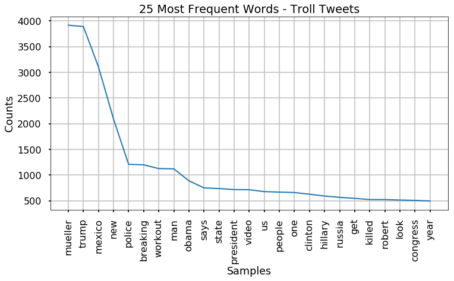


```python
# pause
```

### Generating WordClouds


```python
from wordcloud import WordCloud
# wordcloud.stopwords=[]
# wordcloud.collocations=False
max_font_size=100
width=400
height=400
max_words=100
background_color='white'
cloud_stopwords=[]
collocations=False

def plot_fit_cloud(troll_cloud,contr_cloud,label1='Control',label2='Troll'):
    fig,ax = plt.subplots(nrows=1,ncols=2,figsize=(18,18))

    ax[0].imshow(troll_cloud, interpolation='gaussian')
    # ax[0].set_aspect(1.5)
    ax[0].axis("off")
    ax[0].set_title(label1, fontsize=40)

    ax[1].imshow(contr_cloud, interpolation='bilinear',)
    # ax[1].set_aspect(1.5)
    ax[1].axis("off")
    ax[1].set_title(label2, fontsize=40)
    plt.tight_layout()
    return fig, ax
```


```python
from PIL import Image

## Twitter Bird masks
mask_f_right = np.array(Image.open('figures/masks/twitter1.png'))
mask_f_left = np.array(Image.open('figures/masks/twitter1flip.png'))

# Hashtag and mentions mask 
mask_at = np.array(Image.open('figures/masks/Hashtags and Ats Masks-04.jpg'))
mask_hashtag = np.array(Image.open('figures/masks/Hashtags and Ats Masks-03.jpg'))
# plt.imshow(mask_hashtag)
```


```python
# Create a WordCloud for each group and then plot
troll_cloud = WordCloud(max_font_size=max_font_size, width=width, height=height, max_words=max_words, background_color=background_color,
                        stopwords=cloud_stopwords,collocations=collocations,
                       mask=mask_f_left, contour_color='cornflowerblue', contour_width=2)

contr_cloud = WordCloud(max_font_size=max_font_size, width=width, height=height, max_words=max_words, background_color=background_color,
                        stopwords=cloud_stopwords,collocations=collocations,
                       mask=mask_f_right, contour_color='cornflowerblue', contour_width=2)


TEXT = get_group_texts_tokens(df_small)
troll_cloud.generate(TEXT['trolls']['text'])
contr_cloud.generate(TEXT['controls']['text'])

fig,ax = plot_fit_cloud(contr_cloud, troll_cloud)
```

    dict_keys(['controls', 'trolls']):['tokens']|['text']
    


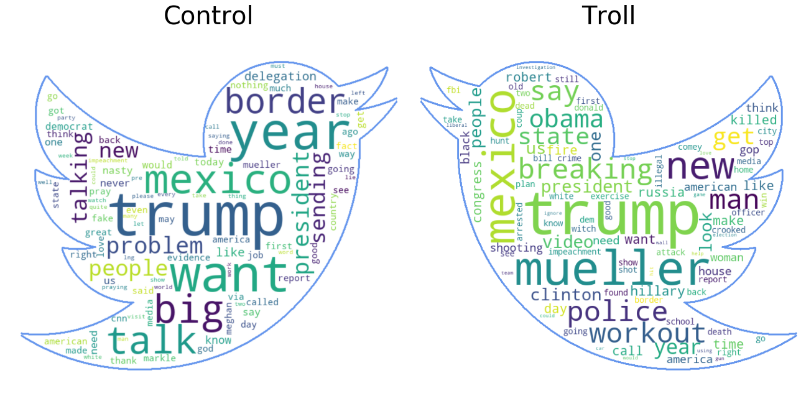


### Wordclouds for Hashtags


```python
# Issue of empty entries for hashtags interfering with joining.
def empty_lists_to_strings(x):
    """Takes a series and replaces any empty lists with an empty string instead."""
    if len(x)==0:
        return ' '
    else:
        return ' '.join(x) #' '.join(tokens)
    
    
# Apply empty_lists_to_strings    
df_small['hashtag_strings'] = df_small['content_hashtags'].apply(lambda x: empty_lists_to_strings(x))
```


```python
## createing a wordcloud for the hashtags section 
from nltk import regexp_tokenize
tags_troll = df_small.groupby('troll_tweet').get_group(1)['content_hashtags']#.apply(lambda x:) #.to_list() 
tags_contr = df_small.groupby('troll_tweet').get_group(0)['content_hashtags']#.to_list()#.str

tags_troll = ' '.join(tags_troll)
tags_contr = ' '.join(tags_contr)

troll_hash_tokens = regexp_tokenize(tags_troll,'(#\w*)')
contr_hash_tokens = regexp_tokenize(tags_contr,'(#\w*)')
```


```python
# WordClouds for Hashtags
max_font_size=300
width=400
height=400
max_words=200
background_color='white'
cloud_stopwords=[]
collocations=False
regexp=r'(#\w*)'
# include_numbers =True

contr_tag_cloud = WordCloud(max_font_size=max_font_size, width=width, height=height,
                            max_words=max_words, background_color=background_color,
                        stopwords=cloud_stopwords,collocations=collocations,
                            regexp=regexp,mask=mask_hashtag, contour_color='black', contour_width=2)#, include_numbers=True)

troll_tag_cloud = WordCloud(max_font_size=max_font_size, width=width, height=height,
                            max_words=max_words, background_color=background_color,
                        stopwords=cloud_stopwords,collocations=collocations,
                            regexp=regexp, mask=mask_hashtag, contour_color='black', contour_width=2)#, include_numbers=True)


troll_tag_cloud.generate(' '.join(troll_hash_tokens))
contr_tag_cloud.generate(' '.join(contr_hash_tokens))

plot_fit_cloud(contr_tag_cloud, troll_tag_cloud)
```


    (<Figure size 1296x1296 with 2 Axes>,
     array([<matplotlib.axes._subplots.AxesSubplot object at 0x000001FACB276860>,
            <matplotlib.axes._subplots.AxesSubplot object at 0x000001FACB26FEF0>],
           dtype=object))


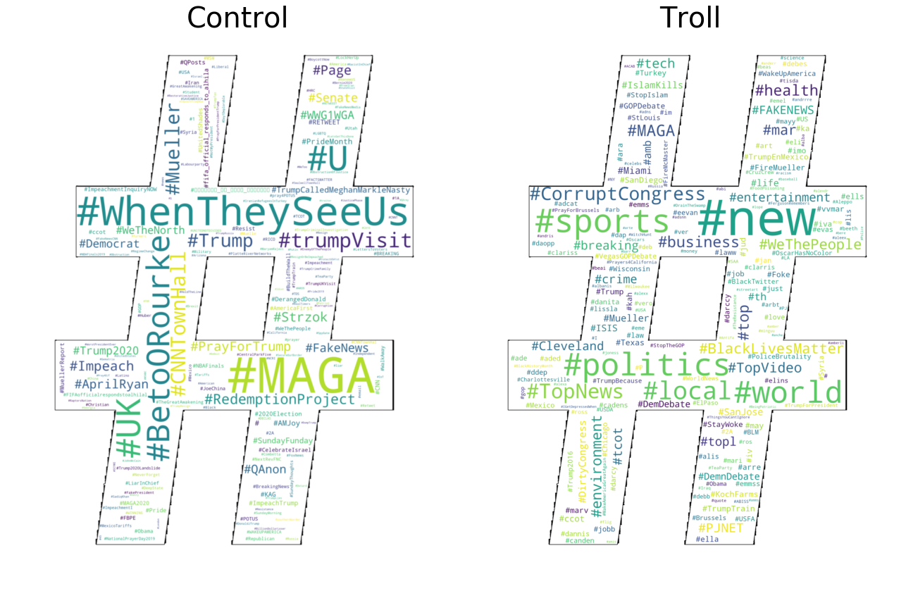


### Wordclouds for @'s


```python
## createing a wordcloud for the hashtags section 
from nltk import regexp_tokenize
ats_troll = df_small.groupby('troll_tweet').get_group(1)['content_mentions']#.apply(lambda x:) #.to_list() 
ats_contr = df_small.groupby('troll_tweet').get_group(0)['content_mentions']#.to_list()#.str

tags_troll = ' '.join(ats_troll)
tags_contr = ' '.join(ats_contr)

troll_ats_tokens = regexp_tokenize(tags_troll,'(@\w*)')
contr_ats_tokens = regexp_tokenize(tags_contr,'(@\w*)')
# troll_ats_tokens[:10], contr_ats_tokens[:10]
```


```python
# WordClouds for mENTIONS
max_font_size=200
width=300
height=300
max_words=200
background_color='white'
cloud_stopwords=[]
collocations=False
regexp=r'(@\w*)'
# include_numbers =True

troll_at_cloud = WordCloud(max_font_size=max_font_size, width=width, height=height,
                            max_words=max_words, background_color=background_color,
                        stopwords=cloud_stopwords,collocations=collocations,
                            regexp=regexp, mask=mask_at, contour_color='black', contour_width=2,
                          prefer_horizontal=0.5)#, include_numbers=True)


contr_at_cloud = WordCloud(max_font_size=max_font_size, width=width, height=height,
                            max_words=max_words, background_color=background_color,
                        stopwords=cloud_stopwords,collocations=collocations,
                            regexp=regexp,mask=mask_at, contour_color='black', contour_width=2,
                          prefer_horizontal=0.5)#, include_numbers=True)


troll_at_cloud.generate(' '.join(troll_ats_tokens))
contr_at_cloud.generate(' '.join(contr_ats_tokens))

plot_fit_cloud(contr_at_cloud,troll_at_cloud)
```


    (<Figure size 1296x1296 with 2 Axes>,
     array([<matplotlib.axes._subplots.AxesSubplot object at 0x000001FACB68C9B0>,
            <matplotlib.axes._subplots.AxesSubplot object at 0x000001FACB686A58>],
           dtype=object))


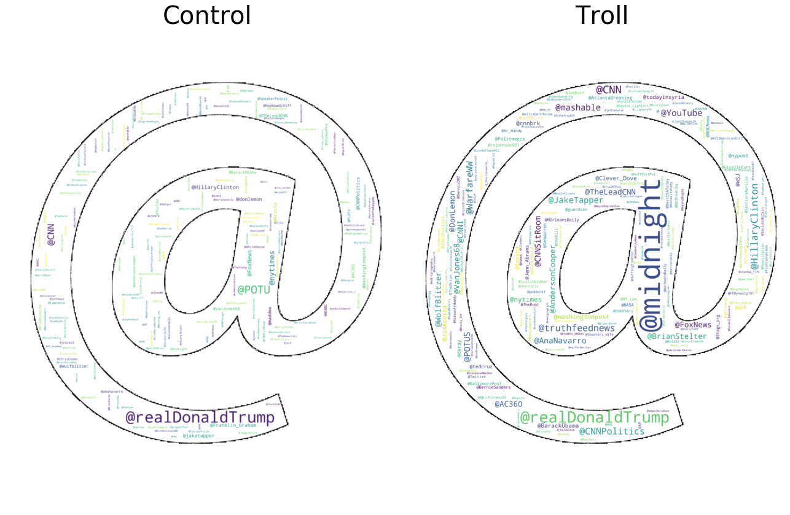


## Creating Bigrams and PMI scores

### Bigrams


```python
from nltk.collocations import BigramAssocMeasures, BigramCollocationFinder, TrigramAssocMeasures, TrigramCollocationFinder
import mod4functions_JMI as jmi
```


```python
bigram_measures =BigramAssocMeasures()

troll_finder = BigramCollocationFinder.from_words(TEXT['trolls']['tokens'])
troll_scored = troll_finder.score_ngrams(bigram_measures.raw_freq)

contr_finder = BigramCollocationFinder.from_words(TEXT['controls']['tokens'])
contr_scored = contr_finder.score_ngrams(bigram_measures.raw_freq)
```


```python
mindex = pd.MultiIndex(levels=[['Control','Troll'],['Bigram','Frequency']],codes=[[0,0,1,1],[0,1,0,1]])

df_1 = jmi.quick_table(contr_scored[:25], col_names =['Bigram','Frequency'],caption='Control Tweet Bigrams', display_df=False);
df_2 = jmi.quick_table(troll_scored[:25], col_names =['Bigram','Frequency'],caption='Troll Tweet Bigrams',display_df=False);

sdf1 = df_1.set_index('Bigram').style.set_caption('Control Tweet Bigrams')
sdf2 = df_2.set_index('Bigram').style.set_caption('Troll Tweet Bigrams')
# df_compare = pd.concat([df_1,df_2],axis=1)
# df_compare.columns=mindex
bs.display_side_by_side(sdf1, sdf2)
```


&nbsp;<style  type="text/css" >
</style><table style="display:inline" id="T_369b4ac0_d4ad_11e9_977e_f48e38b6371f" ><caption>Control Tweet Bigrams</caption><thead>    <tr>        <th class="blank level0" ></th>        <th class="col_heading level0 col0" >Frequency</th>    </tr>    <tr>        <th class="index_name level0" >Bigram</th>        <th class="blank" ></th>    </tr></thead><tbody>
                <tr>
                        <th id="T_369b4ac0_d4ad_11e9_977e_f48e38b6371flevel0_row0" class="row_heading level0 row0" >('border', 'problem')</th>
                        <td id="T_369b4ac0_d4ad_11e9_977e_f48e38b6371frow0_col0" class="data row0 col0" >0.00571695</td>
            </tr>
            <tr>
                        <th id="T_369b4ac0_d4ad_11e9_977e_f48e38b6371flevel0_row1" class="row_heading level0 row1" >('big', 'delegation')</th>
                        <td id="T_369b4ac0_d4ad_11e9_977e_f48e38b6371frow1_col0" class="data row1 col0" >0.00569424</td>
            </tr>
            <tr>
                        <th id="T_369b4ac0_d4ad_11e9_977e_f48e38b6371flevel0_row2" class="row_heading level0 row2" >('talking', 'years')</th>
                        <td id="T_369b4ac0_d4ad_11e9_977e_f48e38b6371frow2_col0" class="data row2 col0" >0.0056914</td>
            </tr>
            <tr>
                        <th id="T_369b4ac0_d4ad_11e9_977e_f48e38b6371flevel0_row3" class="row_heading level0 row3" >('sending', 'big')</th>
                        <td id="T_369b4ac0_d4ad_11e9_977e_f48e38b6371frow3_col0" class="data row3 col0" >0.00568572</td>
            </tr>
            <tr>
                        <th id="T_369b4ac0_d4ad_11e9_977e_f48e38b6371flevel0_row4" class="row_heading level0 row4" >('talk', 'border')</th>
                        <td id="T_369b4ac0_d4ad_11e9_977e_f48e38b6371frow4_col0" class="data row4 col0" >0.00568572</td>
            </tr>
            <tr>
                        <th id="T_369b4ac0_d4ad_11e9_977e_f48e38b6371flevel0_row5" class="row_heading level0 row5" >('years', 'want')</th>
                        <td id="T_369b4ac0_d4ad_11e9_977e_f48e38b6371frow5_col0" class="data row5 col0" >0.00568572</td>
            </tr>
            <tr>
                        <th id="T_369b4ac0_d4ad_11e9_977e_f48e38b6371flevel0_row6" class="row_heading level0 row6" >('delegation', 'talk')</th>
                        <td id="T_369b4ac0_d4ad_11e9_977e_f48e38b6371frow6_col0" class="data row6 col0" >0.00568288</td>
            </tr>
            <tr>
                        <th id="T_369b4ac0_d4ad_11e9_977e_f48e38b6371flevel0_row7" class="row_heading level0 row7" >('mexico', 'sending')</th>
                        <td id="T_369b4ac0_d4ad_11e9_977e_f48e38b6371frow7_col0" class="data row7 col0" >0.00568288</td>
            </tr>
            <tr>
                        <th id="T_369b4ac0_d4ad_11e9_977e_f48e38b6371flevel0_row8" class="row_heading level0 row8" >('problem', 'talking')</th>
                        <td id="T_369b4ac0_d4ad_11e9_977e_f48e38b6371frow8_col0" class="data row8 col0" >0.00568288</td>
            </tr>
            <tr>
                        <th id="T_369b4ac0_d4ad_11e9_977e_f48e38b6371flevel0_row9" class="row_heading level0 row9" >('fake', 'news')</th>
                        <td id="T_369b4ac0_d4ad_11e9_977e_f48e38b6371frow9_col0" class="data row9 col0" >0.00184509</td>
            </tr>
            <tr>
                        <th id="T_369b4ac0_d4ad_11e9_977e_f48e38b6371flevel0_row10" class="row_heading level0 row10" >('meghan', 'markle')</th>
                        <td id="T_369b4ac0_d4ad_11e9_977e_f48e38b6371frow10_col0" class="data row10 col0" >0.00183658</td>
            </tr>
            <tr>
                        <th id="T_369b4ac0_d4ad_11e9_977e_f48e38b6371flevel0_row11" class="row_heading level0 row11" >('markle', 'nasty')</th>
                        <td id="T_369b4ac0_d4ad_11e9_977e_f48e38b6371frow11_col0" class="data row11 col0" >0.00167761</td>
            </tr>
            <tr>
                        <th id="T_369b4ac0_d4ad_11e9_977e_f48e38b6371flevel0_row12" class="row_heading level0 row12" >('never', 'called')</th>
                        <td id="T_369b4ac0_d4ad_11e9_977e_f48e38b6371frow12_col0" class="data row12 col0" >0.00156975</td>
            </tr>
            <tr>
                        <th id="T_369b4ac0_d4ad_11e9_977e_f48e38b6371flevel0_row13" class="row_heading level0 row13" >('called', 'meghan')</th>
                        <td id="T_369b4ac0_d4ad_11e9_977e_f48e38b6371frow13_col0" class="data row13 col0" >0.00155555</td>
            </tr>
            <tr>
                        <th id="T_369b4ac0_d4ad_11e9_977e_f48e38b6371flevel0_row14" class="row_heading level0 row14" >('want', 'mexico')</th>
                        <td id="T_369b4ac0_d4ad_11e9_977e_f48e38b6371frow14_col0" class="data row14 col0" >0.00131143</td>
            </tr>
            <tr>
                        <th id="T_369b4ac0_d4ad_11e9_977e_f48e38b6371flevel0_row15" class="row_heading level0 row15" >('news', 'media')</th>
                        <td id="T_369b4ac0_d4ad_11e9_977e_f48e38b6371frow15_col0" class="data row15 col0" >0.00120641</td>
            </tr>
            <tr>
                        <th id="T_369b4ac0_d4ad_11e9_977e_f48e38b6371flevel0_row16" class="row_heading level0 row16" >('got', 'caught')</th>
                        <td id="T_369b4ac0_d4ad_11e9_977e_f48e38b6371frow16_col0" class="data row16 col0" >0.00118086</td>
            </tr>
            <tr>
                        <th id="T_369b4ac0_d4ad_11e9_977e_f48e38b6371flevel0_row17" class="row_heading level0 row17" >('caught', 'cold')</th>
                        <td id="T_369b4ac0_d4ad_11e9_977e_f48e38b6371frow17_col0" class="data row17 col0" >0.00117518</td>
            </tr>
            <tr>
                        <th id="T_369b4ac0_d4ad_11e9_977e_f48e38b6371flevel0_row18" class="row_heading level0 row18" >('made', 'fake')</th>
                        <td id="T_369b4ac0_d4ad_11e9_977e_f48e38b6371frow18_col0" class="data row18 col0" >0.00116383</td>
            </tr>
            <tr>
                        <th id="T_369b4ac0_d4ad_11e9_977e_f48e38b6371flevel0_row19" class="row_heading level0 row19" >('president', 'trump')</th>
                        <td id="T_369b4ac0_d4ad_11e9_977e_f48e38b6371frow19_col0" class="data row19 col0" >0.00116099</td>
            </tr>
            <tr>
                        <th id="T_369b4ac0_d4ad_11e9_977e_f48e38b6371flevel0_row20" class="row_heading level0 row20" >('media', 'got')</th>
                        <td id="T_369b4ac0_d4ad_11e9_977e_f48e38b6371frow20_col0" class="data row20 col0" >0.00115815</td>
            </tr>
            <tr>
                        <th id="T_369b4ac0_d4ad_11e9_977e_f48e38b6371flevel0_row21" class="row_heading level0 row21" >('nasty', 'made')</th>
                        <td id="T_369b4ac0_d4ad_11e9_977e_f48e38b6371frow21_col0" class="data row21 col0" >0.00115815</td>
            </tr>
            <tr>
                        <th id="T_369b4ac0_d4ad_11e9_977e_f48e38b6371flevel0_row22" class="row_heading level0 row22" >('eyes', 'ears')</th>
                        <td id="T_369b4ac0_d4ad_11e9_977e_f48e38b6371frow22_col0" class="data row22 col0" >0.00112693</td>
            </tr>
            <tr>
                        <th id="T_369b4ac0_d4ad_11e9_977e_f48e38b6371flevel0_row23" class="row_heading level0 row23" >('pres', 'trump')</th>
                        <td id="T_369b4ac0_d4ad_11e9_977e_f48e38b6371frow23_col0" class="data row23 col0" >0.00111841</td>
            </tr>
            <tr>
                        <th id="T_369b4ac0_d4ad_11e9_977e_f48e38b6371flevel0_row24" class="row_heading level0 row24" >('evidence', 'eyes')</th>
                        <td id="T_369b4ac0_d4ad_11e9_977e_f48e38b6371frow24_col0" class="data row24 col0" >0.00111557</td>
            </tr>
    </tbody></table style="display:inline">&nbsp;<style  type="text/css" >
</style><table style="display:inline" id="T_369c8336_d4ad_11e9_8477_f48e38b6371f" ><caption>Troll Tweet Bigrams</caption><thead>    <tr>        <th class="blank level0" ></th>        <th class="col_heading level0 col0" >Frequency</th>    </tr>    <tr>        <th class="index_name level0" >Bigram</th>        <th class="blank" ></th>    </tr></thead><tbody>
                <tr>
                        <th id="T_369c8336_d4ad_11e9_8477_f48e38b6371flevel0_row0" class="row_heading level0 row0" >('new', 'mexico')</th>
                        <td id="T_369c8336_d4ad_11e9_8477_f48e38b6371frow0_col0" class="data row0 col0" >0.00338416</td>
            </tr>
            <tr>
                        <th id="T_369c8336_d4ad_11e9_8477_f48e38b6371flevel0_row1" class="row_heading level0 row1" >('robert', 'mueller')</th>
                        <td id="T_369c8336_d4ad_11e9_8477_f48e38b6371frow1_col0" class="data row1 col0" >0.00168116</td>
            </tr>
            <tr>
                        <th id="T_369c8336_d4ad_11e9_8477_f48e38b6371flevel0_row2" class="row_heading level0 row2" >('witch', 'hunt')</th>
                        <td id="T_369c8336_d4ad_11e9_8477_f48e38b6371frow2_col0" class="data row2 col0" >0.00112805</td>
            </tr>
            <tr>
                        <th id="T_369c8336_d4ad_11e9_8477_f48e38b6371flevel0_row3" class="row_heading level0 row3" >('crooked', 'mueller')</th>
                        <td id="T_369c8336_d4ad_11e9_8477_f48e38b6371frow3_col0" class="data row3 col0" >0.000967941</td>
            </tr>
            <tr>
                        <th id="T_369c8336_d4ad_11e9_8477_f48e38b6371flevel0_row4" class="row_heading level0 row4" >('donald', 'trump')</th>
                        <td id="T_369c8336_d4ad_11e9_8477_f48e38b6371frow4_col0" class="data row4 col0" >0.000949747</td>
            </tr>
            <tr>
                        <th id="T_369c8336_d4ad_11e9_8477_f48e38b6371flevel0_row5" class="row_heading level0 row5" >('year', 'old')</th>
                        <td id="T_369c8336_d4ad_11e9_8477_f48e38b6371frow5_col0" class="data row5 col0" >0.000949747</td>
            </tr>
            <tr>
                        <th id="T_369c8336_d4ad_11e9_8477_f48e38b6371flevel0_row6" class="row_heading level0 row6" >('president', 'trump')</th>
                        <td id="T_369c8336_d4ad_11e9_8477_f48e38b6371frow6_col0" class="data row6 col0" >0.000822386</td>
            </tr>
            <tr>
                        <th id="T_369c8336_d4ad_11e9_8477_f48e38b6371flevel0_row7" class="row_heading level0 row7" >('ignores', 'mueller')</th>
                        <td id="T_369c8336_d4ad_11e9_8477_f48e38b6371frow7_col0" class="data row7 col0" >0.000785998</td>
            </tr>
            <tr>
                        <th id="T_369c8336_d4ad_11e9_8477_f48e38b6371flevel0_row8" class="row_heading level0 row8" >('grand', 'jury')</th>
                        <td id="T_369c8336_d4ad_11e9_8477_f48e38b6371frow8_col0" class="data row8 col0" >0.000775081</td>
            </tr>
            <tr>
                        <th id="T_369c8336_d4ad_11e9_8477_f48e38b6371flevel0_row9" class="row_heading level0 row9" >('coup', 'using')</th>
                        <td id="T_369c8336_d4ad_11e9_8477_f48e38b6371frow9_col0" class="data row9 col0" >0.000753248</td>
            </tr>
            <tr>
                        <th id="T_369c8336_d4ad_11e9_8477_f48e38b6371flevel0_row10" class="row_heading level0 row10" >('approval', 'tanks')</th>
                        <td id="T_369c8336_d4ad_11e9_8477_f48e38b6371frow10_col0" class="data row10 col0" >0.000724137</td>
            </tr>
            <tr>
                        <th id="T_369c8336_d4ad_11e9_8477_f48e38b6371flevel0_row11" class="row_heading level0 row11" >('tanks', 'gt')</th>
                        <td id="T_369c8336_d4ad_11e9_8477_f48e38b6371frow11_col0" class="data row11 col0" >0.000724137</td>
            </tr>
            <tr>
                        <th id="T_369c8336_d4ad_11e9_8477_f48e38b6371flevel0_row12" class="row_heading level0 row12" >('mueller', 'credibility')</th>
                        <td id="T_369c8336_d4ad_11e9_8477_f48e38b6371frow12_col0" class="data row12 col0" >0.000698665</td>
            </tr>
            <tr>
                        <th id="T_369c8336_d4ad_11e9_8477_f48e38b6371flevel0_row13" class="row_heading level0 row13" >('rosenstein', 'mueller')</th>
                        <td id="T_369c8336_d4ad_11e9_8477_f48e38b6371frow13_col0" class="data row13 col0" >0.000698665</td>
            </tr>
            <tr>
                        <th id="T_369c8336_d4ad_11e9_8477_f48e38b6371flevel0_row14" class="row_heading level0 row14" >('deep', 'state')</th>
                        <td id="T_369c8336_d4ad_11e9_8477_f48e38b6371frow14_col0" class="data row14 col0" >0.000651359</td>
            </tr>
            <tr>
                        <th id="T_369c8336_d4ad_11e9_8477_f48e38b6371flevel0_row15" class="row_heading level0 row15" >('lose', 'weight')</th>
                        <td id="T_369c8336_d4ad_11e9_8477_f48e38b6371frow15_col0" class="data row15 col0" >0.000644081</td>
            </tr>
            <tr>
                        <th id="T_369c8336_d4ad_11e9_8477_f48e38b6371flevel0_row16" class="row_heading level0 row16" >('special', 'counsel')</th>
                        <td id="T_369c8336_d4ad_11e9_8477_f48e38b6371frow16_col0" class="data row16 col0" >0.000618609</td>
            </tr>
            <tr>
                        <th id="T_369c8336_d4ad_11e9_8477_f48e38b6371flevel0_row17" class="row_heading level0 row17" >('credibility', 'think')</th>
                        <td id="T_369c8336_d4ad_11e9_8477_f48e38b6371frow17_col0" class="data row17 col0" >0.00058222</td>
            </tr>
            <tr>
                        <th id="T_369c8336_d4ad_11e9_8477_f48e38b6371flevel0_row18" class="row_heading level0 row18" >('mexico', 'border')</th>
                        <td id="T_369c8336_d4ad_11e9_8477_f48e38b6371frow18_col0" class="data row18 col0" >0.000571304</td>
            </tr>
            <tr>
                        <th id="T_369c8336_d4ad_11e9_8477_f48e38b6371flevel0_row19" class="row_heading level0 row19" >('white', 'house')</th>
                        <td id="T_369c8336_d4ad_11e9_8477_f48e38b6371frow19_col0" class="data row19 col0" >0.000567665</td>
            </tr>
            <tr>
                        <th id="T_369c8336_d4ad_11e9_8477_f48e38b6371flevel0_row20" class="row_heading level0 row20" >('attempts', 'coup')</th>
                        <td id="T_369c8336_d4ad_11e9_8477_f48e38b6371frow20_col0" class="data row20 col0" >0.000556748</td>
            </tr>
            <tr>
                        <th id="T_369c8336_d4ad_11e9_8477_f48e38b6371flevel0_row21" class="row_heading level0 row21" >('gt', 'attempts')</th>
                        <td id="T_369c8336_d4ad_11e9_8477_f48e38b6371frow21_col0" class="data row21 col0" >0.000556748</td>
            </tr>
            <tr>
                        <th id="T_369c8336_d4ad_11e9_8477_f48e38b6371flevel0_row22" class="row_heading level0 row22" >('mueller', 'witch')</th>
                        <td id="T_369c8336_d4ad_11e9_8477_f48e38b6371frow22_col0" class="data row22 col0" >0.000505804</td>
            </tr>
            <tr>
                        <th id="T_369c8336_d4ad_11e9_8477_f48e38b6371flevel0_row23" class="row_heading level0 row23" >('hillary', 'clinton')</th>
                        <td id="T_369c8336_d4ad_11e9_8477_f48e38b6371frow23_col0" class="data row23 col0" >0.000491248</td>
            </tr>
            <tr>
                        <th id="T_369c8336_d4ad_11e9_8477_f48e38b6371flevel0_row24" class="row_heading level0 row24" >('crimes', 'obama')</th>
                        <td id="T_369c8336_d4ad_11e9_8477_f48e38b6371frow24_col0" class="data row24 col0" >0.000473054</td>
            </tr>
    </tbody></table style="display:inline">


### Pointwise Mutual Information Score
- Interesting, but heavily influenced by the different time periods.


```python
troll_pmi_finder = BigramCollocationFinder.from_words(TEXT['trolls']['tokens'])
troll_pmi_finder.apply_freq_filter(5)

troll_pmi_scored = troll_pmi_finder.score_ngrams(bigram_measures.pmi)
troll_pmi_df = pd.DataFrame.from_records(troll_pmi_scored[:20],columns=['Bigrams','PMI Score'])

# display(troll_pmi_df.style.set_caption('Troll Tweets'))
sdf1 = troll_pmi_df.set_index('Bigrams').style.set_caption('Troll Tweets')
# quick_table(troll_pmi_scored)
```


```python
contr_pmi_finder = BigramCollocationFinder.from_words(TEXT['controls']['tokens'])
contr_pmi_finder.apply_freq_filter(5)
contr_pmi_scored = contr_pmi_finder.score_ngrams(bigram_measures.pmi)

# contr_pmi_scored
contr_pmi_df = pd.DataFrame.from_records(contr_pmi_scored[:20], columns=['Bigrams','PMI Score'])

# display(contr_pmi_df.style.set_caption('Control Tweets'))
sdf2 = contr_pmi_df.set_index('Bigrams').style.set_caption('Control Tweets')
bs.display_side_by_side(sdf2, sdf1)
```


&nbsp;<style  type="text/css" >
</style><table style="display:inline" id="T_37949fa2_d4ad_11e9_85b6_f48e38b6371f" ><caption>Control Tweets</caption><thead>    <tr>        <th class="blank level0" ></th>        <th class="col_heading level0 col0" >PMI Score</th>    </tr>    <tr>        <th class="index_name level0" >Bigrams</th>        <th class="blank" ></th>    </tr></thead><tbody>
                <tr>
                        <th id="T_37949fa2_d4ad_11e9_85b6_f48e38b6371flevel0_row0" class="row_heading level0 row0" >('disappearance', 'connecticut')</th>
                        <td id="T_37949fa2_d4ad_11e9_85b6_f48e38b6371frow0_col0" class="data row0 col0" >16.1045</td>
            </tr>
            <tr>
                        <th id="T_37949fa2_d4ad_11e9_85b6_f48e38b6371flevel0_row1" class="row_heading level0 row1" >('glen', 'tyrone')</th>
                        <td id="T_37949fa2_d4ad_11e9_85b6_f48e38b6371frow1_col0" class="data row1 col0" >16.1045</td>
            </tr>
            <tr>
                        <th id="T_37949fa2_d4ad_11e9_85b6_f48e38b6371flevel0_row2" class="row_heading level0 row2" >('uscis', 'ignor')</th>
                        <td id="T_37949fa2_d4ad_11e9_85b6_f48e38b6371frow2_col0" class="data row2 col0" >16.1045</td>
            </tr>
            <tr>
                        <th id="T_37949fa2_d4ad_11e9_85b6_f48e38b6371flevel0_row3" class="row_heading level0 row3" >('advisers', 'departing')</th>
                        <td id="T_37949fa2_d4ad_11e9_85b6_f48e38b6371frow3_col0" class="data row3 col0" >15.8414</td>
            </tr>
            <tr>
                        <th id="T_37949fa2_d4ad_11e9_85b6_f48e38b6371flevel0_row4" class="row_heading level0 row4" >('babyhands', 'mcgrifter')</th>
                        <td id="T_37949fa2_d4ad_11e9_85b6_f48e38b6371frow4_col0" class="data row4 col0" >15.8414</td>
            </tr>
            <tr>
                        <th id="T_37949fa2_d4ad_11e9_85b6_f48e38b6371flevel0_row5" class="row_heading level0 row5" >('bryan', 'stevenson')</th>
                        <td id="T_37949fa2_d4ad_11e9_85b6_f48e38b6371frow5_col0" class="data row5 col0" >15.8414</td>
            </tr>
            <tr>
                        <th id="T_37949fa2_d4ad_11e9_85b6_f48e38b6371flevel0_row6" class="row_heading level0 row6" >('computer', 'intrusions')</th>
                        <td id="T_37949fa2_d4ad_11e9_85b6_f48e38b6371frow6_col0" class="data row6 col0" >15.8414</td>
            </tr>
            <tr>
                        <th id="T_37949fa2_d4ad_11e9_85b6_f48e38b6371flevel0_row7" class="row_heading level0 row7" >('grounding', 'airline')</th>
                        <td id="T_37949fa2_d4ad_11e9_85b6_f48e38b6371frow7_col0" class="data row7 col0" >15.8414</td>
            </tr>
            <tr>
                        <th id="T_37949fa2_d4ad_11e9_85b6_f48e38b6371flevel0_row8" class="row_heading level0 row8" >('haberman', 'sycophancy')</th>
                        <td id="T_37949fa2_d4ad_11e9_85b6_f48e38b6371frow8_col0" class="data row8 col0" >15.8414</td>
            </tr>
            <tr>
                        <th id="T_37949fa2_d4ad_11e9_85b6_f48e38b6371flevel0_row9" class="row_heading level0 row9" >('intimidating', 'construc')</th>
                        <td id="T_37949fa2_d4ad_11e9_85b6_f48e38b6371frow9_col0" class="data row9 col0" >15.8414</td>
            </tr>
            <tr>
                        <th id="T_37949fa2_d4ad_11e9_85b6_f48e38b6371flevel0_row10" class="row_heading level0 row10" >('rio', 'grande')</th>
                        <td id="T_37949fa2_d4ad_11e9_85b6_f48e38b6371frow10_col0" class="data row10 col0" >15.8414</td>
            </tr>
            <tr>
                        <th id="T_37949fa2_d4ad_11e9_85b6_f48e38b6371flevel0_row11" class="row_heading level0 row11" >('capone', 'vault')</th>
                        <td id="T_37949fa2_d4ad_11e9_85b6_f48e38b6371frow11_col0" class="data row11 col0" >15.619</td>
            </tr>
            <tr>
                        <th id="T_37949fa2_d4ad_11e9_85b6_f48e38b6371flevel0_row12" class="row_heading level0 row12" >('hs', 'bp')</th>
                        <td id="T_37949fa2_d4ad_11e9_85b6_f48e38b6371frow12_col0" class="data row12 col0" >15.619</td>
            </tr>
            <tr>
                        <th id="T_37949fa2_d4ad_11e9_85b6_f48e38b6371flevel0_row13" class="row_heading level0 row13" >('partnership', 'racing')</th>
                        <td id="T_37949fa2_d4ad_11e9_85b6_f48e38b6371frow13_col0" class="data row13 col0" >15.619</td>
            </tr>
            <tr>
                        <th id="T_37949fa2_d4ad_11e9_85b6_f48e38b6371flevel0_row14" class="row_heading level0 row14" >('racing', 'airs')</th>
                        <td id="T_37949fa2_d4ad_11e9_85b6_f48e38b6371frow14_col0" class="data row14 col0" >15.619</td>
            </tr>
            <tr>
                        <th id="T_37949fa2_d4ad_11e9_85b6_f48e38b6371flevel0_row15" class="row_heading level0 row15" >('riskier', 'bureaucracy')</th>
                        <td id="T_37949fa2_d4ad_11e9_85b6_f48e38b6371frow15_col0" class="data row15 col0" >15.619</td>
            </tr>
            <tr>
                        <th id="T_37949fa2_d4ad_11e9_85b6_f48e38b6371flevel0_row16" class="row_heading level0 row16" >('rweet', 'apprec')</th>
                        <td id="T_37949fa2_d4ad_11e9_85b6_f48e38b6371frow16_col0" class="data row16 col0" >15.619</td>
            </tr>
            <tr>
                        <th id="T_37949fa2_d4ad_11e9_85b6_f48e38b6371flevel0_row17" class="row_heading level0 row17" >('unprepared', 'temperamentally')</th>
                        <td id="T_37949fa2_d4ad_11e9_85b6_f48e38b6371frow17_col0" class="data row17 col0" >15.619</td>
            </tr>
            <tr>
                        <th id="T_37949fa2_d4ad_11e9_85b6_f48e38b6371flevel0_row18" class="row_heading level0 row18" >('vr', 'arcade')</th>
                        <td id="T_37949fa2_d4ad_11e9_85b6_f48e38b6371frow18_col0" class="data row18 col0" >15.619</td>
            </tr>
            <tr>
                        <th id="T_37949fa2_d4ad_11e9_85b6_f48e38b6371flevel0_row19" class="row_heading level0 row19" >('bites', 'dust')</th>
                        <td id="T_37949fa2_d4ad_11e9_85b6_f48e38b6371frow19_col0" class="data row19 col0" >15.5784</td>
            </tr>
    </tbody></table style="display:inline">&nbsp;<style  type="text/css" >
</style><table style="display:inline" id="T_37956258_d4ad_11e9_b349_f48e38b6371f" ><caption>Troll Tweets</caption><thead>    <tr>        <th class="blank level0" ></th>        <th class="col_heading level0 col0" >PMI Score</th>    </tr>    <tr>        <th class="index_name level0" >Bigrams</th>        <th class="blank" ></th>    </tr></thead><tbody>
                <tr>
                        <th id="T_37956258_d4ad_11e9_b349_f48e38b6371flevel0_row0" class="row_heading level0 row0" >('cessation', 'hostilities')</th>
                        <td id="T_37956258_d4ad_11e9_b349_f48e38b6371frow0_col0" class="data row0 col0" >15.7461</td>
            </tr>
            <tr>
                        <th id="T_37956258_d4ad_11e9_b349_f48e38b6371flevel0_row1" class="row_heading level0 row1" >('dunkin', 'donuts')</th>
                        <td id="T_37956258_d4ad_11e9_b349_f48e38b6371frow1_col0" class="data row1 col0" >15.7461</td>
            </tr>
            <tr>
                        <th id="T_37956258_d4ad_11e9_b349_f48e38b6371flevel0_row2" class="row_heading level0 row2" >('lena', 'dunham')</th>
                        <td id="T_37956258_d4ad_11e9_b349_f48e38b6371frow2_col0" class="data row2 col0" >15.7461</td>
            </tr>
            <tr>
                        <th id="T_37956258_d4ad_11e9_b349_f48e38b6371flevel0_row3" class="row_heading level0 row3" >('notre', 'dame')</th>
                        <td id="T_37956258_d4ad_11e9_b349_f48e38b6371frow3_col0" class="data row3 col0" >15.7461</td>
            </tr>
            <tr>
                        <th id="T_37956258_d4ad_11e9_b349_f48e38b6371flevel0_row4" class="row_heading level0 row4" >('snoop', 'dogg')</th>
                        <td id="T_37956258_d4ad_11e9_b349_f48e38b6371frow4_col0" class="data row4 col0" >15.7461</td>
            </tr>
            <tr>
                        <th id="T_37956258_d4ad_11e9_b349_f48e38b6371flevel0_row5" class="row_heading level0 row5" >('boko', 'haram')</th>
                        <td id="T_37956258_d4ad_11e9_b349_f48e38b6371frow5_col0" class="data row5 col0" >15.4831</td>
            </tr>
            <tr>
                        <th id="T_37956258_d4ad_11e9_b349_f48e38b6371flevel0_row6" class="row_heading level0 row6" >('lectric', 'heep')</th>
                        <td id="T_37956258_d4ad_11e9_b349_f48e38b6371frow6_col0" class="data row6 col0" >15.4831</td>
            </tr>
            <tr>
                        <th id="T_37956258_d4ad_11e9_b349_f48e38b6371flevel0_row7" class="row_heading level0 row7" >('nagorno', 'karabakh')</th>
                        <td id="T_37956258_d4ad_11e9_b349_f48e38b6371frow7_col0" class="data row7 col0" >15.4831</td>
            </tr>
            <tr>
                        <th id="T_37956258_d4ad_11e9_b349_f48e38b6371flevel0_row8" class="row_heading level0 row8" >('kayleigh', 'mcenany')</th>
                        <td id="T_37956258_d4ad_11e9_b349_f48e38b6371frow8_col0" class="data row8 col0" >15.2607</td>
            </tr>
            <tr>
                        <th id="T_37956258_d4ad_11e9_b349_f48e38b6371flevel0_row9" class="row_heading level0 row9" >('otto', 'warmbier')</th>
                        <td id="T_37956258_d4ad_11e9_b349_f48e38b6371frow9_col0" class="data row9 col0" >15.2607</td>
            </tr>
            <tr>
                        <th id="T_37956258_d4ad_11e9_b349_f48e38b6371flevel0_row10" class="row_heading level0 row10" >('allahu', 'akbar')</th>
                        <td id="T_37956258_d4ad_11e9_b349_f48e38b6371frow10_col0" class="data row10 col0" >15.0681</td>
            </tr>
            <tr>
                        <th id="T_37956258_d4ad_11e9_b349_f48e38b6371flevel0_row11" class="row_heading level0 row11" >('elon', 'musk')</th>
                        <td id="T_37956258_d4ad_11e9_b349_f48e38b6371frow11_col0" class="data row11 col0" >15.0681</td>
            </tr>
            <tr>
                        <th id="T_37956258_d4ad_11e9_b349_f48e38b6371flevel0_row12" class="row_heading level0 row12" >('ez', 'zor')</th>
                        <td id="T_37956258_d4ad_11e9_b349_f48e38b6371frow12_col0" class="data row12 col0" >15.0681</td>
            </tr>
            <tr>
                        <th id="T_37956258_d4ad_11e9_b349_f48e38b6371flevel0_row13" class="row_heading level0 row13" >('peanut', 'butter')</th>
                        <td id="T_37956258_d4ad_11e9_b349_f48e38b6371frow13_col0" class="data row13 col0" >15.0681</td>
            </tr>
            <tr>
                        <th id="T_37956258_d4ad_11e9_b349_f48e38b6371flevel0_row14" class="row_heading level0 row14" >('palo', 'alto')</th>
                        <td id="T_37956258_d4ad_11e9_b349_f48e38b6371frow14_col0" class="data row14 col0" >14.8981</td>
            </tr>
            <tr>
                        <th id="T_37956258_d4ad_11e9_b349_f48e38b6371flevel0_row15" class="row_heading level0 row15" >('tomi', 'lahren')</th>
                        <td id="T_37956258_d4ad_11e9_b349_f48e38b6371frow15_col0" class="data row15 col0" >14.8981</td>
            </tr>
            <tr>
                        <th id="T_37956258_d4ad_11e9_b349_f48e38b6371flevel0_row16" class="row_heading level0 row16" >('trey', 'gowdy')</th>
                        <td id="T_37956258_d4ad_11e9_b349_f48e38b6371frow16_col0" class="data row16 col0" >14.8981</td>
            </tr>
            <tr>
                        <th id="T_37956258_d4ad_11e9_b349_f48e38b6371flevel0_row17" class="row_heading level0 row17" >('betsy', 'devos')</th>
                        <td id="T_37956258_d4ad_11e9_b349_f48e38b6371frow17_col0" class="data row17 col0" >14.8457</td>
            </tr>
            <tr>
                        <th id="T_37956258_d4ad_11e9_b349_f48e38b6371flevel0_row18" class="row_heading level0 row18" >('caitlyn', 'jenner')</th>
                        <td id="T_37956258_d4ad_11e9_b349_f48e38b6371frow18_col0" class="data row18 col0" >14.7753</td>
            </tr>
            <tr>
                        <th id="T_37956258_d4ad_11e9_b349_f48e38b6371flevel0_row19" class="row_heading level0 row19" >('cranky', 'senile')</th>
                        <td id="T_37956258_d4ad_11e9_b349_f48e38b6371frow19_col0" class="data row19 col0" >14.7461</td>
            </tr>
    </tbody></table style="display:inline">


___

## Sentiment Analysis with VADER


```python
# import nltk
# nltk.download('vader_lexicon')

import bs_ds as bs
import mod4functions_JMI as jmi
from bs_ds.imports import *

df_small = pd.read_csv('df_small_equal_phrase_sampled_tweets.csv',encoding='utf-8',index_col=0)

```


```python
from nltk.sentiment.vader import SentimentIntensityAnalyzer
# df_tokenize = df_small

# Instantiate sid
sid = SentimentIntensityAnalyzer()

# Create a column of sentiment_scores
df_small['sentiment_scores'] = df_small['content_min_clean'].apply(lambda x: sid.polarity_scores(x))
# Returns:
# {'neg': 0.03, 'neu':0.2, 'pos':0.45, 'compound':0.34}

# To extract the compound scores (overall score)
df_small['compound_score'] = df_small['sentiment_scores'].apply(lambda dict: dict['compound'])

# TO simplify to a sentiment_class
df_small['sentiment_class'] = df_small['compound_score'].apply(lambda score: 'pos' if score >=0 else 'neg')
```


```python
# Write a function to extract the group scores from the dataframe
def get_group_sentiment_scores(df, score_col='sentiment_scores', groupby_col='troll_tweet', group_dict={0:'controls',1:'trolls'}):
    import pandas as pd
    series_df = df[score_col]
    series_neg = series_df.apply(lambda x: x['neg'])
    series_pos = series_df.apply(lambda x: x['pos'])
    series_neu = series_df.apply(lambda x: x['neu'])
    
    series_neg.name='neg'
    series_pos.name='pos'
    series_neu.name='neu'
    
    df = pd.concat([df,series_neg,series_neu,series_pos],axis=1)

#     troll_tweet = pd.Series(df[groupby_col])

#     group_scores = pd.concat([troll_tweet,series_pos, series_neu, series_neg], axis=1)  
#     group_scores.set_index(df.index)
#     group_scores.columns = [['troll_tweet','pos','neu','neg']]
    
    return df
```


```python
compound_scores = get_group_sentiment_scores(df_small)
```


```python
with plt.style.context('seaborn-poster'):
    fig,ax =plt.subplots()
    from scipy.stats import sem
    df_troll_res = compound_scores.groupby('troll_tweet')['neg','neu','pos'].get_group(1)
    df_contr_res = compound_scores.groupby('troll_tweet')['neg','neu','pos'].get_group(0)

    y_bars1 = np.mean(df_contr_res[['neg','neu','pos']])
    y_errbars1 = sem(df_contr_res[['neg','neu','pos']])
    y_bars2 = np.mean(df_troll_res[['neg','neu','pos']])
    y_errbars2 = sem(df_troll_res[['neg','neu','pos']])

    bar_width = 0.25
    bar1 = np.arange(len(y_bars1))
    bar2 = [x + bar_width for x in bar1]

    # bar_labels = bar1+0.5
    # bar3 = [x + bar_width for x in bar2]

    ax.bar(x=bar1,height=y_bars1, color='blue', width=bar_width, label = 'Control Tweets',yerr=y_errbars1)

    ax.bar(x=bar2,height=y_bars2,color='orange', width=bar_width, label ='Troll Tweets', yerr=y_errbars2)
    plt.ylim([0,1])
    plt.ylabel('Sentiment Score')
    plt.title('Sentiment Scores by Sentiment Type')
    plt.xticks([r + bar_width for r in range(len(y_bars1))],['Negative','Neutral','Positive'])
    plt.legend()
```


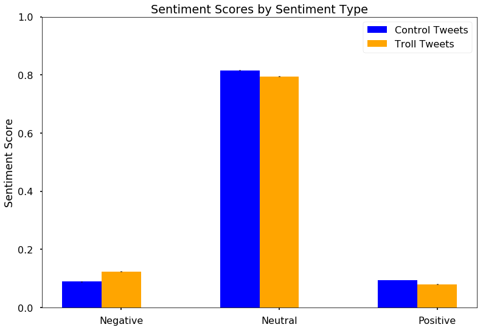


```python
plot_troll_sent = df_small.groupby('troll_tweet').get_group(1)['sentiment_class'].value_counts()
plot_contr_sent = df_small.groupby('troll_tweet').get_group(0)['sentiment_class'].value_counts()

print("RESULTS OF SENTIMENT ANALYSIS BINARY CLASSIFICATION:\n",'-'*60)
# Normalized % of troll sentiment classes
plot_troll_sent_norm = plot_troll_sent/(sum(plot_troll_sent))
print('\tNormalized Troll Classes:\n',plot_troll_sent_norm)

# Normalized % of control sentiment classes
plot_contr_sent_norm = plot_contr_sent/(sum(plot_contr_sent))
print('\n\tNormalized Control Classes:\n',plot_contr_sent_norm)
```

    RESULTS OF SENTIMENT ANALYSIS BINARY CLASSIFICATION:
     ------------------------------------------------------------
    	Normalized Troll Classes:
     pos    0.613535
    neg    0.386465
    Name: sentiment_class, dtype: float64
    
    	Normalized Control Classes:
     pos    0.598126
    neg    0.401874
    Name: sentiment_class, dtype: float64
    


```python
with plt.style.context('seaborn-talk'):
    fig, ax= plt.subplots(nrows=1,ncols=2, figsize=(8,6))

    wedgeprops={'linewidth':1,'edgecolor':'k'}
    textprops={'fontsize':12,'weight':75}#'family':'serif'}
    fontTitle={'fontsize':14,'family':'serif'}
    fontSuptitle={'fontsize':25,'weight':'bold','family':'serif'}
    group_labels = ['Negative','Positive']
    slice_colors = ['coral','steelblue']

    fig.suptitle('Sentiment Classification',y=0.8,fontsize=18,family='serif') #fontdict=fontSuptitle,y=.8)

    ax[0].pie(plot_contr_sent_norm,labels=group_labels, labeldistance=0.3)
#     ax[0].pie(plot_contr_sent_norm, labels=group_labels, colors=slice_colors, labeldistance=0.3, 
#              wedgeprops=wedgeprops, textprops=textprops)

    ax[0].set_title('Control',fontdict=fontTitle,y=-0.02)
    ax[1].pie(plot_troll_sent_norm, labels=group_labels, labeldistance=0.3)
#     ax[1].pie(plot_troll_sent_norm, labels=group_labels,colors=slice_colors, labeldistance=0.3,
#              wedgeprops=wedgeprops, textprops=textprops)

    ax[1].set_title('Trolls', fontdict=fontTitle,y=-0.02)
    # ax[0].legend()
    fig.tight_layout()
```


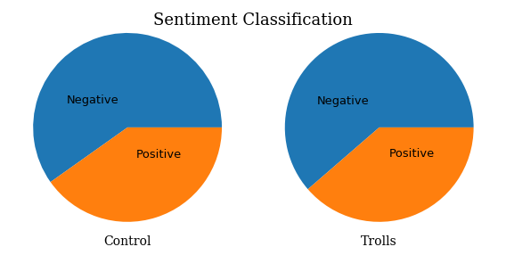


```python
# Plot sentiment analysis classification
with plt.style.context('seaborn-talk'):
    fig, ax = plt.subplots(figsize=(3,5))
    width=0.35
    ind = np.arange(0,2)
    # ax.set_aspect(0.9)
    ax.bar(ind, height=plot_contr_sent_norm, width=width, 
           label='Control Tweets',color='b')#,edgecolor='k')
    ax.bar(ind+width, height=plot_troll_sent_norm,width=width,
           label='Troll Tweets',color='orange')#,edgecolor='k')
    ax.set_ylim(0,1)

    ax.set_xticks(ind + width / 2)
    ax.set_xticklabels(['Negative','Positive'])
    ax.set_xlabel('Sentiment Classification')

    y_ticks = np.linspace(0,1,num=5)
    ax.set_yticks(y_ticks)
    ax.set_yticklabels(y_ticks*100)
    ax.set_ylabel('% of Messages')
    ax.legend()
    ax.autoscale_view()
```


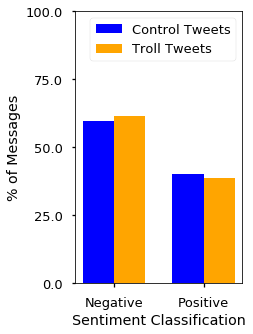


```python
with plt.style.context('seaborn-poster'):
    import seaborn as sns

    # Plot sentiment analysis compound scores
    plot_troll_comp = df_small.groupby('troll_tweet').get_group(1)['compound_score'].values
    plot_contr_comp = df_small.groupby('troll_tweet').get_group(0)['compound_score'].values

    # Plot sentiment ompound scores
    from scipy.stats import sem
    fig, ax = plt.subplots(figsize=(4,5))

    width=0.35
    ind = np.arange(0,2)

    # sns.boxplot(df_small.groupby('troll_tweet')['compound_score'].mean())
    ax.bar(ind[0],height=plot_contr_comp.mean(), yerr=sem(plot_contr_comp), width=width, 
           label='Controls',color='b')#,edgecolor='k')
    ax.bar(ind[1],height=plot_troll_comp.mean(),yerr=sem(plot_troll_comp),width=width,
           label='Trolls',color='orange')#,edgecolor='k')
    ax.legend()#loc='upper right')
    ax.set_xticks([])
    # ax.set_xticklabels(['Negative','Positive'])
    ax.set_title('Compound Sentiment Scores',y=1.03)
    ax.set_ylabel('Mean Compound Score')
    # y_ticks = np.linspace(0,1,num=5)
    # ax.set_yticks(y_ticks)
    # ax.set_yticklabels(y_ticks*100)
    # ax.set_ylabel('% of Messages')
    # ax.legend()
    ax.spines['bottom'].set_visible(False)
    ax.spines['right'].set_visible(False)
    plt.ylim([-0.1,0])
    # ax.autoscale_view()
```


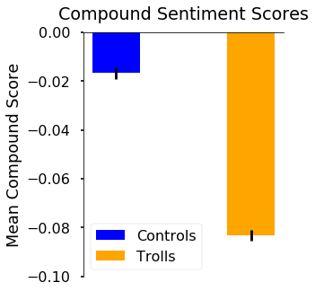


# MODEL


```python
import bs_ds as bs
from bs_ds.imports import *
import mod4functions_JMI as jmi
```


```python
# PAUSE
# df_small.to_csv('df_ready_for_keras_06122019.csv', encoding='utf-8')
df_small = pd.read_csv('df_ready_for_keras_06122019.csv',encoding='utf-8')
df_small.dropna(subset=['content'],inplace=True)
```

## BUILDING THE INITIAL MODELS


___

- naming scheme changing: df_small -> df_tokenize


```python
df_tokenize = df_small
```


```python
import matplotlib.pyplot as plt
import matplotlib as mpl
import pandas as pd
import numpy as np
import random
mpl.rcParams['figure.figsize']=(10,8)

from sklearn import preprocessing
from sklearn.model_selection import train_test_split

# Keras preprocessing
from keras.preprocessing.text import Tokenizer
from keras.utils.np_utils import to_categorical

# Keras neural network basics
from keras import models
from keras import layers
from keras import optimizers
```

    Using TensorFlow backend.
    

## Logistic Regression

### Train, test, val split


```python
df_tokenize['troll_tweet'].value_counts()
```


    1    38094
    0    38094
    Name: troll_tweet, dtype: int64


```python
df_tokenize.dropna(subset=['content_stopped'],inplace=True)
```


```python
# SELECTING X AND Y
y = df_tokenize['troll_tweet'] #.values
X_array = df_tokenize['content_stopped'].values
y.shape, X_array.shape
```


    ((75515,), (75515,))


```python
# TRAIN-TEST-VAL SPLIT
from mod4functions_JMI import train_test_val_split
sentences_train, sentences_test, sentences_val, y_train, y_test, y_val = train_test_val_split(X_array,y)
```


```python
### Vectorization
chosen_vectorizer = 'count' #of tfidf

if chosen_vectorizer.lower()=='count':
    from sklearn.feature_extraction.text import CountVectorizer
    vectorizer = CountVectorizer()
    vectorizer.fit(sentences_train)
    
elif chosen_vectorizer.lower()=='tfidf':
    from sklearn.feature_extraction.text import TfidfVectorizer
    vectorizer = TfidfVectorizer()
    vectorizer.fit(sentences_train)
else:
    raise Exception('No vectorizer chosen')

X_train = vectorizer.transform(sentences_train)
X_test = vectorizer.transform(sentences_test)
X_val = vectorizer.transform(sentences_val)
```


```python
X_train.shape, X_test.shape
```


    ((52860, 30191), (15103, 30191))


```python
import bs_ds as bs
from sklearn.linear_model import LogisticRegression
from sklearn.metrics import confusion_matrix, classification_report, accuracy_score, recall_score

# Timing model
clock_logreg = bs.Clock(verbose=1)
clock_logreg.tic('Starting LogisticRegression')


clf = LogisticRegression()
clf.fit(X_train, y_train)

score_train = clf.score(X_train, y_train)
score_test = clf.score(X_test, y_test)
clock_logreg.toc('LogisticRegression complete.')


y_hat_test = clf.predict(X_test)
print('\n',classification_report(y_test, y_hat_test))

# Adding plot auc-roc 
import bs_ds as bs
# bs.plot_auc_roc_curve(y_test, y_hat_test)

bs.plot_confusion_matrix(confusion_matrix(y_test, y_hat_test),['Control Tweets','Troll Tweets'],normalize=True);
print("\nTrain Accuracy: ",score_train)
print("Test Accuracy: ",score_test)
```

    --- CLOCK STARTED @:    09/11/19 - 12:00:27 PM           Label: Starting LogisticRegression --- 
    --- TOTAL DURATION   =  0 min, 0.945 sec --- 
    


<style  type="text/css" >
    #T_45f642c8_d4ad_11e9_94e8_f48e38b6371f table, th {
          text-align: center;
    }    #T_45f642c8_d4ad_11e9_94e8_f48e38b6371frow0_col1 {
            width:  140px;
        }    #T_45f642c8_d4ad_11e9_94e8_f48e38b6371frow0_col2 {
            width:  140px;
        }</style><table id="T_45f642c8_d4ad_11e9_94e8_f48e38b6371f" ><caption>Summary Table of Clocked Processes</caption><thead>    <tr>        <th class="col_heading level0 col0" >Lap #</th>        <th class="col_heading level0 col1" >Start Time</th>        <th class="col_heading level0 col2" >Duration</th>        <th class="col_heading level0 col3" >Label</th>    </tr></thead><tbody>
                <tr>
                                <td id="T_45f642c8_d4ad_11e9_94e8_f48e38b6371frow0_col0" class="data row0 col0" >TOTAL</td>
                        <td id="T_45f642c8_d4ad_11e9_94e8_f48e38b6371frow0_col1" class="data row0 col1" >09/11/19 - 12:00:27 PM</td>
                        <td id="T_45f642c8_d4ad_11e9_94e8_f48e38b6371frow0_col2" class="data row0 col2" >0 min, 0.945 sec</td>
                        <td id="T_45f642c8_d4ad_11e9_94e8_f48e38b6371frow0_col3" class="data row0 col3" >LogisticRegression complete.</td>
            </tr>
    </tbody></table>


    
                   precision    recall  f1-score   support
    
               0       0.88      0.88      0.88      7552
               1       0.88      0.88      0.88      7551
    
       micro avg       0.88      0.88      0.88     15103
       macro avg       0.88      0.88      0.88     15103
    weighted avg       0.88      0.88      0.88     15103
    
    


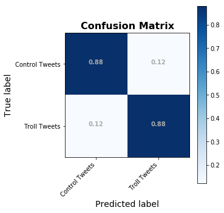


    
    Train Accuracy:  0.9390843738176314
    Test Accuracy:  0.8788320201284513
    

### INITIAL MODEL SUMMARY: Logistic Regression
- Accuracy: 
    - 0.938 for train set
    - 0.875 for test set
- Recall/Precision/F1-scores all around 0.87

- Duration: 
    - 0.78 sec


## DecisionTreeClassifier


```python
from sklearn.tree import DecisionTreeClassifier
dt_clf = DecisionTreeClassifier(criterion='entropy')
```


```python
dt_clock=bs.Clock()
dt_clock.tic('')

dt_clf.fit(X_train,y_train)

dt_clock.toc('')
```

    --- CLOCK STARTED @:    09/11/19 - 12:00:28 PM           Label:            --- 
    --- TOTAL DURATION   =  0 min, 20.204 sec --- 
    


<style  type="text/css" >
    #T_522ffdb6_d4ad_11e9_9916_f48e38b6371f table, th {
          text-align: center;
    }    #T_522ffdb6_d4ad_11e9_9916_f48e38b6371frow0_col1 {
            width:  140px;
        }    #T_522ffdb6_d4ad_11e9_9916_f48e38b6371frow0_col2 {
            width:  140px;
        }</style><table id="T_522ffdb6_d4ad_11e9_9916_f48e38b6371f" ><caption>Summary Table of Clocked Processes</caption><thead>    <tr>        <th class="col_heading level0 col0" >Lap #</th>        <th class="col_heading level0 col1" >Start Time</th>        <th class="col_heading level0 col2" >Duration</th>        <th class="col_heading level0 col3" >Label</th>    </tr></thead><tbody>
                <tr>
                                <td id="T_522ffdb6_d4ad_11e9_9916_f48e38b6371frow0_col0" class="data row0 col0" >TOTAL</td>
                        <td id="T_522ffdb6_d4ad_11e9_9916_f48e38b6371frow0_col1" class="data row0 col1" >09/11/19 - 12:00:28 PM</td>
                        <td id="T_522ffdb6_d4ad_11e9_9916_f48e38b6371frow0_col2" class="data row0 col2" >0 min, 20.204 sec</td>
                        <td id="T_522ffdb6_d4ad_11e9_9916_f48e38b6371frow0_col3" class="data row0 col3" ></td>
            </tr>
    </tbody></table>


```python
y_hat_train = dt_clf.predict(X_train)
y_hat_test = dt_clf.predict(X_test)

score_test = accuracy_score(y_test, y_hat_test)
core_train= accuracy_score(y_train, y_hat_train)

labels=['Control Tweet','Troll Tweet']
cm = confusion_matrix(y_test, y_hat_test)
bs.plot_confusion_matrix(cm,classes=labels, normalize=True)

print("\nTrain Accuracy: ",score_train)
print("Test Accuracy: ",score_test)

```


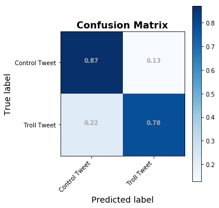


    
    Train Accuracy:  0.9390843738176314
    Test Accuracy:  0.8273852876911871
    

### Plotting Feature Importance


```python
## Getting Feature Importances
feat_names = vectorizer.get_feature_names()
feat_import = dt_clf.feature_importances_
important_features = pd.Series(feat_import, index=feat_names)
```


```python
# Plot the top 100 most important words
top100 = important_features.sort_values(ascending=False)[:100]

with plt.style.context('seaborn-talk'):
    fig = top100.sort_values().plot(kind='barh', figsize=(10,30))
    plt.title('Top 100 Most Important Words for Decision Tree')
    plt.grid('on', axis='x',color='lightslategray', ls=':')
```


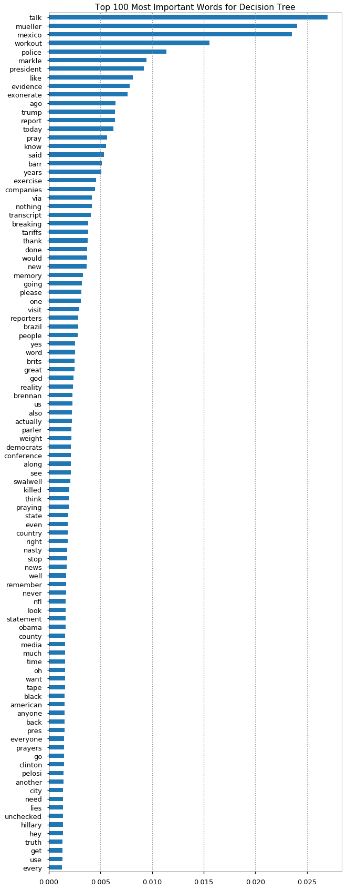


## Random Forests Classifier


```python
from sklearn.ensemble import RandomForestClassifier

rf_clock=bs.Clock()
```


```python
rf_clock.tic('Starting Random Forsest clf')
rf_clf = RandomForestClassifier(n_estimators=100)
rf_clf.fit(X_train, y_train)

y_hat_train = rf_clf.predict(X_train)
y_hat_test = rf_clf.predict(X_test)
rf_clock.toc(f'Accuracy:{score_test}')


score_test = accuracy_score(y_test, y_hat_test)
core_train= accuracy_score(y_train, y_hat_train)

print(classification_report(y_test, y_hat_test))

labels=['Control Tweet','Troll Tweet']
cm = confusion_matrix(y_test, y_hat_test)
bs.plot_confusion_matrix(cm,classes=labels, normalize=True)

print("\nTrain Accuracy: ",score_train)
print("Test Accuracy: ",score_test)
```

    --- CLOCK STARTED @:    09/11/19 - 12:00:50 PM           Label: Starting Random Forsest clf --- 
    --- TOTAL DURATION   =  2 min, 36.929 sec --- 
    


<style  type="text/css" >
    #T_b0f29066_d4ad_11e9_bf51_f48e38b6371f table, th {
          text-align: center;
    }    #T_b0f29066_d4ad_11e9_bf51_f48e38b6371frow0_col1 {
            width:  140px;
        }    #T_b0f29066_d4ad_11e9_bf51_f48e38b6371frow0_col2 {
            width:  140px;
        }</style><table id="T_b0f29066_d4ad_11e9_bf51_f48e38b6371f" ><caption>Summary Table of Clocked Processes</caption><thead>    <tr>        <th class="col_heading level0 col0" >Lap #</th>        <th class="col_heading level0 col1" >Start Time</th>        <th class="col_heading level0 col2" >Duration</th>        <th class="col_heading level0 col3" >Label</th>    </tr></thead><tbody>
                <tr>
                                <td id="T_b0f29066_d4ad_11e9_bf51_f48e38b6371frow0_col0" class="data row0 col0" >TOTAL</td>
                        <td id="T_b0f29066_d4ad_11e9_bf51_f48e38b6371frow0_col1" class="data row0 col1" >09/11/19 - 12:00:50 PM</td>
                        <td id="T_b0f29066_d4ad_11e9_bf51_f48e38b6371frow0_col2" class="data row0 col2" >2 min, 36.929 sec</td>
                        <td id="T_b0f29066_d4ad_11e9_bf51_f48e38b6371frow0_col3" class="data row0 col3" >Accuracy:0.8273852876911871</td>
            </tr>
    </tbody></table>


                  precision    recall  f1-score   support
    
               0       0.79      0.94      0.86      7552
               1       0.93      0.74      0.83      7551
    
       micro avg       0.84      0.84      0.84     15103
       macro avg       0.86      0.84      0.84     15103
    weighted avg       0.86      0.84      0.84     15103
    
    


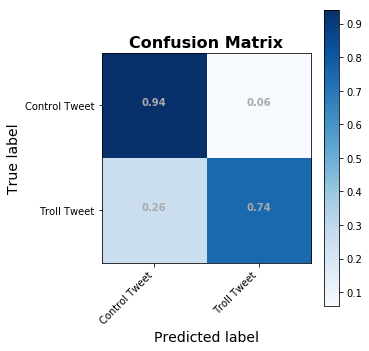


    
    Train Accuracy:  0.9390843738176314
    Test Accuracy:  0.8428126862212806
    

## Keras Model 1: creating a Text Classification Neural Network in Keras
- Using CountVectorized data generated above


```python
## HOW THE USED DATA WAS CREATED ABOVE

#from mod4functions_JMI import train_test_val_split
#sentences_train, sentences_test, sentences_val, y_train, y_test, y_val = train_test_val_split(X_array,y)

# from sklearn.feature_extraction.text import CountVectorizer

# vectorizer = CountVectorizer()
# vectorizer.fit(sentences_train)

# X_train = vectorizer.transform(sentences_train)
# X_test = vectorizer.transform(sentences_test)
# X_val = vectorizer.transform(sentences_val)
```


```python
from keras import models, layers, optimizers
input_dim = X_train.shape[1]
# input_dim = sequences_train.shape[1]
print(input_dim)

model1 = models.Sequential()
# model.add(layers.Embedding)

model1.add(layers.Dense(10, input_dim= input_dim, activation='relu'))
model1.add(layers.Dense(1, activation='sigmoid'))

model1.compile(loss='binary_crossentropy',optimizer="adam",metrics=['accuracy'])
model1.summary()
```

    30191
    WARNING:tensorflow:From C:\Users\james\Anaconda3\envs\learn-env-ext\lib\site-packages\tensorflow\python\framework\op_def_library.py:263: colocate_with (from tensorflow.python.framework.ops) is deprecated and will be removed in a future version.
    Instructions for updating:
    Colocations handled automatically by placer.
    _________________________________________________________________
    Layer (type)                 Output Shape              Param #   
    =================================================================
    dense_1 (Dense)              (None, 10)                301920    
    _________________________________________________________________
    dense_2 (Dense)              (None, 1)                 11        
    =================================================================
    Total params: 301,931
    Trainable params: 301,931
    Non-trainable params: 0
    _________________________________________________________________
    

### Running model 1 with Keras NOTES:
1. When running `history = model1.fit(X_train, y_train, epochs=5, verbose=True, validation_data=(X_val, y_val), batch_size=100)`, result was 0.88 val accuracy, 107 sec
2. WHen running `history = model1.fit(X_train, y_train, epochs=5, verbose=True, validation_data=(X_val, y_val), batch_size=200)`, result was 0.87 val accuracy in 97 sec


```python
clock = bs.Clock()
clock.tic('starting keras .fit')

num_epochs = 10
history = model1.fit(X_train, y_train, epochs=num_epochs, verbose=True, validation_data=(X_val, y_val), batch_size=200)

clock.toc(f'completed {num_epochs} epochs')
```

    --- CLOCK STARTED @:    09/11/19 - 12:03:27 PM           Label: starting keras .fit --- 
    WARNING:tensorflow:From C:\Users\james\Anaconda3\envs\learn-env-ext\lib\site-packages\tensorflow\python\ops\math_ops.py:3066: to_int32 (from tensorflow.python.ops.math_ops) is deprecated and will be removed in a future version.
    Instructions for updating:
    Use tf.cast instead.
    Train on 52860 samples, validate on 7552 samples
    Epoch 1/10
    52860/52860 [==============================] - 22s 407us/step - loss: 0.5001 - acc: 0.8236 - val_loss: 0.3608 - val_acc: 0.8567
    Epoch 2/10
    52860/52860 [==============================] - 20s 384us/step - loss: 0.2977 - acc: 0.8812 - val_loss: 0.2973 - val_acc: 0.8710
    Epoch 3/10
    52860/52860 [==============================] - 20s 387us/step - loss: 0.2340 - acc: 0.9076 - val_loss: 0.2808 - val_acc: 0.8775
    Epoch 4/10
    52860/52860 [==============================] - 22s 414us/step - loss: 0.1975 - acc: 0.9242 - val_loss: 0.2770 - val_acc: 0.8799
    Epoch 5/10
    52860/52860 [==============================] - 23s 431us/step - loss: 0.1719 - acc: 0.9350 - val_loss: 0.2805 - val_acc: 0.8792
    Epoch 6/10
    52860/52860 [==============================] - 22s 417us/step - loss: 0.1526 - acc: 0.9427 - val_loss: 0.2868 - val_acc: 0.8774
    Epoch 7/10
    52860/52860 [==============================] - 25s 470us/step - loss: 0.1375 - acc: 0.9483 - val_loss: 0.2953 - val_acc: 0.8771
    Epoch 8/10
    52860/52860 [==============================] - 23s 439us/step - loss: 0.1251 - acc: 0.9538 - val_loss: 0.3057 - val_acc: 0.8770
    Epoch 9/10
    52860/52860 [==============================] - 22s 425us/step - loss: 0.1147 - acc: 0.9573 - val_loss: 0.3180 - val_acc: 0.8766
    Epoch 10/10
    52860/52860 [==============================] - 24s 453us/step - loss: 0.1062 - acc: 0.9615 - val_loss: 0.3311 - val_acc: 0.8746
    --- TOTAL DURATION   =  3 min, 43.946 sec --- 
    


<style  type="text/css" >
    #T_36bcfc5a_d4ae_11e9_b57a_f48e38b6371f table, th {
          text-align: center;
    }    #T_36bcfc5a_d4ae_11e9_b57a_f48e38b6371frow0_col1 {
            width:  140px;
        }    #T_36bcfc5a_d4ae_11e9_b57a_f48e38b6371frow0_col2 {
            width:  140px;
        }</style><table id="T_36bcfc5a_d4ae_11e9_b57a_f48e38b6371f" ><caption>Summary Table of Clocked Processes</caption><thead>    <tr>        <th class="col_heading level0 col0" >Lap #</th>        <th class="col_heading level0 col1" >Start Time</th>        <th class="col_heading level0 col2" >Duration</th>        <th class="col_heading level0 col3" >Label</th>    </tr></thead><tbody>
                <tr>
                                <td id="T_36bcfc5a_d4ae_11e9_b57a_f48e38b6371frow0_col0" class="data row0 col0" >TOTAL</td>
                        <td id="T_36bcfc5a_d4ae_11e9_b57a_f48e38b6371frow0_col1" class="data row0 col1" >09/11/19 - 12:03:27 PM</td>
                        <td id="T_36bcfc5a_d4ae_11e9_b57a_f48e38b6371frow0_col2" class="data row0 col2" >3 min, 43.946 sec</td>
                        <td id="T_36bcfc5a_d4ae_11e9_b57a_f48e38b6371frow0_col3" class="data row0 col3" >completed 10 epochs</td>
            </tr>
    </tbody></table>


```python
# WILL BE REPLACED WITH plot_keras_history in mod4
def plot_history(history):
    acc = history.history['acc']
    loss = history.history['loss']
    val_acc = history.history['val_acc']
    val_loss = history.history['val_loss']
    x = range(1,len(acc)+1)
    
    fig,ax = plt.subplots(nrows=2, ncols=1, figsize=(6,8))
    ax[0].plot(x, acc,'b',label='Training Acc')
    ax[0].plot(x, val_acc,'r',label='Validation Acc')
    ax[0].legend()
    ax[1].plot(x, loss,'b',label='Training Loss')
    ax[1].plot(x, val_loss, 'r', label='Validation Loss')
    ax[1].legend()
    plt.show()
```


```python
loss, accuracy = model1.evaluate(X_train, y_train, verbose=True)
print(f'Training Accuracy:{accuracy}')

loss, accuracy = model1.evaluate(X_test, y_test, verbose=True)
print(f'Testing Accuracy:{accuracy}')
```

    52860/52860 [==============================] - 19s 366us/step
    Training Accuracy:0.9676125614696319
    15103/15103 [==============================] - 5s 355us/step
    Testing Accuracy:0.8750579354542498
    


```python
plot_history(history)
```


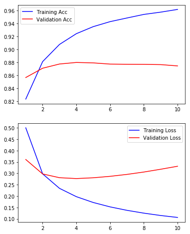


```python
# y_hat_train = model1.predict(X_train)
# y_hat_test = model1.predict(X_test)

# score_test = accuracy_score(y_test, y_hat_test)
# core_train= accuracy_score(y_train, y_hat_train)

# labels=['Control Tweet','Troll Tweet']
# cm = confusion_matrix(y_test, y_hat_test)
# bs.plot_confusion_matrix(cm,classes=labels, normalize=True)

# print("\nTrain Accuracy: ",score_train)
# print("Test Accuracy: ",score_test)

```


```python
# from keras.utils import plot_model
# plot_model(model1, show_shapes=True,to_file='model1.png')

# from IPython.display import SVG
# from keras.utils import model_to_dot

# SVG(model_to_dot(model).create(prog='dot', format='svg'))
# model1_img =plt.imread('model1.png')
# plt.imshow(model1_img)
```

### Summary - Neural Network Analysis on CountVectorized Tweets

- Accuracy:
    - Training: 0.968
    - Testing:0.880
- Run time:
    - 2:48 min


## Keras Model 2 Adding pretrained Word2Vec embeddings
- Adding Word2Vec vectorization into an embedding layer

#### How to get a word2vector model's vectors into a Keras Embedding Layer
- https://sturzamihai.com/how-to-use-pre-trained-word-vectors-with-keras/


```python
import mod4functions_JMI as jmi
```


```python
df_tokenize.head(2)
```


<div>
<style scoped>
    .dataframe tbody tr th:only-of-type {
        vertical-align: middle;
    }

    .dataframe tbody tr th {
        vertical-align: top;
    }

    .dataframe thead th {
        text-align: right;
    }
</style>
<table border="1" class="dataframe">
  <thead>
    <tr style="text-align: right;">
      <th></th>
      <th>Unnamed: 0</th>
      <th>index</th>
      <th>date_published</th>
      <th>account_category</th>
      <th>account_type</th>
      <th>author</th>
      <th>content</th>
      <th>external_author_id</th>
      <th>followers</th>
      <th>following</th>
      <th>...</th>
      <th>starts_RT</th>
      <th>content_starts_RT</th>
      <th>content_min_clean</th>
      <th>content_hashtags</th>
      <th>content_mentions</th>
      <th>content_stopped</th>
      <th>tokens_stopped</th>
      <th>sentiment_scores</th>
      <th>compound_score</th>
      <th>sentiment_class</th>
    </tr>
  </thead>
  <tbody>
    <tr>
      <th>0</th>
      <td>1272760</td>
      <td>1272760</td>
      <td>2019-06-02 18:34:59</td>
      <td>control</td>
      <td>control</td>
      <td>Draftdodgingdon</td>
      <td>it’s perfectly reasonable that   would want ...</td>
      <td>1.114658e+18</td>
      <td>0.0</td>
      <td>NaN</td>
      <td>...</td>
      <td>False</td>
      <td>[]</td>
      <td>@realDonaldTrump it’s perfectly reasonable tha...</td>
      <td>['#draftdodgingdonny']</td>
      <td>['@realDonaldTrump']</td>
      <td>perfectly reasonable would want uss john mccai...</td>
      <td>['perfectly', 'reasonable', 'would', 'want', '...</td>
      <td>{'neg': 0.209, 'neu': 0.513, 'pos': 0.279, 'co...</td>
      <td>0.483</td>
      <td>pos</td>
    </tr>
    <tr>
      <th>1</th>
      <td>1272761</td>
      <td>1272761</td>
      <td>2019-06-02 18:34:59</td>
      <td>control</td>
      <td>control</td>
      <td>beapartofthemo1</td>
      <td>BREAKING NEWS: \n\n  Trump won't be allowed ...</td>
      <td>1.038424e+18</td>
      <td>1198.0</td>
      <td>NaN</td>
      <td>...</td>
      <td>True</td>
      <td>['RT @BelkissObadia:']</td>
      <td>BREAKING NEWS: \n\n@realDonaldTrump Trump wo...</td>
      <td>[]</td>
      <td>['@realDonaldTrump']</td>
      <td>breaking news trump allowed stay buckingham pa...</td>
      <td>['breaking', 'news', 'trump', 'allowed', 'stay...</td>
      <td>{'neg': 0.0, 'neu': 1.0, 'pos': 0.0, 'compound...</td>
      <td>0.000</td>
      <td>pos</td>
    </tr>
  </tbody>
</table>
<p>2 rows × 29 columns</p>
</div>


```python
# jmi.display_random_tweets(df_tokenize, display_cols=['content_min_clean','tokens_stopped'],n=2)
```


```python
# text_data = df_tokenize['content_min_clean']
text_data = df_tokenize['content']
from gensim.models import Word2Vec
vector_size = 300

wv_keras = Word2Vec(text_data, size=vector_size, window=10, min_count=1, workers=4)
wv_keras.train(text_data,total_examples=wv_keras.corpus_count, epochs=10)

wv = wv_keras.wv
```


```python
vocab_size = len(wv_keras.wv.vocab)
print(f'There are {vocab_size} words in the word2vec vocabulary, with a vector size {vector_size}.')
```

    There are 801 words in the word2vec vocabulary, with a vector size 300.
    


```python
wv.vectors[1].shape[0]
```


    300


https://adventuresinmachinelearning.com/word2vec-keras-tutorial/
    https://machinelearningmastery.com/use-word-embedding-layers-deep-learning-keras/


```python
# save the vectors in a new matrix
word_model = wv_keras
vector_size = word_model.wv.vectors[1].shape[0]

embedding_matrix = np.zeros((len(word_model.wv.vocab) + 1, vector_size))
for i, vec in enumerate(word_model.wv.vectors):
  embedding_matrix[i] = vec
embedding_matrix.shape
```


    (802, 300)


```python
# Get list of texts to be converted to sequences
# sentences_train =text_data # df_tokenize['tokens'].values
from keras.preprocessing.text import Tokenizer

tokenizer = Tokenizer(num_words=len(wv.vocab))
tokenizer.fit_on_texts(list(text_data)) #tokenizer.fit_on_texts(text_data)

word_index = tokenizer.index_word
reverse_index = {v:k for k,v in word_index.items()}
```


```python
# return integer-encoded sentences
from keras.preprocessing import text, sequence
X = tokenizer.texts_to_sequences(text_data)
X = sequence.pad_sequences(X)

y = df_tokenize['troll_tweet'].values
# reverse_index
X_train, X_test, X_val, y_train, y_test, y_val = train_test_val_split(X, y)#, test_size=0.1, shuffle=False)
```


```python
X_train.shape
```


    (52860, 51)


```python
len(wv.vocab)
```


    801


```python
# embedding_layer = wv.get_keras_embedding(train_embeddings=False)
# embedding_layer.get_config()
```


```python
from keras import models, layers, optimizers, regularizers

model2 = models.Sequential()
# embedding_layer = wv.get_keras_embedding(train_embeddings=False)

model2.add(layers.Embedding(len(wv_keras.wv.vocab)+1,
                             vector_size,input_length=X_train.shape[1],
                             weights=[embedding_matrix],trainable=False)) 
          
model2.add(layers.LSTM(300, return_sequences=False))#, kernel_regularizer=regularizers.l2(.01)))
# model1B.add(layers.GlobalMaxPooling1D())
model2.add(layers.Dense(10, activation='relu'))
model2.add(layers.Dense(1, activation='sigmoid'))

model2.compile(loss='binary_crossentropy',optimizer="adam",metrics=['accuracy'])
model2.summary()
```

    _________________________________________________________________
    Layer (type)                 Output Shape              Param #   
    =================================================================
    embedding_1 (Embedding)      (None, 51, 300)           240600    
    _________________________________________________________________
    lstm_1 (LSTM)                (None, 300)               721200    
    _________________________________________________________________
    dense_3 (Dense)              (None, 10)                3010      
    _________________________________________________________________
    dense_4 (Dense)              (None, 1)                 11        
    =================================================================
    Total params: 964,821
    Trainable params: 724,221
    Non-trainable params: 240,600
    _________________________________________________________________
    


```python
clock = bs.Clock()
clock.tic('starting keras .fit')
num_epochs = 5
history = model2.fit(X_train, y_train, epochs=num_epochs, verbose=True, validation_data=(X_val, y_val), batch_size=500)

clock.toc(f'completed {num_epochs} epochs')
```

    --- CLOCK STARTED @:    09/11/19 - 12:08:20 PM           Label: starting keras .fit --- 
    Train on 52860 samples, validate on 7552 samples
    Epoch 1/5
    52860/52860 [==============================] - 131s 2ms/step - loss: 0.4562 - acc: 0.7795 - val_loss: 0.3929 - val_acc: 0.8124
    Epoch 2/5
    52860/52860 [==============================] - 127s 2ms/step - loss: 0.3790 - acc: 0.8203 - val_loss: 0.3764 - val_acc: 0.8173
    Epoch 3/5
    52860/52860 [==============================] - 127s 2ms/step - loss: 0.3503 - acc: 0.8348 - val_loss: 0.3578 - val_acc: 0.8264
    Epoch 4/5
    52860/52860 [==============================] - 120s 2ms/step - loss: 0.3292 - acc: 0.8464 - val_loss: 0.3528 - val_acc: 0.8289
    Epoch 5/5
    52860/52860 [==============================] - 122s 2ms/step - loss: 0.3068 - acc: 0.8568 - val_loss: 0.3420 - val_acc: 0.8371
    --- TOTAL DURATION   =  10 min, 28.585 sec --- 
    


<style  type="text/css" >
    #T_d60a0d8c_d4af_11e9_a00e_f48e38b6371f table, th {
          text-align: center;
    }    #T_d60a0d8c_d4af_11e9_a00e_f48e38b6371frow0_col1 {
            width:  140px;
        }    #T_d60a0d8c_d4af_11e9_a00e_f48e38b6371frow0_col2 {
            width:  140px;
        }</style><table id="T_d60a0d8c_d4af_11e9_a00e_f48e38b6371f" ><caption>Summary Table of Clocked Processes</caption><thead>    <tr>        <th class="col_heading level0 col0" >Lap #</th>        <th class="col_heading level0 col1" >Start Time</th>        <th class="col_heading level0 col2" >Duration</th>        <th class="col_heading level0 col3" >Label</th>    </tr></thead><tbody>
                <tr>
                                <td id="T_d60a0d8c_d4af_11e9_a00e_f48e38b6371frow0_col0" class="data row0 col0" >TOTAL</td>
                        <td id="T_d60a0d8c_d4af_11e9_a00e_f48e38b6371frow0_col1" class="data row0 col1" >09/11/19 - 12:08:20 PM</td>
                        <td id="T_d60a0d8c_d4af_11e9_a00e_f48e38b6371frow0_col2" class="data row0 col2" >10 min, 28.585 sec</td>
                        <td id="T_d60a0d8c_d4af_11e9_a00e_f48e38b6371frow0_col3" class="data row0 col3" >completed 5 epochs</td>
            </tr>
    </tbody></table>


```python
loss, accuracy = model2.evaluate(X_train, y_train, verbose=True)
print(f'Training Accuracy:{accuracy}')

loss, accuracy = model2.evaluate(X_test, y_test, verbose=True)
print(f'Testing Accuracy:{accuracy}')
```

    52860/52860 [==============================] - 70s 1ms/step
    Training Accuracy:0.8670450245977757
    15103/15103 [==============================] - 20s 1ms/step
    Testing Accuracy:0.8459908626911964
    


```python
jmi.plot_keras_history(history)
```


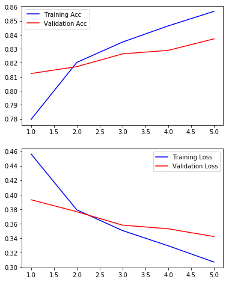


    (<Figure size 432x576 with 2 Axes>,
     array([<matplotlib.axes._subplots.AxesSubplot object at 0x000001FAF83FAA58>,
            <matplotlib.axes._subplots.AxesSubplot object at 0x000001FA851B2F28>],
           dtype=object))


```python
model2.save('model2_emb_lstm_dense_dense.hd5',include_optimizer=True, overwrite=True)
model2.save_weights('model2_emb_lstm_dense_dense_WEIGHTS.hdf')
```


```python
# from keras.models import load_model
# from ann_visualizer.visualize import ann_viz;

# model1B_ = load_model('best_keras_model_lstm_dense10_dense1.hd5')
# model1B_.summary()

# # ann_viz(model1B_, title="Keras Artificial Neural Network")
```

## Keras model 3 -using keras' tokenizer to fit_on_texts+one_hot
### Train, test, val split


```python
# from sklearn.feature_extraction.text import CountVectorizer
from keras.preprocessing.text import Tokenizer, one_hot
from keras.utils.np_utils import to_categorical

from sklearn import preprocessing
from sklearn.model_selection import train_test_split

from keras import models, layers, optimizers

# df_tokenize.head()
```


```python
# Define tweets to be analyzed, fit tokenizer,generate sequences
tweets = df_tokenize['content']
# num_words=len(set(tweets))
tokenizer = Tokenizer(num_words=3000)

tokenizer.fit_on_texts(tweets)
sequences = tokenizer.texts_to_sequences(tweets)
```


```python
one_hot_results = tokenizer.texts_to_matrix(tweets, mode='binary')

word_index = tokenizer.word_index
reverse_index = {v:k for k,v in word_index.items()}
```

### Test Train Split


```python
print(one_hot_results.shape, y.shape)
```

    (75515, 3000) (75515,)
    


```python
import random, math
random.seed(42)
test_size = math.floor(one_hot_results.shape[0]*0.3)
test_index = random.sample(range(1,one_hot_results.shape[0]), test_size)

test = one_hot_results[test_index]
train = np.delete(one_hot_results, test_index, 0)
label_test = y[test_index]
label_train = np.delete(y, test_index, 0)
```


```python
train.shape
train.shape[1]
```


    3000


```python
model3 = models.Sequential()
model3.add(layers.Dense(50, activation='relu', input_shape=(3000,)))
model3.add(layers.Dense(25, activation='relu'))
model3.add(layers.Dense(1,activation='sigmoid'))

model3.compile(optimizer='adam', loss='binary_crossentropy',metrics=['accuracy'])
model3.summary()
```

    _________________________________________________________________
    Layer (type)                 Output Shape              Param #   
    =================================================================
    dense_5 (Dense)              (None, 50)                150050    
    _________________________________________________________________
    dense_6 (Dense)              (None, 25)                1275      
    _________________________________________________________________
    dense_7 (Dense)              (None, 1)                 26        
    =================================================================
    Total params: 151,351
    Trainable params: 151,351
    Non-trainable params: 0
    _________________________________________________________________
    


```python
clock_1hot = bs.Clock()
clock_1hot.tic()

history = model3.fit(train, label_train, epochs=10, batch_size=256, validation_data=(test, label_test))
clock_1hot.toc('')
```

    --- CLOCK STARTED @:    09/11/19 - 12:20:30 PM --- 
    Train on 52861 samples, validate on 22654 samples
    Epoch 1/10
    52861/52861 [==============================] - 4s 84us/step - loss: 0.3724 - acc: 0.8285 - val_loss: 0.2785 - val_acc: 0.8753
    Epoch 2/10
    52861/52861 [==============================] - 3s 61us/step - loss: 0.2456 - acc: 0.8929 - val_loss: 0.2620 - val_acc: 0.8865
    Epoch 3/10
    52861/52861 [==============================] - 3s 64us/step - loss: 0.2059 - acc: 0.9115 - val_loss: 0.2484 - val_acc: 0.8947
    Epoch 4/10
    52861/52861 [==============================] - 3s 66us/step - loss: 0.1648 - acc: 0.9309 - val_loss: 0.2504 - val_acc: 0.8976
    Epoch 5/10
    52861/52861 [==============================] - 3s 66us/step - loss: 0.1296 - acc: 0.9476 - val_loss: 0.2656 - val_acc: 0.8973
    Epoch 6/10
    52861/52861 [==============================] - 3s 61us/step - loss: 0.1009 - acc: 0.9606 - val_loss: 0.2867 - val_acc: 0.8964
    Epoch 7/10
    52861/52861 [==============================] - 3s 60us/step - loss: 0.0773 - acc: 0.9711 - val_loss: 0.3151 - val_acc: 0.8963
    Epoch 8/10
    52861/52861 [==============================] - 3s 60us/step - loss: 0.0594 - acc: 0.9782 - val_loss: 0.3539 - val_acc: 0.8965
    Epoch 9/10
    52861/52861 [==============================] - 3s 60us/step - loss: 0.0465 - acc: 0.9836 - val_loss: 0.3810 - val_acc: 0.8964
    Epoch 10/10
    52861/52861 [==============================] - 3s 61us/step - loss: 0.0367 - acc: 0.9873 - val_loss: 0.4169 - val_acc: 0.8959
    --- TOTAL DURATION   =  0 min, 34.478 sec --- 
    


<style  type="text/css" >
    #T_27140d9e_d4b0_11e9_bdbe_f48e38b6371f table, th {
          text-align: center;
    }    #T_27140d9e_d4b0_11e9_bdbe_f48e38b6371frow0_col1 {
            width:  140px;
        }    #T_27140d9e_d4b0_11e9_bdbe_f48e38b6371frow0_col2 {
            width:  140px;
        }</style><table id="T_27140d9e_d4b0_11e9_bdbe_f48e38b6371f" ><caption>Summary Table of Clocked Processes</caption><thead>    <tr>        <th class="col_heading level0 col0" >Lap #</th>        <th class="col_heading level0 col1" >Start Time</th>        <th class="col_heading level0 col2" >Duration</th>        <th class="col_heading level0 col3" >Label</th>    </tr></thead><tbody>
                <tr>
                                <td id="T_27140d9e_d4b0_11e9_bdbe_f48e38b6371frow0_col0" class="data row0 col0" >TOTAL</td>
                        <td id="T_27140d9e_d4b0_11e9_bdbe_f48e38b6371frow0_col1" class="data row0 col1" >09/11/19 - 12:20:30 PM</td>
                        <td id="T_27140d9e_d4b0_11e9_bdbe_f48e38b6371frow0_col2" class="data row0 col2" >0 min, 34.478 sec</td>
                        <td id="T_27140d9e_d4b0_11e9_bdbe_f48e38b6371frow0_col3" class="data row0 col3" ></td>
            </tr>
    </tbody></table>


```python
loss, accuracy = model3.evaluate(train, label_train, verbose=True)
print(f'Training Accuracy:{accuracy}')

loss, accuracy = model3.evaluate(test, label_test, verbose=True)
print(f'Testing Accuracy:{accuracy}')
```

    52861/52861 [==============================] - 2s 35us/step
    Training Accuracy:0.990976334149251
    22654/22654 [==============================] - 1s 37us/step
    Testing Accuracy:0.8959124216579155
    


```python
plot_history(history)
```


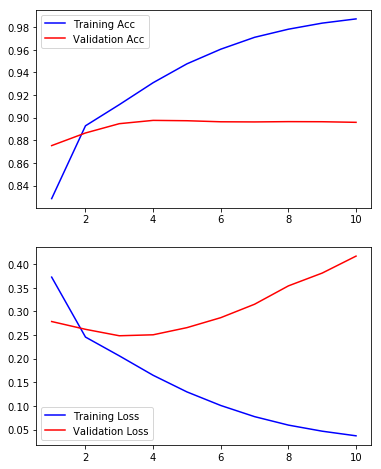


```python
# from keras.utils import plot_model
# plot_model(model3)
```

# INTERPRET


- **Summary:**
    - In terms of efficiency, no model can be a simple Logistic Regression.
    - Decision Trees and Random Forests did not improve performance and took significantly longer.
    - In terms of accuracy, a neural network using CountVectorization with a 3 layers of neurons outperformed all other models with 90% accuracy on the testing data with a run time of 31 seconds.
<br>
- **Caveats:**
    - Perfect control tweets were not available due to the limitations of the twitter API. If we had access to the batch historical tweets, we may be able to better classify troll tweets, as we would be able to leave the hashtags and mentions in the body of the tweet for vectorization. 
    - There is the possibility that the accuracy tested as-is would decrease, due to elimination of any contemporaneous events that influence tweet contents.

# FUTURE DIRECTIONS
- With additional time, we would have explored additional Neural Network configurations using bi-directional layers and additional Dense layers for classification.
- Additional methods of words/sentence vectorization
- Analysis using  Named Entity Recognition with Spacey
- Additional Visualization

- **Using the outputs of the logistic regression or neural networks with model stacking**
    - Adding in the other non-language characteristics of the tweets to further improve accuracy.
