# Final Project Submission

Please fill out:
* Student name: James M. Irving, Ph.D.
* Student pace: Full Time
* Scheduled project review date/time: 
* Instructor name: Brandon Lewis, Jeff Herman
* Blog post URL: https://jirvingphd.github.io/building_artifical_neural_networks


# Goal:
> **To create a deep-learning Natural Language Processing neural network that can analyze the language content of a Tweet to determine if the tweet was written by an authentic user or a Russian Troll.**


## Methods Overview:


### Analysis Framework

- **We will be using the OSEMN framework (outlined in brief below)**
    - [X] Obtain
        - Extract new Twitter control tweets.
        - Merge with Kaggle/FiveThirtyEight dataset
    - [X] Scrub
        - Remove hashtags, mentions, misleading common terms (discovered by feature importance in Decision Tree Classifier. 
    - [X] Explore
        - WordClouds for tokenized, stop-word removed text.
            - Also for hashtags, mentions
            - Bigrams & Pointwise Mutual Information Score
            - Sentiment Analysis
    - [x] Model 
        - Logistic Regression
        - Decision Tree Classifier
        - Random Forests Classifier
        - Artificial Neural Networks (3 vers)
    - [x] Interpret
        - Summary 
        - Future Directions
___

### Data Sources
#### Russian Troll Tweets
>We started with a dataset of **3 Million Tweets sent from 2,752 Twitter accounts connected to the "Internet Research Agency," a Russian-Troll farm** that was part of The Mueller Investigation's February 2018 indictments. The tweets cover a range from February 2012 to May 2018, with the majority published from 2015-2017.
    >    - The tweets [published on Kaggle by FiveThirtyEight](https://www.kaggle.com/fivethirtyeight/russian-troll-tweets) and were originally **collected by Clemson University researchers, Dr. Darren Linvill and Dr. Patrick Warren**, using custom searches using Social-Studio software licensed by Clemson University.<br><br>
    >    - Their analysis on the various tactics used and the various social groups that were targeted by the trolls is detailed in their manuscript ["Troll Factories: The Internet Research Agency and State-Sponsored Agenda Building"](http://pwarren.people.clemson.edu/Linvill_Warren_TrollFactory.pdf) published in July of 2018.


#### Appropriate Control Tweets
> ***However, since the goal is to produce a machine learning model that can accurately classify if a tweet came from an authentic user or a Russian troll, we needed to acquire a set of control tweets from non-trolls.*** 
> - **We used Tweepy to to extract a set of control tweets from the twitter api.**
     - Our goal was to extract tweets from the same time period as the troll tweet dataset, matching the top 20 hashtags(#) and mentions(@).<br><br>
    - However, **due to limitations of the Twitter API** *(including the inability to search for specific date ranges)* we **extracted present-day tweets directed at the top 40 most-frequent mentions (@s) from the troll Tweets.**<br>
        - (The top 20 hashtags contained many generic topics (#news, #sports) that would not be proper controls for the language content of the troll tweets.)<br><br>
        
- ***Our newly extracted control dataset is comprised of:***
    > - **39,086 tweets ranging from 05/24/19 to 06/03/19.**<br><br>
> - We **do not have equal number of troll tweets and new tweets**
> - We **will resample from the troll tweets** to meet the # of new controls.
___


## Original Troll Dataset Features & Observations
**For our analyses, we will be focusing strictly on the language of the tweets, and none of the other characteristics int he dataset.** 

    
#### Observations on the Troll Tweet Dataset
> - **Dataset is comprised of 2,973,371 tweets.**
    - Target Tweet Text to Analyze is in `Content`   
- **Thoughts on specific features:**
    - `language`
        - There are 56 unique languages. 
        - 2.1 million are English (71.6%), 670 K are in Russian, etc.
        - [x] Drop all non-English tweets. 
    - `retweet`
        - 1.3 million entries are retweets (44.1 % )
        - Since this analysis will use language content to predict author, retweets are not helpful.
        - Retweets were not written by the account's author and should be not considered.
        - [x] Drop all retweets
- **Final Troll Tweet Summary:**
    - After dropping non-English tweets and retweets, there are **1,272,848 Russian-Troll tweets.**

# OBTAIN: 

## Control Tweet Extract with TwitterAPI
- See Notebook "student_JMI_twitter_extraction.ipynb" for the extraction of control tweets to match the Troll tweets.

## Combining & Sampling Original Troll Tweets and with Newly-Harvested Control Tweets


<div>
<style scoped>
    .dataframe tbody tr th:only-of-type {
        vertical-align: middle;
    }

    .dataframe tbody tr th {
        vertical-align: top;
    }

    .dataframe thead th {
        text-align: right;
    }
</style>
<table border="1" class="dataframe">
  <thead>
    <tr style="text-align: right;">
      <th></th>
      <th>external_author_id</th>
      <th>author</th>
      <th>content</th>
      <th>region</th>
      <th>language</th>
      <th>publish_date</th>
      <th>following</th>
      <th>followers</th>
      <th>updates</th>
      <th>post_type</th>
      <th>account_type</th>
      <th>retweet</th>
      <th>account_category</th>
      <th>troll_tweet</th>
    </tr>
    <tr>
      <th>date_published</th>
      <th></th>
      <th></th>
      <th></th>
      <th></th>
      <th></th>
      <th></th>
      <th></th>
      <th></th>
      <th></th>
      <th></th>
      <th></th>
      <th></th>
      <th></th>
      <th></th>
    </tr>
  </thead>
  <tbody>
    <tr>
      <th>2017-10-01 19:58:00</th>
      <td>9.060000e+17</td>
      <td>10_GOP</td>
      <td>"We have a sitting Democrat US Senator on tria...</td>
      <td>Unknown</td>
      <td>English</td>
      <td>10/1/2017 19:58</td>
      <td>1052</td>
      <td>9636</td>
      <td>253</td>
      <td>NaN</td>
      <td>Right</td>
      <td>0</td>
      <td>RightTroll</td>
      <td>1</td>
    </tr>
    <tr>
      <th>2017-10-01 22:43:00</th>
      <td>9.060000e+17</td>
      <td>10_GOP</td>
      <td>Marshawn Lynch arrives to game in anti-Trump s...</td>
      <td>Unknown</td>
      <td>English</td>
      <td>10/1/2017 22:43</td>
      <td>1054</td>
      <td>9637</td>
      <td>254</td>
      <td>NaN</td>
      <td>Right</td>
      <td>0</td>
      <td>RightTroll</td>
      <td>1</td>
    </tr>
    <tr>
      <th>2017-10-01 23:52:00</th>
      <td>9.060000e+17</td>
      <td>10_GOP</td>
      <td>JUST IN: President Trump dedicates Presidents ...</td>
      <td>Unknown</td>
      <td>English</td>
      <td>10/1/2017 23:52</td>
      <td>1062</td>
      <td>9642</td>
      <td>256</td>
      <td>NaN</td>
      <td>Right</td>
      <td>0</td>
      <td>RightTroll</td>
      <td>1</td>
    </tr>
  </tbody>
</table>
</div>


    There were 832208 unique hashtags and 673442 unique @'s
    
    


<div>
<style scoped>
    .dataframe tbody tr th:only-of-type {
        vertical-align: middle;
    }

    .dataframe tbody tr th {
        vertical-align: top;
    }

    .dataframe thead th {
        text-align: right;
    }
</style>
<table border="1" class="dataframe">
  <thead>
    <tr style="text-align: right;">
      <th></th>
      <th>tags</th>
      <th>% Total</th>
    </tr>
  </thead>
  <tbody>
    <tr>
      <th>#news</th>
      <td>118624</td>
      <td>14.254129</td>
    </tr>
    <tr>
      <th>#sports</th>
      <td>45544</td>
      <td>5.472670</td>
    </tr>
    <tr>
      <th>#politics</th>
      <td>37452</td>
      <td>4.500317</td>
    </tr>
    <tr>
      <th>#world</th>
      <td>27077</td>
      <td>3.253634</td>
    </tr>
    <tr>
      <th>#local</th>
      <td>23130</td>
      <td>2.779353</td>
    </tr>
    <tr>
      <th>#TopNews</th>
      <td>14621</td>
      <td>1.756893</td>
    </tr>
    <tr>
      <th>#health</th>
      <td>10328</td>
      <td>1.241036</td>
    </tr>
    <tr>
      <th>#business</th>
      <td>9558</td>
      <td>1.148511</td>
    </tr>
    <tr>
      <th>#BlackLivesMatter</th>
      <td>8252</td>
      <td>0.991579</td>
    </tr>
    <tr>
      <th>#tech</th>
      <td>7836</td>
      <td>0.941592</td>
    </tr>
  </tbody>
</table>
</div>


<div>
<style scoped>
    .dataframe tbody tr th:only-of-type {
        vertical-align: middle;
    }

    .dataframe tbody tr th {
        vertical-align: top;
    }

    .dataframe thead th {
        text-align: right;
    }
</style>
<table border="1" class="dataframe">
  <thead>
    <tr style="text-align: right;">
      <th></th>
      <th>ats</th>
      <th>% Total</th>
    </tr>
  </thead>
  <tbody>
    <tr>
      <th>@midnight</th>
      <td>6691</td>
      <td>0.993553</td>
    </tr>
    <tr>
      <th>@realDonaldTrump</th>
      <td>3532</td>
      <td>0.524470</td>
    </tr>
    <tr>
      <th>@WarfareWW</th>
      <td>1529</td>
      <td>0.227043</td>
    </tr>
    <tr>
      <th>@CNN</th>
      <td>1471</td>
      <td>0.218430</td>
    </tr>
    <tr>
      <th>@HillaryClinton</th>
      <td>1424</td>
      <td>0.211451</td>
    </tr>
    <tr>
      <th>@POTUS</th>
      <td>1035</td>
      <td>0.153688</td>
    </tr>
    <tr>
      <th>@CNNPolitics</th>
      <td>948</td>
      <td>0.140769</td>
    </tr>
    <tr>
      <th>@FoxNews</th>
      <td>930</td>
      <td>0.138097</td>
    </tr>
    <tr>
      <th>@mashable</th>
      <td>740</td>
      <td>0.109883</td>
    </tr>
    <tr>
      <th>@YouTube</th>
      <td>680</td>
      <td>0.100974</td>
    </tr>
  </tbody>
</table>
</div>


    (None, None)


# SCRUB: 
## Text Processing: tokenizing, removing stopwords, urls, hashtags

## Using RegularExpressions to extract and replace Urls, Hashtags, and Mentions

- [x] URLs, hasthtags, mentions were already removed.
    - hashtags and mentions are in `content_hashtags`,`content_mentions`
- **Cleaned data columns are:**
    - `content_min_clean`: only RT headers and urls have been removed.
    - `content`: RT headers, urls, hashtags, mentions were all removed. 

#### ADDRESSING THE "RT" ISSUE
- **Summary: many messages in both the troll tweets and new control tweets are prepended with "RT".**
    - Some are `RT @handle:` others are just `RT handle:`, but SOME are using `RT` internally as an abbreviation for the idea of a retweet, not as an indicator that the _current message_ is a retweet. 

___
- [Reference Article from 2014 re: the usage of RT and more modern methods of reatweeting.](https://socialnetworking.lovetoknow.com/What_Does_RT_on_Twitter_Mean)
- According to this article, using "RT @Username:" in an anachronism that has been replaced by an automated retweet function, but that many die-hard old school twitter users still prefer to do it the manual way. 
- Therefore, by filtering out tweets marked as officially retweeted by the Twitter API, but keeping tweets thats were manually retweeted using "RT @handle:", can produce a sort of sampling error.
    - That being said, if someone is taking the effort to manually type the origin and quote, that level of effort, in my opinion, still is a reasonable metric to use to separate out these tweets from the auto-retweeted tweets.
    
- **HOWEVER: there is still the issue of what effect this has on the dataset.**
- **My proposed solution:**
    1. [x] take current df['content'] column and change it to df['content_raw'] (so that it is no longer used by the following code)
    2. [x] **create a new df['content_min_clean'] column that uses  regexp to remove all `RT @handle:` and `RT handle:` from the `df['raw']` column and all URL links, but keeps mentions and hashtags**
        - Use for some vectorized analyses
    3. [x] Create a new `hashtags` and `mentions` columns that will find and save any handles and hashtags from anywhere in the NEW `RT @mention:`-removed content.
        - This means that any hashtags that represent the original source and are pre-pended to the message will NOT be included, but any other mentions WILL be included.
        


## Resampling Troll Tweets to Match Number of Control Tweets

- Since there are many fewer new tweets, we will sample the same # from the larger Troll tweet collection.
- An issue to be reconsidered in future analyses is how to resample in a way that ensures that chosen troll tweets will be as close to the control tweets as the dataset allows.
    - In other words, making sure that if a term appears in the new control tweets, that we purposefully include matching tweets in our resampled troll tweets.

#### Revisiting Data to be Included/Excluded from the Analysis.
- This may or may not be necessary, so saving it as markdown for now until revisiting the word frequency results.


```python
## TO CHECK FOR STRINGS IN TWO DATAFRAMES:
def check_dfs_for_exp_list(df_controls, df_trolls, list_of_exp_to_check):
    import bs_ds as bs
    list_of_results=[['Term','Control Tweets','Troll Tweets']]
    for exp in list_of_exp_to_check:
        num_control = len(df_controls.loc[df_controls['content_min_clean'].str.contains(exp)])
        num_troll = len(df_trolls.loc[df_trolls['content_min_clean'].str.contains(exp)])
        list_of_results.append([exp,num_control,num_troll])
    df_results = bs.list2df(list_of_results, index_col='Term')
    return df_results

## TO CHECK FOR STRINGS IN TWO GROUPS FROM ONE DATAFRAME 
def check_df_groups_for_exp(df_full, list_of_exp_to_check, check_col='content_min_clean', groupby_col='troll_tweet', group_dict={0:'Control',1:'Troll'}):      
    """Checks `check_col` column of input dataframe for expressions in list_of_exp_to_check and 
    counts the # present for each group, defined by the groupby_col and groupdict. 
    Returns a dataframe of counts."""
    import bs_ds as bs
    list_of_results = []      

    header_list= ['Term']
    [header_list.append(x) for x in group_dict.values()]
    list_of_results.append(header_list)
    
    for exp in list_of_exp_to_check:
        curr_exp_list = [exp]
        
        for k,v in group_dict.items():
            df_group = df_full.groupby(groupby_col).get_group(k)
            curr_group_count = len(df_group.loc[df_group[check_col].str.contains(exp)])
            curr_exp_list.append(curr_group_count)
        
        list_of_results.append(curr_exp_list)
        
    df_results = bs.list2df(list_of_results, index_col='Term')
    return df_results
```


```python
## CHECKING WORD OCCURANCES 
# Important Features from Decision Tree Classificaiton: verify if they are present in Troll and Controll Tweets
list_of_exp_to_check = ['[Pp]eggy','[Nn]oonan','[Mm]exico','nasty','impeachment','[mM]ueller']
df_compare = check_df_groups_for_exp(df_full, list_of_exp_to_check)
```


    The troll_tweet classes are imbalanced.
    There are 1272847 troll tweets and 39086 control tweets
    


```python
## REMOVE MISLEADING FREQUENT TERMS
import bs_ds as bs
# Removing Peggy Noonan since she was one of the most important words and theres a recent news event about her
list_to_remove =['[Pp]eggy','[Nn]oonan']

for exp in list_to_remove:
    df_full['content'].loc[df_full['content_min_clean'].str.contains(exp)]=np.nan
    df_full.dropna(subset=['content'],inplace=True)

print("New Number of Control Tweets=",len(df_full.loc[df_full['troll_tweet']==0]))
print(f"New Number of Troll Tweets=",len(df_full.loc[df_full['troll_tweet']==1]))
# Re-check for list of expressions
df_compare = check_df_groups_for_exp(df_full, list_of_exp_to_check)
df_compare.style.set_caption('Full Dataset Expressions')
```

    New Number of Control Tweets= 38094
    New Number of Troll Tweets= 1272760
    


# EXPLORE

## Generating Frequency Distribtuions


```python
import nltk
import string
from nltk import word_tokenize
```


```python
def get_group_texts_tokens(df_small, groupby_col='troll_tweet', group_dict={0:'controls',1:'trolls'}, column='content_stopped'):
    from nltk import regexp_tokenize
    pattern = "([a-zA-Z]+(?:'[a-z]+)?)"
    text_dict = {}
    for k,v in group_dict.items():
        group_text_temp = df_small.groupby(groupby_col).get_group(k)[column]
        group_text_temp = ' '.join(group_text_temp)
        group_tokens = regexp_tokenize(group_text_temp, pattern)
        text_dict[v] = {}
        text_dict[v]['tokens'] = group_tokens
        text_dict[v]['text'] =  ' '.join(group_tokens)
            
    print(f"{text_dict.keys()}:['tokens']|['text']")
    return text_dict
```


```python
# Function will return a dictionary of all of the text and tokens split by group
TEXT = get_group_texts_tokens(df_small,groupby_col='troll_tweet', group_dict={0:'controls',1:'trolls'}, column='content_stopped')

# TEXT[Group][Text-or-Tokens]
TEXT['trolls']['tokens'][:10]
```

    dict_keys(['controls', 'trolls']):['tokens']|['text']
    


    ['building',
     'collapses',
     'mexico',
     'city',
     'following',
     'magnitude',
     'earthquake',
     'current',
     'scene',
     'mexico']


```python
from nltk import FreqDist

TEXT = get_group_texts_tokens(df_small)

freq_trolls = FreqDist(TEXT['trolls']['tokens'])
freq_controls = FreqDist(TEXT['controls']['tokens'])

df_compare=pd.DataFrame()
df_compare['Troll Words'] = freq_trolls.most_common(25)
df_compare['Control Words'] = freq_controls.most_common(25)
display(df_compare)

# print(freq_controls.most_common(50))
```

    dict_keys(['controls', 'trolls']):['tokens']|['text']
    


<div>
<style scoped>
    .dataframe tbody tr th:only-of-type {
        vertical-align: middle;
    }

    .dataframe tbody tr th {
        vertical-align: top;
    }

    .dataframe thead th {
        text-align: right;
    }
</style>
<table border="1" class="dataframe">
  <thead>
    <tr style="text-align: right;">
      <th></th>
      <th>Troll Words</th>
      <th>Control Words</th>
    </tr>
  </thead>
  <tbody>
    <tr>
      <th>0</th>
      <td>(mueller, 3919)</td>
      <td>(trump, 4053)</td>
    </tr>
    <tr>
      <th>1</th>
      <td>(trump, 3893)</td>
      <td>(want, 2851)</td>
    </tr>
    <tr>
      <th>2</th>
      <td>(mexico, 3108)</td>
      <td>(mexico, 2843)</td>
    </tr>
    <tr>
      <th>3</th>
      <td>(new, 2091)</td>
      <td>(years, 2828)</td>
    </tr>
    <tr>
      <th>4</th>
      <td>(police, 1210)</td>
      <td>(big, 2598)</td>
    </tr>
    <tr>
      <th>5</th>
      <td>(breaking, 1200)</td>
      <td>(talk, 2494)</td>
    </tr>
    <tr>
      <th>6</th>
      <td>(workout, 1127)</td>
      <td>(border, 2440)</td>
    </tr>
    <tr>
      <th>7</th>
      <td>(man, 1122)</td>
      <td>(problem, 2365)</td>
    </tr>
    <tr>
      <th>8</th>
      <td>(obama, 889)</td>
      <td>(president, 2360)</td>
    </tr>
    <tr>
      <th>9</th>
      <td>(says, 751)</td>
      <td>(people, 2235)</td>
    </tr>
    <tr>
      <th>10</th>
      <td>(state, 738)</td>
      <td>(talking, 2219)</td>
    </tr>
    <tr>
      <th>11</th>
      <td>(president, 718)</td>
      <td>(sending, 2031)</td>
    </tr>
    <tr>
      <th>12</th>
      <td>(video, 715)</td>
      <td>(delegation, 2015)</td>
    </tr>
    <tr>
      <th>13</th>
      <td>(us, 679)</td>
      <td>(like, 1943)</td>
    </tr>
    <tr>
      <th>14</th>
      <td>(people, 669)</td>
      <td>(news, 1542)</td>
    </tr>
    <tr>
      <th>15</th>
      <td>(one, 661)</td>
      <td>(know, 1538)</td>
    </tr>
    <tr>
      <th>16</th>
      <td>(clinton, 628)</td>
      <td>(us, 1487)</td>
    </tr>
    <tr>
      <th>17</th>
      <td>(hillary, 592)</td>
      <td>(never, 1375)</td>
    </tr>
    <tr>
      <th>18</th>
      <td>(russia, 567)</td>
      <td>(one, 1372)</td>
    </tr>
    <tr>
      <th>19</th>
      <td>(get, 547)</td>
      <td>(nasty, 1326)</td>
    </tr>
    <tr>
      <th>20</th>
      <td>(killed, 524)</td>
      <td>(would, 1198)</td>
    </tr>
    <tr>
      <th>21</th>
      <td>(robert, 524)</td>
      <td>(today, 1148)</td>
    </tr>
    <tr>
      <th>22</th>
      <td>(look, 514)</td>
      <td>(get, 1033)</td>
    </tr>
    <tr>
      <th>23</th>
      <td>(congress, 508)</td>
      <td>(need, 1019)</td>
    </tr>
    <tr>
      <th>24</th>
      <td>(year, 496)</td>
      <td>(said, 1004)</td>
    </tr>
  </tbody>
</table>
</div>


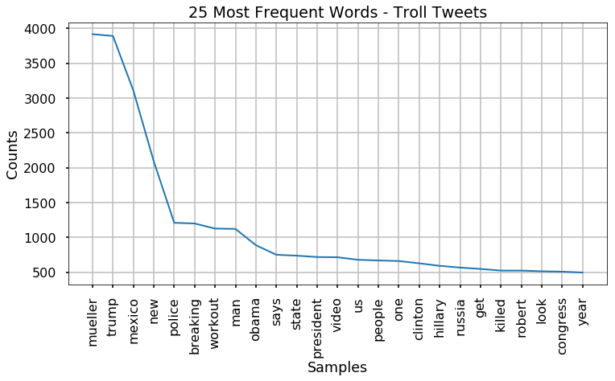


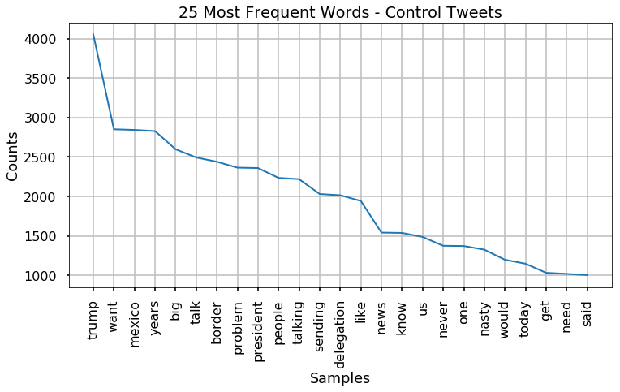


```python
# pause
```

### Generating WordClouds


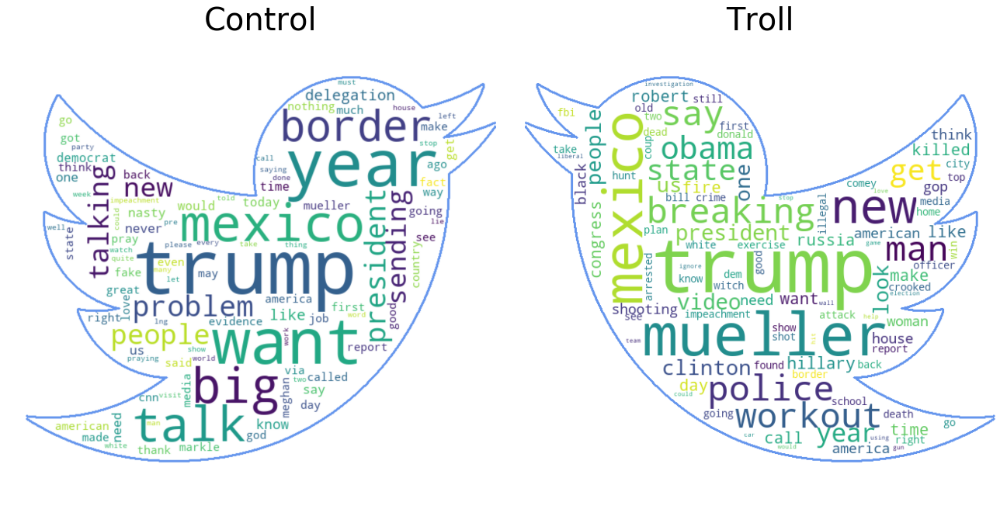


### Wordclouds for Hashtags


### Wordclouds for @'s


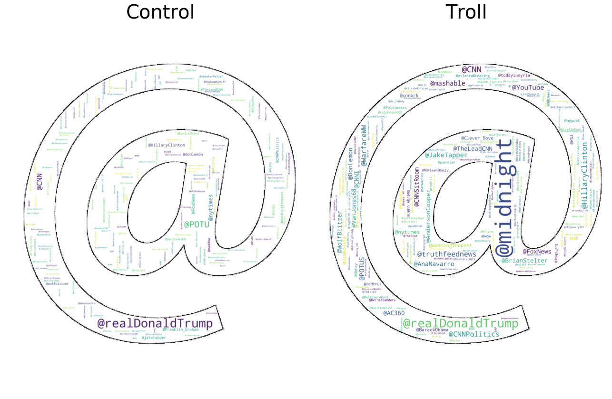


## Creating Bigrams and PMI scores

### Bigrams


<table style="display:inline" id="T_369b4ac0_d4ad_11e9_977e_f48e38b6371f" ><caption>Control Tweet Bigrams</caption><thead>    <tr>        <th class="blank level0" ></th>        <th class="col_heading level0 col0" >Frequency</th>    </tr>    <tr>        <th class="index_name level0" >Bigram</th>        <th class="blank" ></th>    </tr></thead><tbody>
                <tr>
                        <th id="T_369b4ac0_d4ad_11e9_977e_f48e38b6371flevel0_row0" class="row_heading level0 row0" >('border', 'problem')</th>
                        <td id="T_369b4ac0_d4ad_11e9_977e_f48e38b6371frow0_col0" class="data row0 col0" >0.00571695</td>
            </tr>
            <tr>
                        <th id="T_369b4ac0_d4ad_11e9_977e_f48e38b6371flevel0_row1" class="row_heading level0 row1" >('big', 'delegation')</th>
                        <td id="T_369b4ac0_d4ad_11e9_977e_f48e38b6371frow1_col0" class="data row1 col0" >0.00569424</td>
            </tr>
            <tr>
                        <th id="T_369b4ac0_d4ad_11e9_977e_f48e38b6371flevel0_row2" class="row_heading level0 row2" >('talking', 'years')</th>
                        <td id="T_369b4ac0_d4ad_11e9_977e_f48e38b6371frow2_col0" class="data row2 col0" >0.0056914</td>
            </tr>
            <tr>
                        <th id="T_369b4ac0_d4ad_11e9_977e_f48e38b6371flevel0_row3" class="row_heading level0 row3" >('sending', 'big')</th>
                        <td id="T_369b4ac0_d4ad_11e9_977e_f48e38b6371frow3_col0" class="data row3 col0" >0.00568572</td>
            </tr>
            <tr>
                        <th id="T_369b4ac0_d4ad_11e9_977e_f48e38b6371flevel0_row4" class="row_heading level0 row4" >('talk', 'border')</th>
                        <td id="T_369b4ac0_d4ad_11e9_977e_f48e38b6371frow4_col0" class="data row4 col0" >0.00568572</td>
            </tr>
            <tr>
                        <th id="T_369b4ac0_d4ad_11e9_977e_f48e38b6371flevel0_row5" class="row_heading level0 row5" >('years', 'want')</th>
                        <td id="T_369b4ac0_d4ad_11e9_977e_f48e38b6371frow5_col0" class="data row5 col0" >0.00568572</td>
            </tr>
            <tr>
                        <th id="T_369b4ac0_d4ad_11e9_977e_f48e38b6371flevel0_row6" class="row_heading level0 row6" >('delegation', 'talk')</th>
                        <td id="T_369b4ac0_d4ad_11e9_977e_f48e38b6371frow6_col0" class="data row6 col0" >0.00568288</td>
            </tr>
            <tr>
                        <th id="T_369b4ac0_d4ad_11e9_977e_f48e38b6371flevel0_row7" class="row_heading level0 row7" >('mexico', 'sending')</th>
                        <td id="T_369b4ac0_d4ad_11e9_977e_f48e38b6371frow7_col0" class="data row7 col0" >0.00568288</td>
            </tr>
            <tr>
                        <th id="T_369b4ac0_d4ad_11e9_977e_f48e38b6371flevel0_row8" class="row_heading level0 row8" >('problem', 'talking')</th>
                        <td id="T_369b4ac0_d4ad_11e9_977e_f48e38b6371frow8_col0" class="data row8 col0" >0.00568288</td>
            </tr>
            <tr>
                        <th id="T_369b4ac0_d4ad_11e9_977e_f48e38b6371flevel0_row9" class="row_heading level0 row9" >('fake', 'news')</th>
                        <td id="T_369b4ac0_d4ad_11e9_977e_f48e38b6371frow9_col0" class="data row9 col0" >0.00184509</td>
            </tr>
            <tr>
                        <th id="T_369b4ac0_d4ad_11e9_977e_f48e38b6371flevel0_row10" class="row_heading level0 row10" >('meghan', 'markle')</th>
                        <td id="T_369b4ac0_d4ad_11e9_977e_f48e38b6371frow10_col0" class="data row10 col0" >0.00183658</td>
            </tr>
            <tr>
                        <th id="T_369b4ac0_d4ad_11e9_977e_f48e38b6371flevel0_row11" class="row_heading level0 row11" >('markle', 'nasty')</th>
                        <td id="T_369b4ac0_d4ad_11e9_977e_f48e38b6371frow11_col0" class="data row11 col0" >0.00167761</td>
            </tr>
            <tr>
                        <th id="T_369b4ac0_d4ad_11e9_977e_f48e38b6371flevel0_row12" class="row_heading level0 row12" >('never', 'called')</th>
                        <td id="T_369b4ac0_d4ad_11e9_977e_f48e38b6371frow12_col0" class="data row12 col0" >0.00156975</td>
            </tr>
            <tr>
                        <th id="T_369b4ac0_d4ad_11e9_977e_f48e38b6371flevel0_row13" class="row_heading level0 row13" >('called', 'meghan')</th>
                        <td id="T_369b4ac0_d4ad_11e9_977e_f48e38b6371frow13_col0" class="data row13 col0" >0.00155555</td>
            </tr>
            <tr>
                        <th id="T_369b4ac0_d4ad_11e9_977e_f48e38b6371flevel0_row14" class="row_heading level0 row14" >('want', 'mexico')</th>
                        <td id="T_369b4ac0_d4ad_11e9_977e_f48e38b6371frow14_col0" class="data row14 col0" >0.00131143</td>
            </tr>
            <tr>
                        <th id="T_369b4ac0_d4ad_11e9_977e_f48e38b6371flevel0_row15" class="row_heading level0 row15" >('news', 'media')</th>
                        <td id="T_369b4ac0_d4ad_11e9_977e_f48e38b6371frow15_col0" class="data row15 col0" >0.00120641</td>
            </tr>
            <tr>
                        <th id="T_369b4ac0_d4ad_11e9_977e_f48e38b6371flevel0_row16" class="row_heading level0 row16" >('got', 'caught')</th>
                        <td id="T_369b4ac0_d4ad_11e9_977e_f48e38b6371frow16_col0" class="data row16 col0" >0.00118086</td>
            </tr>
            <tr>
                        <th id="T_369b4ac0_d4ad_11e9_977e_f48e38b6371flevel0_row17" class="row_heading level0 row17" >('caught', 'cold')</th>
                        <td id="T_369b4ac0_d4ad_11e9_977e_f48e38b6371frow17_col0" class="data row17 col0" >0.00117518</td>
            </tr>
            <tr>
                        <th id="T_369b4ac0_d4ad_11e9_977e_f48e38b6371flevel0_row18" class="row_heading level0 row18" >('made', 'fake')</th>
                        <td id="T_369b4ac0_d4ad_11e9_977e_f48e38b6371frow18_col0" class="data row18 col0" >0.00116383</td>
            </tr>
            <tr>
                        <th id="T_369b4ac0_d4ad_11e9_977e_f48e38b6371flevel0_row19" class="row_heading level0 row19" >('president', 'trump')</th>
                        <td id="T_369b4ac0_d4ad_11e9_977e_f48e38b6371frow19_col0" class="data row19 col0" >0.00116099</td>
            </tr>
            <tr>
                        <th id="T_369b4ac0_d4ad_11e9_977e_f48e38b6371flevel0_row20" class="row_heading level0 row20" >('media', 'got')</th>
                        <td id="T_369b4ac0_d4ad_11e9_977e_f48e38b6371frow20_col0" class="data row20 col0" >0.00115815</td>
            </tr>
            <tr>
                        <th id="T_369b4ac0_d4ad_11e9_977e_f48e38b6371flevel0_row21" class="row_heading level0 row21" >('nasty', 'made')</th>
                        <td id="T_369b4ac0_d4ad_11e9_977e_f48e38b6371frow21_col0" class="data row21 col0" >0.00115815</td>
            </tr>
            <tr>
                        <th id="T_369b4ac0_d4ad_11e9_977e_f48e38b6371flevel0_row22" class="row_heading level0 row22" >('eyes', 'ears')</th>
                        <td id="T_369b4ac0_d4ad_11e9_977e_f48e38b6371frow22_col0" class="data row22 col0" >0.00112693</td>
            </tr>
            <tr>
                        <th id="T_369b4ac0_d4ad_11e9_977e_f48e38b6371flevel0_row23" class="row_heading level0 row23" >('pres', 'trump')</th>
                        <td id="T_369b4ac0_d4ad_11e9_977e_f48e38b6371frow23_col0" class="data row23 col0" >0.00111841</td>
            </tr>
            <tr>
                        <th id="T_369b4ac0_d4ad_11e9_977e_f48e38b6371flevel0_row24" class="row_heading level0 row24" >('evidence', 'eyes')</th>
                        <td id="T_369b4ac0_d4ad_11e9_977e_f48e38b6371frow24_col0" class="data row24 col0" >0.00111557</td>
            </tr>
    </tbody></table style="display:inline">&nbsp;<style  type="text/css" >
</style><table style="display:inline" id="T_369c8336_d4ad_11e9_8477_f48e38b6371f" ><caption>Troll Tweet Bigrams</caption><thead>    <tr>        <th class="blank level0" ></th>        <th class="col_heading level0 col0" >Frequency</th>    </tr>    <tr>        <th class="index_name level0" >Bigram</th>        <th class="blank" ></th>    </tr></thead><tbody>
                <tr>
                        <th id="T_369c8336_d4ad_11e9_8477_f48e38b6371flevel0_row0" class="row_heading level0 row0" >('new', 'mexico')</th>
                        <td id="T_369c8336_d4ad_11e9_8477_f48e38b6371frow0_col0" class="data row0 col0" >0.00338416</td>
            </tr>
            <tr>
                        <th id="T_369c8336_d4ad_11e9_8477_f48e38b6371flevel0_row1" class="row_heading level0 row1" >('robert', 'mueller')</th>
                        <td id="T_369c8336_d4ad_11e9_8477_f48e38b6371frow1_col0" class="data row1 col0" >0.00168116</td>
            </tr>
            <tr>
                        <th id="T_369c8336_d4ad_11e9_8477_f48e38b6371flevel0_row2" class="row_heading level0 row2" >('witch', 'hunt')</th>
                        <td id="T_369c8336_d4ad_11e9_8477_f48e38b6371frow2_col0" class="data row2 col0" >0.00112805</td>
            </tr>
            <tr>
                        <th id="T_369c8336_d4ad_11e9_8477_f48e38b6371flevel0_row3" class="row_heading level0 row3" >('crooked', 'mueller')</th>
                        <td id="T_369c8336_d4ad_11e9_8477_f48e38b6371frow3_col0" class="data row3 col0" >0.000967941</td>
            </tr>
            <tr>
                        <th id="T_369c8336_d4ad_11e9_8477_f48e38b6371flevel0_row4" class="row_heading level0 row4" >('donald', 'trump')</th>
                        <td id="T_369c8336_d4ad_11e9_8477_f48e38b6371frow4_col0" class="data row4 col0" >0.000949747</td>
            </tr>
            <tr>
                        <th id="T_369c8336_d4ad_11e9_8477_f48e38b6371flevel0_row5" class="row_heading level0 row5" >('year', 'old')</th>
                        <td id="T_369c8336_d4ad_11e9_8477_f48e38b6371frow5_col0" class="data row5 col0" >0.000949747</td>
            </tr>
            <tr>
                        <th id="T_369c8336_d4ad_11e9_8477_f48e38b6371flevel0_row6" class="row_heading level0 row6" >('president', 'trump')</th>
                        <td id="T_369c8336_d4ad_11e9_8477_f48e38b6371frow6_col0" class="data row6 col0" >0.000822386</td>
            </tr>
            <tr>
                        <th id="T_369c8336_d4ad_11e9_8477_f48e38b6371flevel0_row7" class="row_heading level0 row7" >('ignores', 'mueller')</th>
                        <td id="T_369c8336_d4ad_11e9_8477_f48e38b6371frow7_col0" class="data row7 col0" >0.000785998</td>
            </tr>
            <tr>
                        <th id="T_369c8336_d4ad_11e9_8477_f48e38b6371flevel0_row8" class="row_heading level0 row8" >('grand', 'jury')</th>
                        <td id="T_369c8336_d4ad_11e9_8477_f48e38b6371frow8_col0" class="data row8 col0" >0.000775081</td>
            </tr>
            <tr>
                        <th id="T_369c8336_d4ad_11e9_8477_f48e38b6371flevel0_row9" class="row_heading level0 row9" >('coup', 'using')</th>
                        <td id="T_369c8336_d4ad_11e9_8477_f48e38b6371frow9_col0" class="data row9 col0" >0.000753248</td>
            </tr>
            <tr>
                        <th id="T_369c8336_d4ad_11e9_8477_f48e38b6371flevel0_row10" class="row_heading level0 row10" >('approval', 'tanks')</th>
                        <td id="T_369c8336_d4ad_11e9_8477_f48e38b6371frow10_col0" class="data row10 col0" >0.000724137</td>
            </tr>
            <tr>
                        <th id="T_369c8336_d4ad_11e9_8477_f48e38b6371flevel0_row11" class="row_heading level0 row11" >('tanks', 'gt')</th>
                        <td id="T_369c8336_d4ad_11e9_8477_f48e38b6371frow11_col0" class="data row11 col0" >0.000724137</td>
            </tr>
            <tr>
                        <th id="T_369c8336_d4ad_11e9_8477_f48e38b6371flevel0_row12" class="row_heading level0 row12" >('mueller', 'credibility')</th>
                        <td id="T_369c8336_d4ad_11e9_8477_f48e38b6371frow12_col0" class="data row12 col0" >0.000698665</td>
            </tr>
            <tr>
                        <th id="T_369c8336_d4ad_11e9_8477_f48e38b6371flevel0_row13" class="row_heading level0 row13" >('rosenstein', 'mueller')</th>
                        <td id="T_369c8336_d4ad_11e9_8477_f48e38b6371frow13_col0" class="data row13 col0" >0.000698665</td>
            </tr>
            <tr>
                        <th id="T_369c8336_d4ad_11e9_8477_f48e38b6371flevel0_row14" class="row_heading level0 row14" >('deep', 'state')</th>
                        <td id="T_369c8336_d4ad_11e9_8477_f48e38b6371frow14_col0" class="data row14 col0" >0.000651359</td>
            </tr>
            <tr>
                        <th id="T_369c8336_d4ad_11e9_8477_f48e38b6371flevel0_row15" class="row_heading level0 row15" >('lose', 'weight')</th>
                        <td id="T_369c8336_d4ad_11e9_8477_f48e38b6371frow15_col0" class="data row15 col0" >0.000644081</td>
            </tr>
            <tr>
                        <th id="T_369c8336_d4ad_11e9_8477_f48e38b6371flevel0_row16" class="row_heading level0 row16" >('special', 'counsel')</th>
                        <td id="T_369c8336_d4ad_11e9_8477_f48e38b6371frow16_col0" class="data row16 col0" >0.000618609</td>
            </tr>
            <tr>
                        <th id="T_369c8336_d4ad_11e9_8477_f48e38b6371flevel0_row17" class="row_heading level0 row17" >('credibility', 'think')</th>
                        <td id="T_369c8336_d4ad_11e9_8477_f48e38b6371frow17_col0" class="data row17 col0" >0.00058222</td>
            </tr>
            <tr>
                        <th id="T_369c8336_d4ad_11e9_8477_f48e38b6371flevel0_row18" class="row_heading level0 row18" >('mexico', 'border')</th>
                        <td id="T_369c8336_d4ad_11e9_8477_f48e38b6371frow18_col0" class="data row18 col0" >0.000571304</td>
            </tr>
            <tr>
                        <th id="T_369c8336_d4ad_11e9_8477_f48e38b6371flevel0_row19" class="row_heading level0 row19" >('white', 'house')</th>
                        <td id="T_369c8336_d4ad_11e9_8477_f48e38b6371frow19_col0" class="data row19 col0" >0.000567665</td>
            </tr>
            <tr>
                        <th id="T_369c8336_d4ad_11e9_8477_f48e38b6371flevel0_row20" class="row_heading level0 row20" >('attempts', 'coup')</th>
                        <td id="T_369c8336_d4ad_11e9_8477_f48e38b6371frow20_col0" class="data row20 col0" >0.000556748</td>
            </tr>
            <tr>
                        <th id="T_369c8336_d4ad_11e9_8477_f48e38b6371flevel0_row21" class="row_heading level0 row21" >('gt', 'attempts')</th>
                        <td id="T_369c8336_d4ad_11e9_8477_f48e38b6371frow21_col0" class="data row21 col0" >0.000556748</td>
            </tr>
            <tr>
                        <th id="T_369c8336_d4ad_11e9_8477_f48e38b6371flevel0_row22" class="row_heading level0 row22" >('mueller', 'witch')</th>
                        <td id="T_369c8336_d4ad_11e9_8477_f48e38b6371frow22_col0" class="data row22 col0" >0.000505804</td>
            </tr>
            <tr>
                        <th id="T_369c8336_d4ad_11e9_8477_f48e38b6371flevel0_row23" class="row_heading level0 row23" >('hillary', 'clinton')</th>
                        <td id="T_369c8336_d4ad_11e9_8477_f48e38b6371frow23_col0" class="data row23 col0" >0.000491248</td>
            </tr>
            <tr>
                        <th id="T_369c8336_d4ad_11e9_8477_f48e38b6371flevel0_row24" class="row_heading level0 row24" >('crimes', 'obama')</th>
                        <td id="T_369c8336_d4ad_11e9_8477_f48e38b6371frow24_col0" class="data row24 col0" >0.000473054</td>
            </tr>
    </tbody></table style="display:inline">


### Pointwise Mutual Information Score
- Interesting, but heavily influenced by the different time periods.

<table style="display:inline" id="T_37949fa2_d4ad_11e9_85b6_f48e38b6371f" ><caption>Control Tweets</caption><thead>    <tr>        <th class="blank level0" ></th>        <th class="col_heading level0 col0" >PMI Score</th>    </tr>    <tr>        <th class="index_name level0" >Bigrams</th>        <th class="blank" ></th>    </tr></thead><tbody>
                <tr>
                        <th id="T_37949fa2_d4ad_11e9_85b6_f48e38b6371flevel0_row0" class="row_heading level0 row0" >('disappearance', 'connecticut')</th>
                        <td id="T_37949fa2_d4ad_11e9_85b6_f48e38b6371frow0_col0" class="data row0 col0" >16.1045</td>
            </tr>
            <tr>
                        <th id="T_37949fa2_d4ad_11e9_85b6_f48e38b6371flevel0_row1" class="row_heading level0 row1" >('glen', 'tyrone')</th>
                        <td id="T_37949fa2_d4ad_11e9_85b6_f48e38b6371frow1_col0" class="data row1 col0" >16.1045</td>
            </tr>
            <tr>
                        <th id="T_37949fa2_d4ad_11e9_85b6_f48e38b6371flevel0_row2" class="row_heading level0 row2" >('uscis', 'ignor')</th>
                        <td id="T_37949fa2_d4ad_11e9_85b6_f48e38b6371frow2_col0" class="data row2 col0" >16.1045</td>
            </tr>
            <tr>
                        <th id="T_37949fa2_d4ad_11e9_85b6_f48e38b6371flevel0_row3" class="row_heading level0 row3" >('advisers', 'departing')</th>
                        <td id="T_37949fa2_d4ad_11e9_85b6_f48e38b6371frow3_col0" class="data row3 col0" >15.8414</td>
            </tr>
            <tr>
                        <th id="T_37949fa2_d4ad_11e9_85b6_f48e38b6371flevel0_row4" class="row_heading level0 row4" >('babyhands', 'mcgrifter')</th>
                        <td id="T_37949fa2_d4ad_11e9_85b6_f48e38b6371frow4_col0" class="data row4 col0" >15.8414</td>
            </tr>
            <tr>
                        <th id="T_37949fa2_d4ad_11e9_85b6_f48e38b6371flevel0_row5" class="row_heading level0 row5" >('bryan', 'stevenson')</th>
                        <td id="T_37949fa2_d4ad_11e9_85b6_f48e38b6371frow5_col0" class="data row5 col0" >15.8414</td>
            </tr>
            <tr>
                        <th id="T_37949fa2_d4ad_11e9_85b6_f48e38b6371flevel0_row6" class="row_heading level0 row6" >('computer', 'intrusions')</th>
                        <td id="T_37949fa2_d4ad_11e9_85b6_f48e38b6371frow6_col0" class="data row6 col0" >15.8414</td>
            </tr>
            <tr>
                        <th id="T_37949fa2_d4ad_11e9_85b6_f48e38b6371flevel0_row7" class="row_heading level0 row7" >('grounding', 'airline')</th>
                        <td id="T_37949fa2_d4ad_11e9_85b6_f48e38b6371frow7_col0" class="data row7 col0" >15.8414</td>
            </tr>
            <tr>
                        <th id="T_37949fa2_d4ad_11e9_85b6_f48e38b6371flevel0_row8" class="row_heading level0 row8" >('haberman', 'sycophancy')</th>
                        <td id="T_37949fa2_d4ad_11e9_85b6_f48e38b6371frow8_col0" class="data row8 col0" >15.8414</td>
            </tr>
            <tr>
                        <th id="T_37949fa2_d4ad_11e9_85b6_f48e38b6371flevel0_row9" class="row_heading level0 row9" >('intimidating', 'construc')</th>
                        <td id="T_37949fa2_d4ad_11e9_85b6_f48e38b6371frow9_col0" class="data row9 col0" >15.8414</td>
            </tr>
            <tr>
                        <th id="T_37949fa2_d4ad_11e9_85b6_f48e38b6371flevel0_row10" class="row_heading level0 row10" >('rio', 'grande')</th>
                        <td id="T_37949fa2_d4ad_11e9_85b6_f48e38b6371frow10_col0" class="data row10 col0" >15.8414</td>
            </tr>
            <tr>
                        <th id="T_37949fa2_d4ad_11e9_85b6_f48e38b6371flevel0_row11" class="row_heading level0 row11" >('capone', 'vault')</th>
                        <td id="T_37949fa2_d4ad_11e9_85b6_f48e38b6371frow11_col0" class="data row11 col0" >15.619</td>
            </tr>
            <tr>
                        <th id="T_37949fa2_d4ad_11e9_85b6_f48e38b6371flevel0_row12" class="row_heading level0 row12" >('hs', 'bp')</th>
                        <td id="T_37949fa2_d4ad_11e9_85b6_f48e38b6371frow12_col0" class="data row12 col0" >15.619</td>
            </tr>
            <tr>
                        <th id="T_37949fa2_d4ad_11e9_85b6_f48e38b6371flevel0_row13" class="row_heading level0 row13" >('partnership', 'racing')</th>
                        <td id="T_37949fa2_d4ad_11e9_85b6_f48e38b6371frow13_col0" class="data row13 col0" >15.619</td>
            </tr>
            <tr>
                        <th id="T_37949fa2_d4ad_11e9_85b6_f48e38b6371flevel0_row14" class="row_heading level0 row14" >('racing', 'airs')</th>
                        <td id="T_37949fa2_d4ad_11e9_85b6_f48e38b6371frow14_col0" class="data row14 col0" >15.619</td>
            </tr>
            <tr>
                        <th id="T_37949fa2_d4ad_11e9_85b6_f48e38b6371flevel0_row15" class="row_heading level0 row15" >('riskier', 'bureaucracy')</th>
                        <td id="T_37949fa2_d4ad_11e9_85b6_f48e38b6371frow15_col0" class="data row15 col0" >15.619</td>
            </tr>
            <tr>
                        <th id="T_37949fa2_d4ad_11e9_85b6_f48e38b6371flevel0_row16" class="row_heading level0 row16" >('rweet', 'apprec')</th>
                        <td id="T_37949fa2_d4ad_11e9_85b6_f48e38b6371frow16_col0" class="data row16 col0" >15.619</td>
            </tr>
            <tr>
                        <th id="T_37949fa2_d4ad_11e9_85b6_f48e38b6371flevel0_row17" class="row_heading level0 row17" >('unprepared', 'temperamentally')</th>
                        <td id="T_37949fa2_d4ad_11e9_85b6_f48e38b6371frow17_col0" class="data row17 col0" >15.619</td>
            </tr>
            <tr>
                        <th id="T_37949fa2_d4ad_11e9_85b6_f48e38b6371flevel0_row18" class="row_heading level0 row18" >('vr', 'arcade')</th>
                        <td id="T_37949fa2_d4ad_11e9_85b6_f48e38b6371frow18_col0" class="data row18 col0" >15.619</td>
            </tr>
            <tr>
                        <th id="T_37949fa2_d4ad_11e9_85b6_f48e38b6371flevel0_row19" class="row_heading level0 row19" >('bites', 'dust')</th>
                        <td id="T_37949fa2_d4ad_11e9_85b6_f48e38b6371frow19_col0" class="data row19 col0" >15.5784</td>
            </tr>
    </tbody></table style="display:inline">&nbsp;<style  type="text/css" >
</style><table style="display:inline" id="T_37956258_d4ad_11e9_b349_f48e38b6371f" ><caption>Troll Tweets</caption><thead>    <tr>        <th class="blank level0" ></th>        <th class="col_heading level0 col0" >PMI Score</th>    </tr>    <tr>        <th class="index_name level0" >Bigrams</th>        <th class="blank" ></th>    </tr></thead><tbody>
                <tr>
                        <th id="T_37956258_d4ad_11e9_b349_f48e38b6371flevel0_row0" class="row_heading level0 row0" >('cessation', 'hostilities')</th>
                        <td id="T_37956258_d4ad_11e9_b349_f48e38b6371frow0_col0" class="data row0 col0" >15.7461</td>
            </tr>
            <tr>
                        <th id="T_37956258_d4ad_11e9_b349_f48e38b6371flevel0_row1" class="row_heading level0 row1" >('dunkin', 'donuts')</th>
                        <td id="T_37956258_d4ad_11e9_b349_f48e38b6371frow1_col0" class="data row1 col0" >15.7461</td>
            </tr>
            <tr>
                        <th id="T_37956258_d4ad_11e9_b349_f48e38b6371flevel0_row2" class="row_heading level0 row2" >('lena', 'dunham')</th>
                        <td id="T_37956258_d4ad_11e9_b349_f48e38b6371frow2_col0" class="data row2 col0" >15.7461</td>
            </tr>
            <tr>
                        <th id="T_37956258_d4ad_11e9_b349_f48e38b6371flevel0_row3" class="row_heading level0 row3" >('notre', 'dame')</th>
                        <td id="T_37956258_d4ad_11e9_b349_f48e38b6371frow3_col0" class="data row3 col0" >15.7461</td>
            </tr>
            <tr>
                        <th id="T_37956258_d4ad_11e9_b349_f48e38b6371flevel0_row4" class="row_heading level0 row4" >('snoop', 'dogg')</th>
                        <td id="T_37956258_d4ad_11e9_b349_f48e38b6371frow4_col0" class="data row4 col0" >15.7461</td>
            </tr>
            <tr>
                        <th id="T_37956258_d4ad_11e9_b349_f48e38b6371flevel0_row5" class="row_heading level0 row5" >('boko', 'haram')</th>
                        <td id="T_37956258_d4ad_11e9_b349_f48e38b6371frow5_col0" class="data row5 col0" >15.4831</td>
            </tr>
            <tr>
                        <th id="T_37956258_d4ad_11e9_b349_f48e38b6371flevel0_row6" class="row_heading level0 row6" >('lectric', 'heep')</th>
                        <td id="T_37956258_d4ad_11e9_b349_f48e38b6371frow6_col0" class="data row6 col0" >15.4831</td>
            </tr>
            <tr>
                        <th id="T_37956258_d4ad_11e9_b349_f48e38b6371flevel0_row7" class="row_heading level0 row7" >('nagorno', 'karabakh')</th>
                        <td id="T_37956258_d4ad_11e9_b349_f48e38b6371frow7_col0" class="data row7 col0" >15.4831</td>
            </tr>
            <tr>
                        <th id="T_37956258_d4ad_11e9_b349_f48e38b6371flevel0_row8" class="row_heading level0 row8" >('kayleigh', 'mcenany')</th>
                        <td id="T_37956258_d4ad_11e9_b349_f48e38b6371frow8_col0" class="data row8 col0" >15.2607</td>
            </tr>
            <tr>
                        <th id="T_37956258_d4ad_11e9_b349_f48e38b6371flevel0_row9" class="row_heading level0 row9" >('otto', 'warmbier')</th>
                        <td id="T_37956258_d4ad_11e9_b349_f48e38b6371frow9_col0" class="data row9 col0" >15.2607</td>
            </tr>
            <tr>
                        <th id="T_37956258_d4ad_11e9_b349_f48e38b6371flevel0_row10" class="row_heading level0 row10" >('allahu', 'akbar')</th>
                        <td id="T_37956258_d4ad_11e9_b349_f48e38b6371frow10_col0" class="data row10 col0" >15.0681</td>
            </tr>
            <tr>
                        <th id="T_37956258_d4ad_11e9_b349_f48e38b6371flevel0_row11" class="row_heading level0 row11" >('elon', 'musk')</th>
                        <td id="T_37956258_d4ad_11e9_b349_f48e38b6371frow11_col0" class="data row11 col0" >15.0681</td>
            </tr>
            <tr>
                        <th id="T_37956258_d4ad_11e9_b349_f48e38b6371flevel0_row12" class="row_heading level0 row12" >('ez', 'zor')</th>
                        <td id="T_37956258_d4ad_11e9_b349_f48e38b6371frow12_col0" class="data row12 col0" >15.0681</td>
            </tr>
            <tr>
                        <th id="T_37956258_d4ad_11e9_b349_f48e38b6371flevel0_row13" class="row_heading level0 row13" >('peanut', 'butter')</th>
                        <td id="T_37956258_d4ad_11e9_b349_f48e38b6371frow13_col0" class="data row13 col0" >15.0681</td>
            </tr>
            <tr>
                        <th id="T_37956258_d4ad_11e9_b349_f48e38b6371flevel0_row14" class="row_heading level0 row14" >('palo', 'alto')</th>
                        <td id="T_37956258_d4ad_11e9_b349_f48e38b6371frow14_col0" class="data row14 col0" >14.8981</td>
            </tr>
            <tr>
                        <th id="T_37956258_d4ad_11e9_b349_f48e38b6371flevel0_row15" class="row_heading level0 row15" >('tomi', 'lahren')</th>
                        <td id="T_37956258_d4ad_11e9_b349_f48e38b6371frow15_col0" class="data row15 col0" >14.8981</td>
            </tr>
            <tr>
                        <th id="T_37956258_d4ad_11e9_b349_f48e38b6371flevel0_row16" class="row_heading level0 row16" >('trey', 'gowdy')</th>
                        <td id="T_37956258_d4ad_11e9_b349_f48e38b6371frow16_col0" class="data row16 col0" >14.8981</td>
            </tr>
            <tr>
                        <th id="T_37956258_d4ad_11e9_b349_f48e38b6371flevel0_row17" class="row_heading level0 row17" >('betsy', 'devos')</th>
                        <td id="T_37956258_d4ad_11e9_b349_f48e38b6371frow17_col0" class="data row17 col0" >14.8457</td>
            </tr>
            <tr>
                        <th id="T_37956258_d4ad_11e9_b349_f48e38b6371flevel0_row18" class="row_heading level0 row18" >('caitlyn', 'jenner')</th>
                        <td id="T_37956258_d4ad_11e9_b349_f48e38b6371frow18_col0" class="data row18 col0" >14.7753</td>
            </tr>
            <tr>
                        <th id="T_37956258_d4ad_11e9_b349_f48e38b6371flevel0_row19" class="row_heading level0 row19" >('cranky', 'senile')</th>
                        <td id="T_37956258_d4ad_11e9_b349_f48e38b6371frow19_col0" class="data row19 col0" >14.7461</td>
            </tr>
    </tbody></table style="display:inline">


___

## Sentiment Analysis with VADER


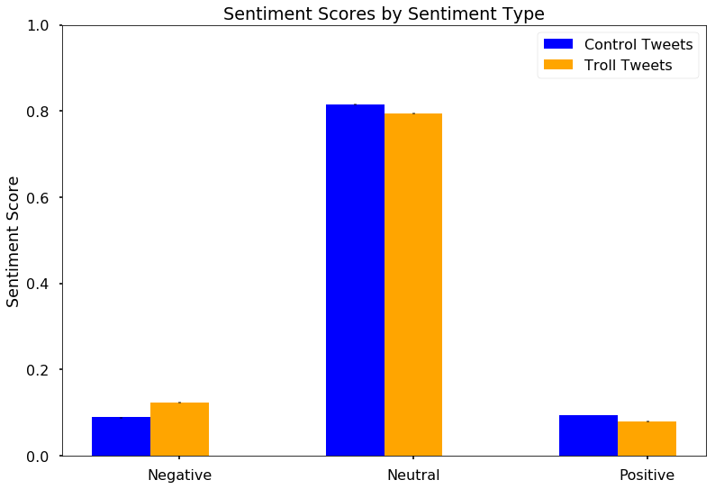


    RESULTS OF SENTIMENT ANALYSIS BINARY CLASSIFICATION:
     ------------------------------------------------------------
    	Normalized Troll Classes:
     pos    0.613535
    neg    0.386465
    Name: sentiment_class, dtype: float64
    
    	Normalized Control Classes:
     pos    0.598126
    neg    0.401874
    Name: sentiment_class, dtype: float64
    


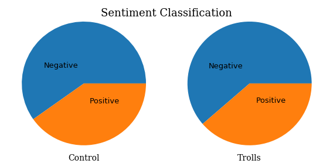


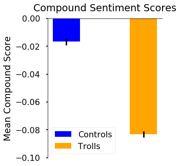


# MODEL


## BUILDING THE INITIAL MODELS


    

## Logistic Regression


<table id="T_45f642c8_d4ad_11e9_94e8_f48e38b6371f" ><caption>Summary Table of Clocked Processes</caption><thead>    <tr>        <th class="col_heading level0 col0" >Lap #</th>        <th class="col_heading level0 col1" >Start Time</th>        <th class="col_heading level0 col2" >Duration</th>        <th class="col_heading level0 col3" >Label</th>    </tr></thead><tbody>
                <tr>
                                <td id="T_45f642c8_d4ad_11e9_94e8_f48e38b6371frow0_col0" class="data row0 col0" >TOTAL</td>
                        <td id="T_45f642c8_d4ad_11e9_94e8_f48e38b6371frow0_col1" class="data row0 col1" >09/11/19 - 12:00:27 PM</td>
                        <td id="T_45f642c8_d4ad_11e9_94e8_f48e38b6371frow0_col2" class="data row0 col2" >0 min, 0.945 sec</td>
                        <td id="T_45f642c8_d4ad_11e9_94e8_f48e38b6371frow0_col3" class="data row0 col3" >LogisticRegression complete.</td>
            </tr>
    </tbody></table>


    
                   precision    recall  f1-score   support
    
               0       0.88      0.88      0.88      7552
               1       0.88      0.88      0.88      7551
    
       micro avg       0.88      0.88      0.88     15103
       macro avg       0.88      0.88      0.88     15103
    weighted avg       0.88      0.88      0.88     15103
    
    


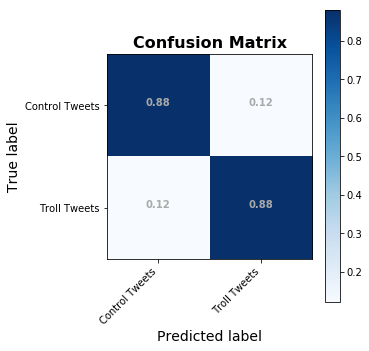


    
    Train Accuracy:  0.9390843738176314
    Test Accuracy:  0.8788320201284513
    

### INITIAL MODEL SUMMARY: Logistic Regression
- Accuracy: 
    - 0.938 for train set
    - 0.875 for test set
- Recall/Precision/F1-scores all around 0.87

- Duration: 
    - 0.78 sec


## DecisionTreeClassifier


<table id="T_522ffdb6_d4ad_11e9_9916_f48e38b6371f" ><caption>Summary Table of Clocked Processes</caption><thead>    <tr>        <th class="col_heading level0 col0" >Lap #</th>        <th class="col_heading level0 col1" >Start Time</th>        <th class="col_heading level0 col2" >Duration</th>        <th class="col_heading level0 col3" >Label</th>    </tr></thead><tbody>
                <tr>
                                <td id="T_522ffdb6_d4ad_11e9_9916_f48e38b6371frow0_col0" class="data row0 col0" >TOTAL</td>
                        <td id="T_522ffdb6_d4ad_11e9_9916_f48e38b6371frow0_col1" class="data row0 col1" >09/11/19 - 12:00:28 PM</td>
                        <td id="T_522ffdb6_d4ad_11e9_9916_f48e38b6371frow0_col2" class="data row0 col2" >0 min, 20.204 sec</td>
                        <td id="T_522ffdb6_d4ad_11e9_9916_f48e38b6371frow0_col3" class="data row0 col3" ></td>
            </tr>
    </tbody></table>


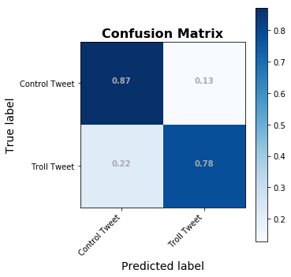


    
    Train Accuracy:  0.9390843738176314
    Test Accuracy:  0.8273852876911871
    

### Plotting Feature Importance


## Random Forests Classifier

<table id="T_b0f29066_d4ad_11e9_bf51_f48e38b6371f" ><caption>Summary Table of Clocked Processes</caption><thead>    <tr>        <th class="col_heading level0 col0" >Lap #</th>        <th class="col_heading level0 col1" >Start Time</th>        <th class="col_heading level0 col2" >Duration</th>        <th class="col_heading level0 col3" >Label</th>    </tr></thead><tbody>
                <tr>
                                <td id="T_b0f29066_d4ad_11e9_bf51_f48e38b6371frow0_col0" class="data row0 col0" >TOTAL</td>
                        <td id="T_b0f29066_d4ad_11e9_bf51_f48e38b6371frow0_col1" class="data row0 col1" >09/11/19 - 12:00:50 PM</td>
                        <td id="T_b0f29066_d4ad_11e9_bf51_f48e38b6371frow0_col2" class="data row0 col2" >2 min, 36.929 sec</td>
                        <td id="T_b0f29066_d4ad_11e9_bf51_f48e38b6371frow0_col3" class="data row0 col3" >Accuracy:0.8273852876911871</td>
            </tr>
    </tbody></table>


                  precision    recall  f1-score   support
    
               0       0.79      0.94      0.86      7552
               1       0.93      0.74      0.83      7551
    
       micro avg       0.84      0.84      0.84     15103
       macro avg       0.86      0.84      0.84     15103
    weighted avg       0.86      0.84      0.84     15103
    
    


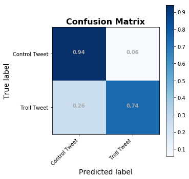


    
    Train Accuracy:  0.9390843738176314
    Test Accuracy:  0.8428126862212806
    

## Keras Model 1: creating a Text Classification Neural Network in Keras
- Using CountVectorized data generated above


```python
from keras import models, layers, optimizers
input_dim = X_train.shape[1]
# input_dim = sequences_train.shape[1]
print(input_dim)

model1 = models.Sequential()
# model.add(layers.Embedding)

model1.add(layers.Dense(10, input_dim= input_dim, activation='relu'))
model1.add(layers.Dense(1, activation='sigmoid'))

model1.compile(loss='binary_crossentropy',optimizer="adam",metrics=['accuracy'])
model1.summary()
```

    30191
    WARNING:tensorflow:From C:\Users\james\Anaconda3\envs\learn-env-ext\lib\site-packages\tensorflow\python\framework\op_def_library.py:263: colocate_with (from tensorflow.python.framework.ops) is deprecated and will be removed in a future version.
    Instructions for updating:
    Colocations handled automatically by placer.
    _________________________________________________________________
    Layer (type)                 Output Shape              Param #   
    =================================================================
    dense_1 (Dense)              (None, 10)                301920    
    _________________________________________________________________
    dense_2 (Dense)              (None, 1)                 11        
    =================================================================
    Total params: 301,931
    Trainable params: 301,931
    Non-trainable params: 0
    _________________________________________________________________
    


    --- CLOCK STARTED @:    09/11/19 - 12:03:27 PM           Label: starting keras .fit --- 
    WARNING:tensorflow:From C:\Users\james\Anaconda3\envs\learn-env-ext\lib\site-packages\tensorflow\python\ops\math_ops.py:3066: to_int32 (from tensorflow.python.ops.math_ops) is deprecated and will be removed in a future version.
    Instructions for updating:
    Use tf.cast instead.
    Train on 52860 samples, validate on 7552 samples
    Epoch 1/10
    52860/52860 [==============================] - 22s 407us/step - loss: 0.5001 - acc: 0.8236 - val_loss: 0.3608 - val_acc: 0.8567
    Epoch 2/10
    52860/52860 [==============================] - 20s 384us/step - loss: 0.2977 - acc: 0.8812 - val_loss: 0.2973 - val_acc: 0.8710
    Epoch 3/10
    52860/52860 [==============================] - 20s 387us/step - loss: 0.2340 - acc: 0.9076 - val_loss: 0.2808 - val_acc: 0.8775
    Epoch 4/10
    52860/52860 [==============================] - 22s 414us/step - loss: 0.1975 - acc: 0.9242 - val_loss: 0.2770 - val_acc: 0.8799
    Epoch 5/10
    52860/52860 [==============================] - 23s 431us/step - loss: 0.1719 - acc: 0.9350 - val_loss: 0.2805 - val_acc: 0.8792
    Epoch 6/10
    52860/52860 [==============================] - 22s 417us/step - loss: 0.1526 - acc: 0.9427 - val_loss: 0.2868 - val_acc: 0.8774
    Epoch 7/10
    52860/52860 [==============================] - 25s 470us/step - loss: 0.1375 - acc: 0.9483 - val_loss: 0.2953 - val_acc: 0.8771
    Epoch 8/10
    52860/52860 [==============================] - 23s 439us/step - loss: 0.1251 - acc: 0.9538 - val_loss: 0.3057 - val_acc: 0.8770
    Epoch 9/10
    52860/52860 [==============================] - 22s 425us/step - loss: 0.1147 - acc: 0.9573 - val_loss: 0.3180 - val_acc: 0.8766
    Epoch 10/10
    52860/52860 [==============================] - 24s 453us/step - loss: 0.1062 - acc: 0.9615 - val_loss: 0.3311 - val_acc: 0.8746
    --- TOTAL DURATION   =  3 min, 43.946 sec --- 
    


<table id="T_36bcfc5a_d4ae_11e9_b57a_f48e38b6371f" ><caption>Summary Table of Clocked Processes</caption><thead>    <tr>        <th class="col_heading level0 col0" >Lap #</th>        <th class="col_heading level0 col1" >Start Time</th>        <th class="col_heading level0 col2" >Duration</th>        <th class="col_heading level0 col3" >Label</th>    </tr></thead><tbody>
                <tr>
                                <td id="T_36bcfc5a_d4ae_11e9_b57a_f48e38b6371frow0_col0" class="data row0 col0" >TOTAL</td>
                        <td id="T_36bcfc5a_d4ae_11e9_b57a_f48e38b6371frow0_col1" class="data row0 col1" >09/11/19 - 12:03:27 PM</td>
                        <td id="T_36bcfc5a_d4ae_11e9_b57a_f48e38b6371frow0_col2" class="data row0 col2" >3 min, 43.946 sec</td>
                        <td id="T_36bcfc5a_d4ae_11e9_b57a_f48e38b6371frow0_col3" class="data row0 col3" >completed 10 epochs</td>
            </tr>
    </tbody></table>


    52860/52860 [==============================] - 19s 366us/step
    Training Accuracy:0.9676125614696319
    15103/15103 [==============================] - 5s 355us/step
    Testing Accuracy:0.8750579354542498
    

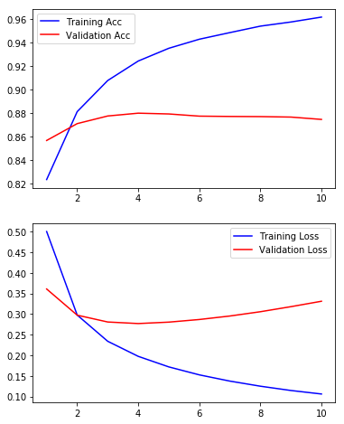


### Summary - Neural Network Analysis on CountVectorized Tweets

- Accuracy:
    - Training: 0.968
    - Testing:0.880
- Run time:
    - 2:48 min


## Keras Model 2 Adding pretrained Word2Vec embeddings
- Adding Word2Vec vectorization into an embedding layer

#### How to get a word2vector model's vectors into a Keras Embedding Layer
- https://sturzamihai.com/how-to-use-pre-trained-word-vectors-with-keras/


```python
text_data = df_tokenize['content']
from gensim.models import Word2Vec
vector_size = 300

wv_keras = Word2Vec(text_data, size=vector_size, window=10, min_count=1, workers=4)
wv_keras.train(text_data,total_examples=wv_keras.corpus_count, epochs=10)

wv = wv_keras.wv
```


```python
vocab_size = len(wv_keras.wv.vocab)
print(f'There are {vocab_size} words in the word2vec vocabulary, with a vector size {vector_size}.')
```

    There are 801 words in the word2vec vocabulary, with a vector size 300.
    


https://adventuresinmachinelearning.com/word2vec-keras-tutorial/
    https://machinelearningmastery.com/use-word-embedding-layers-deep-learning-keras/


```python
# save the vectors in a new matrix
word_model = wv_keras
vector_size = word_model.wv.vectors[1].shape[0]

embedding_matrix = np.zeros((len(word_model.wv.vocab) + 1, vector_size))
for i, vec in enumerate(word_model.wv.vectors):
  embedding_matrix[i] = vec
```


```python
# Get list of texts to be converted to sequences
# sentences_train =text_data # df_tokenize['tokens'].values
from keras.preprocessing.text import Tokenizer

tokenizer = Tokenizer(num_words=len(wv.vocab))
tokenizer.fit_on_texts(list(text_data)) #tokenizer.fit_on_texts(text_data)

word_index = tokenizer.index_word
reverse_index = {v:k for k,v in word_index.items()}
```


```python
# return integer-encoded sentences
from keras.preprocessing import text, sequence
X = tokenizer.texts_to_sequences(text_data)
X = sequence.pad_sequences(X)

y = df_tokenize['troll_tweet'].values
# reverse_index
X_train, X_test, X_val, y_train, y_test, y_val = train_test_val_split(X, y)#, test_size=0.1, shuffle=False)
```


```python

model2 = models.Sequential()

model2.add(layers.Embedding(len(wv_keras.wv.vocab)+1,
                             vector_size,input_length=X_train.shape[1],
                             weights=[embedding_matrix],trainable=False)) 
          
model2.add(layers.LSTM(300, return_sequences=False))#, kernel_regularizer=regularizers.l2(.01)))
# model1B.add(layers.GlobalMaxPooling1D())
model2.add(layers.Dense(10, activation='relu'))
model2.add(layers.Dense(1, activation='sigmoid'))

model2.compile(loss='binary_crossentropy',optimizer="adam",metrics=['accuracy'])
model2.summary()
```

    _________________________________________________________________
    Layer (type)                 Output Shape              Param #   
    =================================================================
    embedding_1 (Embedding)      (None, 51, 300)           240600    
    _________________________________________________________________
    lstm_1 (LSTM)                (None, 300)               721200    
    _________________________________________________________________
    dense_3 (Dense)              (None, 10)                3010      
    _________________________________________________________________
    dense_4 (Dense)              (None, 1)                 11        
    =================================================================
    Total params: 964,821
    Trainable params: 724,221
    Non-trainable params: 240,600
    _________________________________________________________________
    


```python
num_epochs = 5
history = model2.fit(X_train, y_train, epochs=num_epochs, verbose=True, validation_data=(X_val, y_val), batch_size=500)
```

    --- CLOCK STARTED @:    09/11/19 - 12:08:20 PM           Label: starting keras .fit --- 
    Train on 52860 samples, validate on 7552 samples
    Epoch 1/5
    52860/52860 [==============================] - 131s 2ms/step - loss: 0.4562 - acc: 0.7795 - val_loss: 0.3929 - val_acc: 0.8124
    Epoch 2/5
    52860/52860 [==============================] - 127s 2ms/step - loss: 0.3790 - acc: 0.8203 - val_loss: 0.3764 - val_acc: 0.8173
    Epoch 3/5
    52860/52860 [==============================] - 127s 2ms/step - loss: 0.3503 - acc: 0.8348 - val_loss: 0.3578 - val_acc: 0.8264
    Epoch 4/5
    52860/52860 [==============================] - 120s 2ms/step - loss: 0.3292 - acc: 0.8464 - val_loss: 0.3528 - val_acc: 0.8289
    Epoch 5/5
    52860/52860 [==============================] - 122s 2ms/step - loss: 0.3068 - acc: 0.8568 - val_loss: 0.3420 - val_acc: 0.8371
    --- TOTAL DURATION   =  10 min, 28.585 sec --- 
    


<table id="T_d60a0d8c_d4af_11e9_a00e_f48e38b6371f" ><caption>Summary Table of Clocked Processes</caption><thead>    <tr>        <th class="col_heading level0 col0" >Lap #</th>        <th class="col_heading level0 col1" >Start Time</th>        <th class="col_heading level0 col2" >Duration</th>        <th class="col_heading level0 col3" >Label</th>    </tr></thead><tbody>
                <tr>
                                <td id="T_d60a0d8c_d4af_11e9_a00e_f48e38b6371frow0_col0" class="data row0 col0" >TOTAL</td>
                        <td id="T_d60a0d8c_d4af_11e9_a00e_f48e38b6371frow0_col1" class="data row0 col1" >09/11/19 - 12:08:20 PM</td>
                        <td id="T_d60a0d8c_d4af_11e9_a00e_f48e38b6371frow0_col2" class="data row0 col2" >10 min, 28.585 sec</td>
                        <td id="T_d60a0d8c_d4af_11e9_a00e_f48e38b6371frow0_col3" class="data row0 col3" >completed 5 epochs</td>
            </tr>
    </tbody></table>


```python
loss, accuracy = model2.evaluate(X_train, y_train, verbose=True)
print(f'Training Accuracy:{accuracy}')

loss, accuracy = model2.evaluate(X_test, y_test, verbose=True)
print(f'Testing Accuracy:{accuracy}')
```

    52860/52860 [==============================] - 70s 1ms/step
    Training Accuracy:0.8670450245977757
    15103/15103 [==============================] - 20s 1ms/step
    Testing Accuracy:0.8459908626911964
    


```python
jmi.plot_keras_history(history)
```


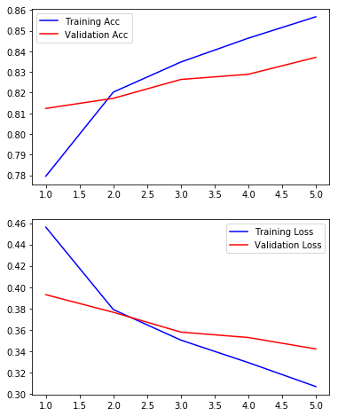


    (<Figure size 432x576 with 2 Axes>,
     array([<matplotlib.axes._subplots.AxesSubplot object at 0x000001FAF83FAA58>,
            <matplotlib.axes._subplots.AxesSubplot object at 0x000001FA851B2F28>],
           dtype=object))


```python
model2.save('model2_emb_lstm_dense_dense.hd5',include_optimizer=True, overwrite=True)
model2.save_weights('model2_emb_lstm_dense_dense_WEIGHTS.hdf')
```


## Keras model 3 -using keras' tokenizer to fit_on_texts+one_hot
### Train, test, val split


```python
# from sklearn.feature_extraction.text import CountVectorizer
from keras.preprocessing.text import Tokenizer, one_hot
from keras.utils.np_utils import to_categorical

from sklearn import preprocessing
from sklearn.model_selection import train_test_split

from keras import models, layers, optimizers

# df_tokenize.head()
```


```python
# Define tweets to be analyzed, fit tokenizer,generate sequences
tweets = df_tokenize['content']
# num_words=len(set(tweets))
tokenizer = Tokenizer(num_words=3000)

tokenizer.fit_on_texts(tweets)
sequences = tokenizer.texts_to_sequences(tweets)
```


```python
one_hot_results = tokenizer.texts_to_matrix(tweets, mode='binary')

word_index = tokenizer.word_index
reverse_index = {v:k for k,v in word_index.items()}
```

### Test Train Split


```python
print(one_hot_results.shape, y.shape)
```

    (75515, 3000) (75515,)
    


```python
import random, math
random.seed(42)
test_size = math.floor(one_hot_results.shape[0]*0.3)
test_index = random.sample(range(1,one_hot_results.shape[0]), test_size)

test = one_hot_results[test_index]
train = np.delete(one_hot_results, test_index, 0)
label_test = y[test_index]
label_train = np.delete(y, test_index, 0)
```


```python
train.shape
train.shape[1]
```


    3000


```python
model3 = models.Sequential()
model3.add(layers.Dense(50, activation='relu', input_shape=(3000,)))
model3.add(layers.Dense(25, activation='relu'))
model3.add(layers.Dense(1,activation='sigmoid'))

model3.compile(optimizer='adam', loss='binary_crossentropy',metrics=['accuracy'])
model3.summary()
```

    _________________________________________________________________
    Layer (type)                 Output Shape              Param #   
    =================================================================
    dense_5 (Dense)              (None, 50)                150050    
    _________________________________________________________________
    dense_6 (Dense)              (None, 25)                1275      
    _________________________________________________________________
    dense_7 (Dense)              (None, 1)                 26        
    =================================================================
    Total params: 151,351
    Trainable params: 151,351
    Non-trainable params: 0
    _________________________________________________________________
    


```python
clock_1hot = bs.Clock()
clock_1hot.tic()

history = model3.fit(train, label_train, epochs=10, batch_size=256, validation_data=(test, label_test))
clock_1hot.toc('')
```

    --- CLOCK STARTED @:    09/11/19 - 12:20:30 PM --- 
    Train on 52861 samples, validate on 22654 samples
    Epoch 1/10
    52861/52861 [==============================] - 4s 84us/step - loss: 0.3724 - acc: 0.8285 - val_loss: 0.2785 - val_acc: 0.8753
    Epoch 2/10
    52861/52861 [==============================] - 3s 61us/step - loss: 0.2456 - acc: 0.8929 - val_loss: 0.2620 - val_acc: 0.8865
    Epoch 3/10
    52861/52861 [==============================] - 3s 64us/step - loss: 0.2059 - acc: 0.9115 - val_loss: 0.2484 - val_acc: 0.8947
    Epoch 4/10
    52861/52861 [==============================] - 3s 66us/step - loss: 0.1648 - acc: 0.9309 - val_loss: 0.2504 - val_acc: 0.8976
    Epoch 5/10
    52861/52861 [==============================] - 3s 66us/step - loss: 0.1296 - acc: 0.9476 - val_loss: 0.2656 - val_acc: 0.8973
    Epoch 6/10
    52861/52861 [==============================] - 3s 61us/step - loss: 0.1009 - acc: 0.9606 - val_loss: 0.2867 - val_acc: 0.8964
    Epoch 7/10
    52861/52861 [==============================] - 3s 60us/step - loss: 0.0773 - acc: 0.9711 - val_loss: 0.3151 - val_acc: 0.8963
    Epoch 8/10
    52861/52861 [==============================] - 3s 60us/step - loss: 0.0594 - acc: 0.9782 - val_loss: 0.3539 - val_acc: 0.8965
    Epoch 9/10
    52861/52861 [==============================] - 3s 60us/step - loss: 0.0465 - acc: 0.9836 - val_loss: 0.3810 - val_acc: 0.8964
    Epoch 10/10
    52861/52861 [==============================] - 3s 61us/step - loss: 0.0367 - acc: 0.9873 - val_loss: 0.4169 - val_acc: 0.8959
    --- TOTAL DURATION   =  0 min, 34.478 sec --- 
    


<style  type="text/css" >
    #T_27140d9e_d4b0_11e9_bdbe_f48e38b6371f table, th {
          text-align: center;
    }    #T_27140d9e_d4b0_11e9_bdbe_f48e38b6371frow0_col1 {
            width:  140px;
        }    #T_27140d9e_d4b0_11e9_bdbe_f48e38b6371frow0_col2 {
            width:  140px;
        }</style><table id="T_27140d9e_d4b0_11e9_bdbe_f48e38b6371f" ><caption>Summary Table of Clocked Processes</caption><thead>    <tr>        <th class="col_heading level0 col0" >Lap #</th>        <th class="col_heading level0 col1" >Start Time</th>        <th class="col_heading level0 col2" >Duration</th>        <th class="col_heading level0 col3" >Label</th>    </tr></thead><tbody>
                <tr>
                                <td id="T_27140d9e_d4b0_11e9_bdbe_f48e38b6371frow0_col0" class="data row0 col0" >TOTAL</td>
                        <td id="T_27140d9e_d4b0_11e9_bdbe_f48e38b6371frow0_col1" class="data row0 col1" >09/11/19 - 12:20:30 PM</td>
                        <td id="T_27140d9e_d4b0_11e9_bdbe_f48e38b6371frow0_col2" class="data row0 col2" >0 min, 34.478 sec</td>
                        <td id="T_27140d9e_d4b0_11e9_bdbe_f48e38b6371frow0_col3" class="data row0 col3" ></td>
            </tr>
    </tbody></table>


```python
loss, accuracy = model3.evaluate(train, label_train, verbose=True)
print(f'Training Accuracy:{accuracy}')

loss, accuracy = model3.evaluate(test, label_test, verbose=True)
print(f'Testing Accuracy:{accuracy}')
```

    52861/52861 [==============================] - 2s 35us/step
    Training Accuracy:0.990976334149251
    22654/22654 [==============================] - 1s 37us/step
    Testing Accuracy:0.8959124216579155
    


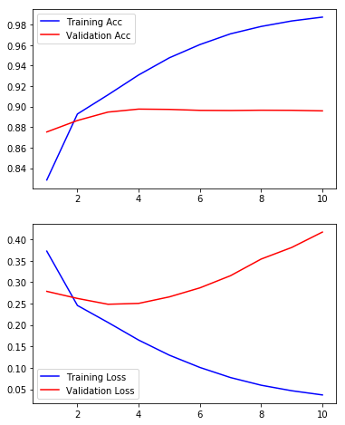


# INTERPRET


- **Summary:**
    - In terms of efficiency, no model can be a simple Logistic Regression.
    - Decision Trees and Random Forests did not improve performance and took significantly longer.
    - In terms of accuracy, a neural network using CountVectorization with a 3 layers of neurons outperformed all other models with 90% accuracy on the testing data with a run time of 31 seconds.
<br>
- **Caveats:**
    - Perfect control tweets were not available due to the limitations of the twitter API. If we had access to the batch historical tweets, we may be able to better classify troll tweets, as we would be able to leave the hashtags and mentions in the body of the tweet for vectorization. 
    - There is the possibility that the accuracy tested as-is would decrease, due to elimination of any contemporaneous events that influence tweet contents.

# FUTURE DIRECTIONS
- With additional time, we would have explored additional Neural Network configurations using bi-directional layers and additional Dense layers for classification.
- Additional methods of words/sentence vectorization
- Analysis using  Named Entity Recognition with Spacey
- Additional Visualization

- **Using the outputs of the logistic regression or neural networks with model stacking**
    - Adding in the other non-language characteristics of the tweets to further improve accuracy.